# NeoCode 系统架构文档

**文档版本：** v0.1
**维护者：** NeoCode 团队
**最后更新：** 2026-05-08
**适用系统版本：** main 分支 HEAD
**目标读者：** 团队成员、项目贡献者

---

## 1. 文档元信息

本文档用于描述 **NeoCode** 的整体架构设计，包括系统边界、核心模块、关键流程、部署拓扑、安全设计和架构决策记录（ADR）。

本文档面向 **团队成员、项目贡献者**，旨在回答以下问题：
- 系统解决什么问题、边界在哪里？
- 核心组件如何划分、如何协作？
- 为什么选择这种架构而不是其他方案？
- 有哪些质量目标、已知风险和演进方向？

本文档 **不包含**：
- 详细 API 字段说明（参见 `docs/reference/gateway-rpc-api.md`）
- 具体部署操作步骤（参见部署手册）
- 用户使用指南（参见官方文档站）

本文档随代码库演进持续更新。当架构决策发生变更时，应在第 15 节追加新的 ADR，并更新受影响的相关章节。

---

## 2. 设计约束

### 2.1 架构驱动力

以下六条驱动力贯串全部架构决策。它们不是功能需求，而是**系统必须满足的约束**——文档后续的每个重要决策都应能追溯回这里。

| # | 驱动力 | 含义 | 强制了怎样的设计 |
|---|--------|------|-----------------|
| D1 | **本地优先** | 代码、会话、配置和密钥的全部生命周期停留在用户机器上 | 零依赖单二进制分发；嵌入式数据库（SQLite）；离线可运行；Web UI 嵌入二进制 |
| D2 | **多端对等接入** | TUI、Web、Desktop、IM Bot、CI/CD 脚本都是对等的一等公民客户端 | Gateway 作为唯一 RPC 边界，不含端侧特化逻辑；新增客户端不修改 Runtime 或 Gateway |
| D3 | **多模型可替换** | 用户自由选择和切换底层大模型，厂商差异不向上泄漏 | Provider 插件化（极简接口）；新增模型零侵入上层；厂商特定逻辑收敛在 Provider 层内 |
| D4 | **工具执行可控** | AI 拥有读写文件、执行 Shell 的权限——每次执行需可审计、可阻断、可回滚 | 所有工具调用经过 Security Engine；Human-in-the-Loop 权限审批；WorkspaceSandbox 路径隔离；Checkpoint 写前快照 |
| D5 | **Human-in-the-Loop** | 危险操作在执行前需经过人类审批，系统不假设审批发生在哪个客户端 | 事件驱动的暂停-恢复推理循环；PolicyEngine 三态决策（allow/deny/ask）；会话级权限记忆 |
| D6 | **单机零运维** | 系统在本地机器上运行，用户不需要是 DBA 或 SRE | 无外部数据库/消息队列依赖；核心模块同进程运行；数据生命周期全自动管理 |

### 2.2 驱动力 → 决策追溯

| 驱动力 | 直接导致的架构决策（章节/ADR） |
|--------|-----------------------------|
| D1 本地优先 | SQLite 持久化（ADR-005）、Go 单二进制静态编译（ADR-004）、离线可用 Web UI（§3.3）、Checkpoint 本地快照（ADR-008） |
| D2 多端对等 | Gateway 唯一 RPC 边界（ADR-001、§7.4 决策 1）、JSON-RPC 2.0（ADR-006）、客户端适配器模式（§3.3、§7.6） |
| D3 多模型可替换 | Provider 插件化 2 方法接口（ADR-002、§7.4 决策 2）、厂商差异不出 Provider 层（§8.3、§7.6.3） |
| D4 工具可控 | Security Engine 关键路径（§8.4）、WorkspaceSandbox 路径隔离（§13.3）、敏感路径自动检测（§13.3）、Checkpoint 写前快照（ADR-008、§8.5.1） |
| D5 Human-in-the-Loop | 事件驱动模型（ADR-003、§7.4 决策 3）、PolicyEngine ask 态 + PermissionFingerprint 会话记忆（§9.3、§10.2.3） |
| D6 零运维 | 强边界单体（ADR-004）、SQLite 零依赖（ADR-005）、自动过期清理 + Checkpoint 修剪（§9.5、§12.5） |

---

## 3. 系统范围与边界

### 3.1 系统职责（In Scope）

| 职责域 | 说明 |
|--------|------|
| 多模型 Provider 适配 | 归一化不同厂商的 Chat API 协议为统一流式事件模型 |
| ReAct 推理循环 | 用户输入 → 上下文构建 → 模型推理 → 工具调用 → 结果回灌 → 循环，直到产出最终回复 |
| 工具执行与安全管理 | 文件读写、Bash 执行（含 Git 语义分类）、代码库检索、Web 抓取、MCP 扩展、Todo/子代理等工具的 schema 暴露、参数校验、权限决策和执行 |
| 多端客户端接入 | 通过 Gateway 统一暴露 JSON-RPC、SSE、WebSocket 接口，支持 TUI、Web、桌面端（Electron）、飞书 Bot 等对等接入 |
| 会话与状态管理 | 会话创建、持久化（SQLite）、历史消息管理、Token 追踪、上下文裁剪（Compact） |
| Skills 系统 | 从本地文件系统加载 SKILL.md，按需激活并注入 System Prompt，为特定任务提供专用行为和流程 |
| 上下文构建与压缩 | 按照会话状态、预算阈值、消息历史动态构建 Provider 请求的 System Prompt 和消息列表 |
| 记忆（Memo）系统 | 跨会话保存用户偏好、项目事实和上下文，通过 LLM 提取结构化记忆 |
| 自我更新 | 通过 Go 自更新机制拉取最新版本 |

### 3.2 明确不在范围内（Out of Scope）

| 不在范围内 | 说明 |
|-----------|------|
| 中心化云端 SaaS / 多租户 | 数据、会话、代码上下文全部留在本地工作区，权限继承系统进程权限 |
| 与单一模型厂商绑定 | Provider 接口保持开放，允许随时切换到新模型或本地部署的开源模型 |
| 完全无人值守的黑盒程序员 | 所有操作可打断、可审查，坚持 Human-in-the-loop |
| 重型 IDE 插件 / fork | 不 Fork VS Code 或任何编辑器；可在 IDE 中嵌入瘦客户端复用 Gateway 能力 |
| 强依赖公网的 Web 客户端 | Web/桌面端可在离线局域网环境下直连本机 Gateway |
| 代码托管（远程仓库） | 有本地 Checkpoint 快照（§10），不替代 GitHub/GitLab；Git 操作经 Bash 语义分类层安全管控 |
| 自主研发大模型 | NeoCode 是 Agent 框架，不训练或部署自有模型 |
| 项目管理和需求跟踪 | 不替代 Jira、Linear 等，可通过 Todo 工具做任务级编排 |
| 组织级 RBAC 与多租户 | 鉴权仅限于 Gateway 连接级 Token，不做企业组织架构映射 |

### 3.3 客户端接入架构与外部依赖

NeoCode 的客户端分为两类：**原生客户端**（由 NeoCode 自身提供）和 **第三方客户端**（通过适配器接入）。所有客户端均通过 Gateway 暴露的统一 RPC 接口与 Runtime 通信，Gateway 内部不包含任何端侧特化逻辑。

```
┌──────────────────────────────────────────────────────────────────┐
│                         NeoCode 系统                              │
│                                                                  │
│  原生客户端（NeoCode 内置）           第三方客户端（适配器接入）     │
│  ┌────────┐ ┌────────┐ ┌──────────┐  ┌───────────┐              │
│  │  TUI   │ │  Web   │ │ Desktop  │  │ 飞书 Bot   │  ...         │
│  └───┬────┘ └───┬────┘ └────┬─────┘  └─────┬─────┘              │
│      │           │           │              │                     │
│      │    RPC (JSON-RPC / SSE / WebSocket)  │  Feishu Adapter   │
│      │           │           │              │                     │
│      └───────────┼───────────┼──────────────┘                    │
│                  │           │                                    │
│                  └───────────┘                                    │
│                      │                                            │
│                ┌─────┴──────┐                                     │
│                │  Gateway   │  ← 统一 RPC 边界，无客户端特化逻辑   │
│                └─────┬──────┘                                     │
│                      │                                            │
│                ┌─────┴──────┐                                     │
│                │  Runtime   │                                     │
│                └─────┬──────┘                                     │
│                      │                                            │
│        ┌─────────────┼──────────────┐                             │
│        │             │              │                              │
│   ┌────┴────┐  ┌────┴────┐  ┌─────┴──────┐                       │
│   │Provider │  │ Tools   │  │ Session    │                       │
│   └────┬────┘  └────┬────┘  └────────────┘                       │
│        │             │                                            │
└────────┼─────────────┼────────────────────────────────────────────┘
         │             │
         ▼             ▼
  ┌──────────┐  ┌──────────────┐
  │ 模型厂商  │  │ 外部工具/服务  │
  │          │  │              │
  │ Anthropic│  │ MCP Servers  │
  │ OpenAI   │  │ Git (local)  │
  │ Gemini   │  │ Filesystem   │
  │ DeepSeek │  │ Shell        │
  │ MiniMax  │  │ Web (HTTP)   │
  │ ...      │  │              │
  └──────────┘  └──────────────┘
```

**原生客户端（NeoCode 内置）：**
- **TUI**：终端交互界面（Bubble Tea），通过 RPC 连接 Gateway
- **Web**：React SPA，embed 到二进制中，由 Gateway 提供静态文件服务
- **Desktop**：Electron 壳，内嵌 Web UI，提供系统托盘和原生通知等桌面能力

**第三方客户端接入模式：**
- 第三方软件可通过编写适配器接入 NeoCode，适配器负责将外部事件/消息转换为 Gateway RPC 调用
- **飞书 Bot** 是第三方客户端的典型范例：`Feishu Adapter` 接收飞书开放平台 Webhook → 转换为 Gateway JSON-RPC 请求 → 将 Runtime 回复通过飞书消息 API 返回
- 同模式可扩展至其他 IM 平台（企业微信、钉钉、Slack 等）或自定义系统

**对外依赖（模型与工具层）：**
- **模型厂商 API**：Anthropic、OpenAI、Google Gemini、DeepSeek、MiniMax、Mimo、Qwen、GLM 等（通过 HTTPS）
- **MCP 服务器**：本地 stdio 子进程，提供外部工具扩展
- **Git**：本地 Git 命令行（通过 Bash 工具的语义分类层间接调用，不暴露为独立 `git_*` 工具）
- **Shell**：操作系统原生 Shell（bash/zsh/pwsh 等，用于 `bash` 工具）
- **飞书开放平台 API**：供 Feishu Adapter 使用，用于接收 Webhook 与发送消息回复

### 3.4 边界规则

1. **代码数据不出本地**：所有文件系统操作限制在 `--workdir` 指定目录内，代码内容不经 Gateway 上传至任何云端服务。
2. **模型请求仅含必要上下文**：发送给模型厂商的请求仅包含 System Prompt + 对话历史 + 工具定义，不泄露本地路径、环境变量或密钥。
3. **Gateway 是唯一跨边界通道**：所有客户端（原生或第三方）通过 Gateway 的 RPC 接口与 Runtime 通信，不直连 Runtime。第三方接入时，适配器负责协议转换，Gateway 不感知客户端来源。

---

## 4. 架构目标与质量属性

以下按优先级从高到低排列。每条不只陈述"要什么"，更说明**当它与其他目标冲突时，系统优先保护什么。**

### 4.1 安全性（Security）— 最高优先级，优先于所有其他目标

作为拥有文件读写和 Bash 执行权限的本地 Agent，任何沙箱逃逸或不可控行为都可能造成严重后果。

**权衡：** 安全性优先于便利性。例如——用户可能希望 AI "自动执行所有 bash 命令而不弹窗询问"，但系统会对破坏性 Git 操作、越界路径访问、敏感文件读写进行审批或阻断。安全策略的默认决策是 `ask`（询问用户），即使这会增加交互摩擦。

**关键设计选择：** 四层纵深防御（认证 → ACL → 工具策略 → OS 隔离）；敏感路径自动检测不依赖用户配置；工具执行路径不可旁路 Security Engine。详见 §13。

### 4.2 可测试性（Testability）— 对抗 AI 不确定性的工程锚

大模型的输出不可预测，因此框架链路（流式解析、工具回调、状态机流转）必须可被快速、独立地验证。

**权衡：** 可测试性优先于实现便利性。例如——与物理世界交互的组件（文件系统、Bash、网络、模型 API）全部 Interface 化，允许 Mock 注入。这意味着每个工具需要额外定义一个 interface + 至少一个 mock 实现，增加了代码量，但换取了核心引擎数千个单测在 5 秒内完成的能力。

**关键设计选择：** Provider 仅 2 个方法；Tools Manager 通过 Executor interface 解耦；所有物理交互组件可替换。详见 §8.2–§8.4。

### 4.3 可扩展性（Extensibility）— 生态兼容的核心引擎

系统需要以最低成本适配新模型、新客户端和新工具。

**权衡：** 可扩展性优先于深度优化。例如——Provider interface 只有 2 个方法（`EstimateInputTokens` + `Generate`），而不是为每个厂商的独特能力（如 Anthropic 的 thinking 预算、OpenAI 的 response_format）提供定制接口。这牺牲了对某些厂商高级特性的深度利用，但换取了新增模型的零侵入——不修改 Runtime 一行代码。

**关键设计选择：** Provider 插件化（ADR-002）；Gateway 不含端侧特化；MCP 和 Skills 提供零代码扩展路径。详见 §7.6。

### 4.4 可观测性（Observability）— 黑盒执行的破局点

开发者必须能追踪 AI 的完整决策链：读了什么、想了什么、调了什么工具、消耗了多少 Token。

**权衡：** 可观测性优先于性能。例如——每次 Run Loop 的 Token 用量（Input/Output/Cache）作为事件透出，每个 Tool Call 的确切入参和原始结果完整保存（不受输出截断影响），SessionID + RunID 贯穿全链路。这增加了事件序列化和日志写入开销，但换取了生产环境中"为什么 AI 做了这个决策"的可追溯性。

**关键设计选择：** 统一 `RuntimeEvent` channel 承载所有事件；StreamRelay 广播到所有订阅客户端；Prometheus 指标暴露认证失败、ACL 拒绝等安全关键计数器。详见 §14。

### 4.5 性能（Performance）— 流畅的结对编程体验

AI 推理耗时由云端 API 主导，但本地框架的组装与工具执行不能成为瓶颈。

**权衡：** 本地性能优先于资源节省。例如——工具执行采用并行调度（默认并发度 4），同时发起多个独立的 goroutine。这在 I/O 密集型场景（同时读 3 个文件）显著降低延迟，但增加了 goroutine 调度开销。Single-binary 部署（Go 静态编译）的启动时间以毫秒计，换取零依赖分发体验。

**关键设计选择：** 并行工具执行（可配置并发度）；进程内事件驱动（Go channel 而非外部消息队列）；Compact 触发耗时 < 100ms。详见 §9.1、§9.2。

---

## 5. 约束与设计原则

### 5.1 技术栈约束

| 层面 | 选型 | 约束来源 |
|------|------|----------|
| 语言 | Go 1.25+ | 团队能力、编译为单一二进制、跨平台 |
| TUI 框架 | Charmbracelet Bubble Tea + Lipgloss | Go 生态最成熟的 TUI 框架 |
| 数据库 | SQLite（modernc 纯 Go 实现） | 零依赖本地持久化，无需外部数据库进程 |
| 配置管理 | Viper + YAML | Go 生态标准方案 |
| CLI 框架 | Cobra | Go 生态标准方案 |
| 自更新 | go-selfupdate | 支持跨平台二进制差分更新 |
| Web UI | React + Vite（embed 到 Go binary） | Web 端嵌入，启动时由 Gateway 提供静态文件服务 |
| 桌面端 | Electron | 跨平台桌面壳，内嵌 Web UI |

### 5.2 部署与平台约束

| 约束项 | 说明 |
|--------|------|
| 目标平台 | Windows、macOS、Linux 三大桌面平台全部支持；用户分布以 Windows 为主 |
| 部署形态 | 单一二进制文件（`neocode`），提供 CLI 交互、Gateway 服务 (`neocode gateway`)、HTTP URL Scheme 唤醒 Daemon (`neocode daemon`)、Web UI、Local Runner (`neocode runner`) 等全部子命令 |
| 网络环境 | 无特殊限制：在线环境通过 HTTPS 调用模型 API；离线环境可搭配本地模型使用，Web 端和桌面端也可在局域网环境下直连本机 Gateway |
| 数据目录 | 默认 `~/.neocode/`（可配置），存放配置文件、SQLite 会话数据库、Skill 缓存、自更新下载等 |
| 进程间通信 | 客户端与 Gateway 通过 JSON-RPC / SSE / WebSocket 等 RPC 协议通信；底层传输层正在从 IPC（Unix domain socket / named pipe）向全 RPC 方案迁移 |

### 5.3 设计原则

以下原则提炼自项目 AGENTS.md，每条原则在 NeoCode 中有其具体的设计动机。

#### 原则 1：分层隔离

上层只依赖下层契约，不依赖下层实现细节。`tui` 不感知 provider 协议，`runtime` 不感知具体模型厂商字段。

**动机：** 分层隔离使得各层可独立开发、测试和替换。Provider 的零侵入可扩展性（§4.3）直接依赖此原则。

#### 原则 2：能力入口收敛

任何模型可调用的能力，必须经过 `internal/tools` 的 Schema + Execute 协议，不允许在 `runtime` 或 `tui` 中内嵌工具逻辑。

**动机：** 安全性（§4.1）要求所有工具执行经过统一的安全策略引擎（权限决策、工作区边界检查）。如果工具逻辑分散在各处，安全审计将不可行。

#### 原则 3：状态集中

会话状态、消息历史、工具调用记录由 `runtime/session` 统一管理，不分散到 UI 或其他消费层。

**动机：** 多端（TUI/Web/Desktop/飞书）共享同一 Runtime 实例时，状态若分散会导致一致性问题。集中管理保证了全链路可观测性（§4.4）中 SessionID/RunID 的全局统一。

#### 原则 4：配置先行

环境差异项（超时、路径、模型名、输出限制）优先通过配置注入，不硬编码。

**动机：** 支持多模型自由切换和多部署环境（本地/内网/离线）的必然要求。配置的外部化也保证了密钥零泄漏（密钥仅存于环境变量，不入配置文件）。

#### 原则 5：接口优于实现

核心抽象上的导出类型、函数、接口优先面向接口编程，不暴露具体厂商结构。

**动机：** 可测试性（§4.2）要求所有物理世界交互组件（文件系统、Bash、模型 API）可被 Mock。接口化是实现亚秒级 Mock 测试的前提。

---

## 6. 系统上下文视图

本节描述 NeoCode 与外部世界的交互关系，即 C4 模型中的 Level 1（系统上下文图）。


**图 6-1：NeoCode 系统上下文图。** 此图展示系统的四类调用方（终端开发者、Web/桌面用户、IM 用户、CI/CD 流水线）和五类外部依赖（模型厂商 API、MCP 服务器、本地 Git、操作系统 Shell、飞书开放平台）。为便于理解，系统边界内部标注了核心模块的逻辑分组，但不展开内部交互细节——详见 §7 容器图。

### 6.1 调用方（Actor）分析

| 调用方 | 接入方式 | 是否原生客户端 | 典型交互模式 |
|--------|----------|---------------|-------------|
| 终端开发者 | `neocode` CLI / TUI → Gateway RPC | 是 | 长会话交互，持续多轮对话 + 工具执行 |
| Web/桌面用户 | Web UI / Electron → Gateway RPC | 是 | 长会话交互，UI 面板展示实时流式输出 |
| IM 用户（飞书） | 飞书消息 → Feishu Adapter → Gateway RPC | 否（第三方适配器） | 短任务驱动："查代码" "修 Bug" "跑诊断" |
| CI/CD 流水线 | 脚本 → Gateway JSON-RPC | 否（自动化调用方） | 无状态单次调用：代码审查、自动修复、批量操作 |

### 6.2 外部系统依赖方向

- **传出依赖**（NeoCode → 外部）：模型 API 调用、MCP 子进程启动、Git 信息查询、Shell 命令执行——均为 NeoCode 主动发起
- **传入依赖**（外部 → NeoCode）：飞书开放平台 Webhook → Feishu Adapter——为外部系统回调触发
- **被动资源**：本地文件系统和 Git 仓库——由 NeoCode 通过工具层读写，不直接向 NeoCode 发送请求

---

## 7. 整体架构设计

### 7.0 核心架构选择摘要

以下五个选择定义了 NeoCode 的基本架构形态。每项选择的详细论证（背景、替代方案、后果）见对应的 ADR。

| 设计张力 | 当前选择 | 原因摘要 | 详见 |
|----------|----------|----------|------|
| 微服务 vs 单体 | **强边界单体** | 单机单用户场景下分布式复杂度是负收益；通过 Go interface 保持模块边界 | ADR-004 |
| 同步调用 vs 事件驱动 | **进程内事件驱动** | 流式输出、中途取消、权限审批、多客户端广播都需要异步事件模型 | ADR-003 |
| Go vs Python/TS/Rust | **Go 单二进制** | 静态编译零依赖分发、goroutine 并行工具执行、跨平台、AI SDK 生态成熟 | ADR-004 |
| SQLite vs 外部数据库 | **SQLite（modernc）** | 零外部依赖、ACID 事务满足会话与 Checkpoint 需求、单文件管理 | ADR-005 |
| JSON-RPC vs gRPC/REST | **JSON-RPC 2.0 + SSE/WS** | 协议门槛最低——任何能发 JSON 的环境都能接入；配合 SSE/WS 做流式输出 | ADR-006 |

### 7.1 架构风格：分层 + 事件驱动

在上述选择的约束下，NeoCode 的架构风格自然收敛为 **分层架构（Layered Architecture）** + **进程内事件驱动（Event-Driven）**。

**分层架构的动机：**
- 严格接口边界使各层可独立开发、测试和替换
- Provider 层和 Client 层的可替换性（见 §4.3）直接依赖分层边界
- 安全审计（见 §4.1）要求工具执行路径可预测、可审计——分层保证了安全策略引擎的唯一入口

**事件驱动的动机：**
- 模型推理是流式、异步的过程：Provider 通过 channel 推送 `StreamEvent`，Runtime 消费并转换为 `RuntimeEvent`。客户端通过 JSON-RPC 发起请求，Gateway 同步返回 ack；对于长时间运行的 run/ask 操作，Gateway 通过 StreamRelay 将 Runtime 事件以 SSE 或 WebSocket 推送至订阅客户端
- 多客户端并发：Gateway 通过流中继（Stream Relay）机制，将同一 Runtime 事件广播到多个订阅连接
- Human-in-the-loop 权限审批：工具执行遇到需用户决策的操作时，Runtime 暂停并向 Gateway 发送 `permission_request` 事件，等待客户端通过 JSON-RPC（`gateway.resolve_permission`）回复

### 7.2 容器视图（C4 Level 2）

> **容器 = 可独立部署/运行的最小单元。** 在 NeoCode 中，CLI、Gateway Daemon、Runner 通过同一二进制文件的不同子命令启动；Web UI 嵌入在 Gateway 进程内。

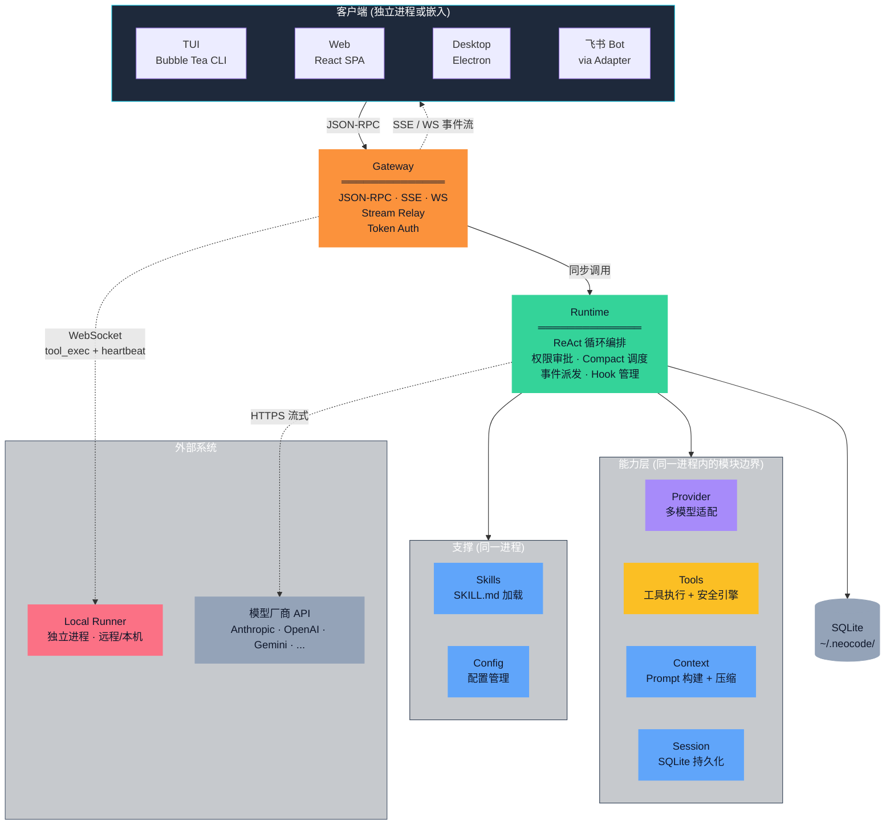

**图 7-1：NeoCode 容器图（C4 Level 2）。** 实线 = 同步调用；虚线 = 异步事件/外部通信。颜色：橙 = 协议边界、绿 = 编排中枢、紫 = 适配层、黄 = 工具层、蓝 = 支撑层、红 = 独立进程、灰 = 外部系统/数据存储。

**关键拓扑特征：**
- Gateway、Runtime、Provider、Tools、Session、Context、Skills、Config **共享同一进程**，通过 Go interface 解耦而非网络调用
- Local Runner 是**唯一可能跨越物理机边界**的容器（通过 WebSocket 反向连接 Gateway）
- Web UI 的静态资源嵌入在 Gateway 二进制中，不独立部署
- SQLite 是唯一的持久化存储，无需外部数据库进程

### 7.3 层间依赖规则

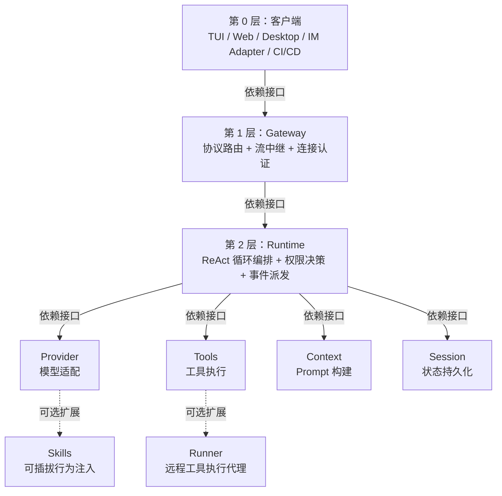

**依赖规则：** 上层只依赖下层契约（接口），不依赖具体实现。实线箭头 = 编译时依赖，虚线箭头 = 运行时可选绑定。

**跨层规则（提炼自 AGENTS.md）：**
- `tui` 不直接调用 `provider` 或 `tools`
- `runtime` 不内嵌具体厂商字段或工具执行逻辑
- `gateway` 不包含客户端特化逻辑（所有客户端通过统一 RPC 接入）
- 模型厂商差异不泄漏到 `runtime` 或上层

### 7.4 核心设计决策

#### 决策 1：Gateway 作为唯一 RPC 边界

所有客户端（原生和第三方）必须通过 Gateway 与 Runtime 通信。Gateway 内部通过 `Action` 路由表将 JSON-RPC 请求帧分发到对应的处理器（`run`、`ask`、`cancel`、`resolve_permission` 等），并通过 `StreamRelay` 将 Runtime 的异步事件广播到订阅连接。

**选择理由：**
- 多端对等接入：TUI、Web、Desktop、IM Bot 在 Gateway 视角完全一致
- 安全收敛：认证、授权、速率限制集中在 Gateway 层，不需要每个客户端独立实现
- 协议统一：未来新增协议（如 gRPC）只需在 Gateway 增加 transport handler

**替代方案对比：**

| 方案 | 优点 | 缺点 | 为何不选 |
|------|------|------|----------|
| 各客户端直连 Runtime | 无中间层延迟 | 每个客户端需独立实现认证/鉴权/重连；Runtime 需理解多种传输协议；新增客户端成本高 | 违背"客户端对等"原则，安全面分散 |
| 纯 HTTP REST | 生态成熟、调试方便 | 流式推理结果需客户端轮询或长轮询，延迟高，实现不优雅 | AI 推理天然是流式的，SSE/WS 更适合 |
| **Gateway 统一 RPC** | 安全收敛、客户端对等、流式原生支持 | 增加一跳网络延迟（本地 loopback 可忽略） | ✅ 当前选择 |

#### 决策 2：Provider 作为一等公民的插件化抽象

`Provider` 接口仅定义两个方法：`EstimateInputTokens` 和 `Generate`（通过 channel 推送流式事件）。所有模型厂商差异（请求组装、响应解析、工具调用格式转换）收敛在各自的 Provider 实现中。

**选择理由：**
- 零侵入新增模型：现有已接入的 Provider 实现包括 Anthropic、OpenAI Compat（Qwen/GLM/通用）、Gemini、DeepSeek、MiniMax、Mimo
- 测试友好：Runtime 测试只需注入 Mock Provider，不依赖真实 API

**替代方案对比：**

| 方案 | 优点 | 缺点 | 为何不选 |
|------|------|------|----------|
| 统一的内部模型协议，由 Gateway 做协议转换 | Provider 实现更简单 | Gateway 成为瓶颈：每种新模型的流式格式差异需在 Gateway 处理；Gateway 职责膨胀 | 违反"Gateway 不感知模型差异"的边界原则 |
| 每个客户端自行集成模型 SDK | 无中间损耗 | 模型切换需更新所有客户端；安全密钥分散管理；无法做统一的 Token 预算管理 | 安全性和可维护性灾难 |
| **Provider 插件化** | 新增模型零侵入上层；Runtime 无厂商感知；测试可 Mock | 每个新厂商需写适配代码 | ✅ 当前选择 |

#### 决策 3：事件驱动的异步工具执行

Runtime 在 ReAct 循环中收到模型的 tool call 后，并行调度工具执行（默认并发度 4），并将结果回灌到消息历史。工具执行结果、权限请求、流式文本增量全部通过统一 `RuntimeEvent` channel 发出。

**选择理由：**
- Human-in-the-loop：`permission_request` 事件可被 Gateway 拦截，暂停执行等待用户决策
- 实时流式透出：文本增量事件经 SSE 流式推送到客户端，用户可见 AI "打字"过程
- 全链路可追踪：所有事件共享 `SessionID + RunID`

**替代方案对比：**

| 方案 | 优点 | 缺点 | 为何不选 |
|------|------|------|----------|
| 同步回调（工具执行完再统一返回） | 实现简单 | 工具执行期间客户端完全黑屏；不支持 Human-in-the-loop；不支持并行工具执行 | 用户体验差，无法满足 §4.4 可观测性要求 |
| 纯轮询（客户端定时查询执行状态） | 无长连接需求 | 延迟高、带宽浪费、无法支持实时权限审批 | 不适合流式推理场景 |
| **事件驱动 + Channel** | 实时流式、Human-in-the-loop、并行工具 | 需要客户端支持 SSE/WS 长连接 | ✅ 当前选择 |

---

### 7.5 关键角色与职责

以下从架构视角定义系统中的关键"角色"——这里说的不是代码中的类或模块，而是在运行时协作中承担明确职责的逻辑参与者。一个 Go 包可能承载多个角色；一个角色也可能跨多个包协作完成。

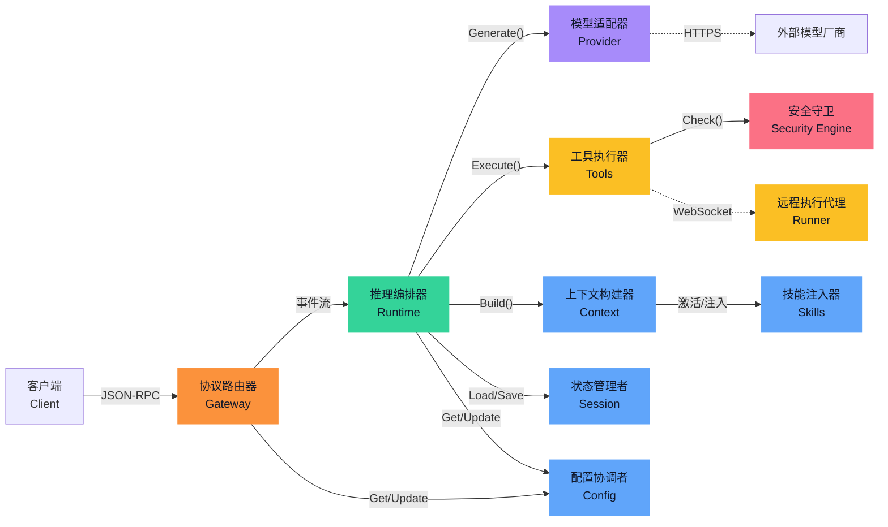

**图 7-3：关键角色关系图。** 实线箭头 = 同步调用依赖；虚线箭头 = 异步/外部通信。颜色：橙=协议边界、绿=编排中枢、紫=适配层、黄=执行层、红=安全、蓝=支撑角色。

| 角色 | 职责 | 关键约束 | 承载模块 |
|------|------|----------|----------|
| **协议路由器** | 将客户端 JSON-RPC 请求路由至正确的处理器；将 Runtime 异步事件中继至订阅的客户端连接；执行连接级认证与 Token 校验 | 不包含任何客户端特化逻辑；不感知模型厂商差异 | Gateway |
| **推理编排器** | 驱动 ReAct 循环：调度上下文构建 → 模型推理 → 工具执行 → 结果回灌；管理 Token 预算与 Compact 触发；协调权限审批的暂停/恢复 | 不直接执行工具逻辑；不内嵌厂商字段；不跨层直连客户端 | Runtime |
| **模型适配器** | 归一化不同厂商的 Chat API 为统一的 `Generate()` + `EstimateInputTokens()` 接口；将厂商特定的流式响应格式转换为标准 `StreamEvent` | 厂商差异不泄漏到 Runtime；每个 Adapter 独立测试 | Provider |
| **工具执行器** | 暴露工具的 Schema 供模型选择；校验参数并执行工具调用；在每次执行前经过安全守卫的权限裁决 | 所有模型可调用的能力收敛于此角色；不在 Runtime 或客户端中绕过 | Tools (Manager) |
| **安全守卫** | 基于策略规则（Priority 排序）裁决每个操作的 allow/deny/ask 决策；校验工作区边界（路径穿越检测、Symlink 解析）；管理会话级权限记忆 | 位于工具执行的关键路径上，不可跳过 | Security Engine |
| **上下文构建器** | 按会话状态 + 预算阈值动态组装 System Prompt 和消息列表；执行上下文压缩（MicroCompact / Full Compact / Trim） | 压缩时不丢失 System Prompt 和 Pin 标记的关键消息；组装顺序稳定 | Context |
| **状态管理者** | 持久化会话消息历史（SQLite）；管理 Checkpoint 快照的创建/恢复/修剪；执行过期会话的自动清理 | 同会话并发写串行化（sessionLock）；消息追加原子化 | Session |
| **技能注入器** | 从文件系统扫描 SKILL.md；管理会话级 Skill 激活状态；按激活列表将 Skill Prompt 注入 System Prompt 的技能段落 | project 层覆盖 global 层（同名去重）；单文件大小限制 1MB | Skills |
| **远程执行代理** | 在远程/本机独立进程中接收 Gateway 的工具执行请求；校验 Capability Token；在本地完成工具执行并返回结果 | 主动连接 Gateway（反向连接）；不开放入站端口；受 WorkdirAllowlist 限制 | Runner |
| **配置协调者** | 管理配置文件加载、校验、热更新和持久化；维护跨会话的 Provider/Model 选择状态；协调多端的 Provider 切换一致性 | 密钥仅通过环境变量引用，不入配置文件；配置变更通过回调通知下游 | Config |

### 7.6 可扩展性设计

NeoCode 在多处预留了扩展点。本节集中描述：**哪里可以扩展、怎么扩展、哪些边界是刻意保留的以及为什么。**

#### 7.6.1 扩展点总览

| 扩展点 | 扩展什么 | 接口/契约 | 生效范围 | 侵入性 |
|--------|----------|----------|----------|--------|
| **Provider** | 新增模型厂商（如接入新的 LLM 服务） | 实现 `Provider` interface（2 方法）：`EstimateInputTokens` + `Generate` | 全局 | 仅需在 `provider/` 下新增包，上层零改动 |
| **Tools** | 新增模型可调用的工具能力 | 实现 `Executor` interface：`Name()` + `ListAvailableSpecs()` + `Execute()` + `Supports()`，注册到 `Registry` | 全局 | 工具 schema 自动进入模型上下文 |
| **MCP** | 动态挂载外部工具（无需写 Go 代码） | MCP stdio 协议（JSON-RPC 子进程） | 会话级或全局 | 零代码：配置 MCP server 路径即可 |
| **Skills** | 注入专用行为 Prompt（不改变工具列表） | 在指定目录下放置 `SKILL.md` 文件（YAML frontmatter + Markdown body） | 会话级（按需激活） | 零代码：文件即 Skill |
| **Client** | 新增客户端类型（如企业微信、Slack、自定义脚本） | 实现适配器：接收外部事件 → 转换为 Gateway JSON-RPC 请求 → 接收 SSE/WS 事件 → 转换为目标格式 | 全局 | Gateway 零改动；适配器独立进程 |
| **Hook** | 在 Runtime 生命周期节点注入自定义行为（如合规检查、自定义日志） | 在 hooks 配置目录下放置可执行文件；支持 `PreToolUse`、`PostToolUse`、`PreCompact`、`SessionStart`、`UserPromptSubmit` 等 hook point | 会话级或全局 | 零侵入：Hook 以子进程运行，通过 stdin/stdout JSON 通信 |
| **Transport** | 新增 Gateway 传输协议（如 gRPC、QUIC） | 实现 `transport.Listener` interface | 全局 | Gateway handler 逻辑不变，仅新增 transport |

#### 7.6.2 扩展机制详解

**Provider 扩展（最常用的扩展点）：**

```
新增模型厂商需要的步骤：
1. 在 internal/provider/ 下创建新包
2. 实现 Provider interface（EstimateInputTokens + Generate）
3. 将厂商特定的流式响应格式转换为统一的 StreamEvent
4. 在配置文件中添加 provider 条目（name + driver + base_url + api_key_env + models）
→ 完成。Runtime 和 Gateway 代码零改动。

为什么接口只有 2 个方法？
- 接口越大，实现成本越高，厂商差异泄漏的风险越大
- "估算 Token 数"和"发起推理"是模型调用的最小完备集
- 其他可变行为（重试策略、超时、模型发现）通过 RuntimeConfig 注入，不进入 interface
```

**工具扩展（有代码 vs 无代码两条路径）：**

| 路径 | 适用场景 | 成本 |
|------|----------|------|
| 实现 `Executor` interface（Go 代码） | 需要深度系统集成的新工具（如 Tree-sitter 代码分析） | 写 Go 代码 + 注册 |
| MCP stdio 子进程（零 Go 代码） | 外部团队的工具、已有 CLI 工具包装 | 配置 JSON 声明 server 路径 |

**客户端扩展（适配器模式）：**

```
第三方接入 NeoCode 的最小合约：
1. 能够发送 JSON-RPC 2.0 请求到 Gateway 的 /rpc 端点
2. 能够接收 SSE 或 WebSocket 事件流
3. (可选) 实现 gateway.authenticate 获取 subject_id

飞书 Adapter 就是按这个合约实现的第一个第三方客户端。
任何能发 HTTP POST + 解析 JSON 的环境（Python 脚本、Shell curl、Node.js 服务）
都可以成为 NeoCode 客户端。
```

#### 7.6.3 刻意保留的边界

以下边界不是技术限制，而是架构假设。修改它们意味着改变了系统的基本设计：

| 边界 | 为什么保留这个边界 |
|------|-------------------|
| **Gateway 是唯一的 RPC 入口** | 如果客户端绕开 Gateway 直连 Runtime，安全认证、流中继、客户端对等性全部失效 |
| **工具执行经过 Security Engine** | 如果某个工具跳过 PolicyEngine + WorkspaceSandbox，整个安全模型无法保证 |
| **Provider 差异不出 Provider 层** | 如果 Anthropic 的工具调用格式泄漏到 Runtime，新增 DeepSeek Provider 时就需要修改 Runtime 代码 |
| **配置文件不存明文密钥** | API Key 通过环境变量引用而非存入 YAML。如果开放此限制，密钥泄漏风险将从"单个环境变量"扩散到"配置文件 + 备份 + 版本控制" |

---

## 8. 核心模块设计

以下选取 9 个最具架构意义的模块，按层从上到下逐一描述。

### 8.1 Gateway（协议路由与多端接入边界）

**存在理由：** Gateway 是系统唯一的 RPC 边界。它的存在不是技术偏好——它是 D2（多端对等接入）和 D4（工具执行可控）的直接推论：如果每个客户端自行接入 Runtime，认证、授权、流式事件中继将在 N 个客户端中重复实现，安全面无法收敛。

**拥有的决策权：**
- 哪个客户端连接被接受（认证）
- 哪个 RPC method 被允许（ACL）
- Runtime 事件路由到哪个客户端连接（流绑定）

**不能知道什么：**
- 不能知道客户端的具体实现（TUI/Web/Desktop/飞书在 Gateway 视角完全相同）
- 不能知道模型厂商的具体字段或协议（Provider 差异不出 Provider 层）
- 不能知道工具的具体执行逻辑（那是 Tools Manager 的职责）

**禁止的调用路径：**
- 客户端直接调用 Runtime 的任意方法 ← 必须经过 Gateway
- Gateway 内嵌特定客户端的 UI 逻辑或消息格式 ← 适配器模式处理
- Gateway 直接执行工具或调用 Provider ← 必须委托给 Runtime

**边界破坏的后果：** 如果客户端绕过 Gateway 直连 Runtime——安全认证分散、流式事件推送需要在每个客户端中重新实现、新增客户端类型需要修改 Runtime。系统的 N×M 复杂度问题从 Gateway 的一层收敛退化为全连接。如果 Gateway 内嵌了客户端特化逻辑——每新增一种客户端类型就需要修改 Gateway，这与"Gateway 无客户端感知"的架构铁律冲突。

**关键接口：** JSON-RPC 2.0 over HTTP（loopback 或网络）；SSE 和 WebSocket 用于流式事件推送；`transport.Listener` 允许替换底层传输协议。详见 §11。

### 8.2 Runtime（ReAct 循环与会话编排）

**存在理由：** Runtime 是系统的神经中枢。但它的核心设计原则是"指挥不执行"——它知道推理循环的每个步骤**何时应该发生**，但不知道每个步骤的**具体实现细节**。这是 D3（多模型可替换）和 D4（工具可控）的共同要求：如果 Runtime 知道 Anthropic 的 tool call 格式，新增 DeepSeek 就需要改 Runtime；如果 Runtime 内嵌了文件写入逻辑，安全审计就需要检查 Runtime 而非仅检查 Tools Manager。

**拥有的决策权：**
- ReAct 循环何时继续、何时终止
- Compact（上下文压缩）何时触发
- 权限审批（`permission_request`）何时暂停、何时恢复
- 工具调用何时并行、何时串行（并发度控制）

**不能知道什么：**
- 不能知道模型厂商的具体协议字段 ← Provider 封装
- 不能知道工具的具体执行逻辑 ← Tools Manager 封装
- 不能知道 Prompt 的组装细节 ← Context Builder 封装
- 不能知道会话的存储格式 ← Session Store 封装
- 不能知道传输协议（HTTP/WS/IPC）← Gateway 封装

**禁止的调用路径：**
- Runtime 直接执行文件 I/O 或 Bash 命令 ← 必须通过 Tools Manager
- Runtime 直接读取模型厂商的原始响应 ← 必须通过 Provider
- Runtime 直接访问 SQLite ← 必须通过 Session Store
- Runtime 直连客户端推送事件 ← 必须通过 Gateway 的 StreamRelay

**边界破坏的后果：** 如果 Runtime 内嵌了工具执行逻辑——每新增一个工具都需要修改 Runtime，5 人并行开发的合并冲突频率将急剧上升，且安全审计被迫检查 Runtime 的每一行代码。如果 Runtime 内嵌了厂商字段——切换模型时会引入难以追踪的回归（"为什么 DeepSeek 的行为和 Anthropic 不同？原因埋在 Runtime 的某个 if-else 里"）。

**关键接口：** `Runtime` interface 定义了与 Gateway 的完整契约（`Submit`、`Run`、`Ask`、`Compact`、`CancelActiveRun`、`ResolvePermission`、`Events()` 等）。所有与下层模块的交互通过 interface 完成，无具体类型依赖。

### 8.3 Provider（多模型厂商协议适配）

**存在理由：** D3（多模型可替换）的工程载体。Provider 层的唯一职责是将不同厂商的 Chat API 归一化为两个操作——估算 Token 数、发起流式推理——使得 Runtime 完全不感知"当前用的是哪个模型厂商"。这是 NeoCode 多模型自由度的结构保障：不是"配置项切换"，而是架构级的接口隔离。

**拥有的决策权：** 如何将厂商特定的请求/响应格式映射到统一的 `GenerateRequest` / `StreamEvent`。

**不能知道什么：** Provider 不依赖 NeoCode 的任何上层模块。它是一个**单向依赖**——仅被 Runtime 调用，自身不调用 Runtime、Gateway、Tools 或 Session。

**禁止的调用路径：** 厂商特定的字段（如 Anthropic 的 `thinking` 预算类型、OpenAI 的 `response_format`）不得以原始形态穿过 Provider 向上传递。如需暴露，必须归一化为 Provider 层定义的通用类型——否则 Runtime 就会产生厂商感知。

**边界破坏的后果：** 如果某个 Provider 的特定行为（如错误格式、tool call 编码方式）被 Runtime 直接依赖——切换模型时 Runtime 行为异常，且排查时需要同时理解 Runtime 和特定 Provider 的实现。这就是"厂商差异泄漏"——也是 ADR-002 明确要避免的。

**关键约束：** `Provider` interface 仅 2 个方法。接口膨胀的代价是每个已有 Provider 实现必须同步修改——因此新增方法需要极其严格的审查。

### 8.4 Tools（工具执行与安全策略引擎）

**存在理由：** D4（工具执行可控）和 D5（Human-in-the-Loop）的工程载体。Tools 层是系统中唯一被允许执行文件 I/O、Bash 命令、网络请求和 MCP 外部工具的模块。任何模型可调用的能力必须在此注册——这是"能力入口收敛"原则（§5.3 原则 2）的实现。

**拥有的决策权：** 哪些工具暴露给模型（Schema 列表）；每次工具调用是否允许执行（经 Security Engine 裁决）；工具结果如何裁剪和格式化（防止输出过大撑爆上下文）。

**不能知道什么：** 工具本身不感知"推理循环的状态"（那是 Runtime 的职责）；不感知"当前用的是哪个模型"（那是 Provider 的职责）；不感知"客户端是谁"（那是 Gateway 的职责）。

**禁止的调用路径：**
- 任何模块绕过 `Manager.Execute()` 直接执行工具 ← Security Engine 的关键路径不可旁路
- Runtime 或客户端直接调用文件系统/shell ← 必须通过 Tools Manager

**边界破坏的后果：** 如果一个新工具被添加到 Runtime 而不是 Tools Manager——安全审计需要同时检查 Runtime 和 Tools 两个模块；如果某个工具绕过 Security Engine 执行——整个安全模型崩溃，因为 D4 的唯一保障是这个关键路径不被旁路。

**关键接口：** `Manager` interface（`ListAvailableSpecs` + `Execute` + `RememberSessionDecision`）；`Executor` interface（每个工具的标准化契约）。Security Engine（`PolicyEngine` + `WorkspaceSandbox`）位于 `Execute()` 的关键路径上，不可跳过。详见 §13.3。

#### 8.4.1 已有工具清单（Inferred from `internal/tools/`）

| 工具名 | 分类 | 说明 |
|--------|------|------|
| `bash` | 系统执行 | 执行 Shell 命令，含 Git 语义分类（只读/远端操作/破坏性） |
| `filesystem_read_file` | 文件系统 | 读取文件内容 |
| `filesystem_write_file` | 文件系统 | 写入/创建文件 |
| `filesystem_edit` | 文件系统 | 基于字符串精确替换的原地编辑 |
| `filesystem_glob` | 文件系统 | 文件名模式匹配 |
| `filesystem_grep` | 文件系统 | 文件内容正则搜索 |
| `filesystem_delete_file` | 文件系统 | 删除文件 |
| `codebase_read` | 代码库 | 读取代码文件（含语义增强） |
| `codebase_search_text` | 代码库 | 基于文本搜索代码库 |
| `codebase_search_symbol` | 代码库 | 基于 Tree-sitter 的跨语言符号搜索 |
| `webfetch` | 网络 | 获取 URL 内容（限制协议与响应大小） |
| `todo_write` | 任务管理 | 创建/更新 Todo 列表 |
| `memo_list` / `memo_remember` / `memo_recall` / `memo_remove` | 记忆 | 跨会话结构化记忆管理 |
| `diagnose` | 诊断 | 分析终端异常输出并给出建议 |
| `spawn_sub_agent` | 编排 | 创建子代理处理独立子任务 |
| MCP 工具（动态） | 扩展 | 通过 MCP stdio 协议挂载的外部工具 |

### 8.5 Session（会话领域模型与 SQLite 持久化）

**存在理由：** D1（本地优先）和 D6（零运维）决定了持久化必须是嵌入式的、零依赖的。Session 层是系统中**唯一拥有会话数据的模块**——消息历史、Token 计数、Todo 列表、Plan 快照、Skills 激活状态的读写全部经由此层。这是 D4（工具可控）的延伸：如果会话状态散落在多个模块中，审计和恢复将不可行。

**拥有的决策权：** 会话何时创建、消息何时追加、何时触发过期清理（30 天无更新）、何时裁剪最旧消息（8192 条硬上限）。

**不能知道什么：** Session 层不感知推理循环的状态（那是 Runtime 的职责），不感知 Prompt 的组装逻辑（那是 Context 的职责）。

**关键不变量：** 同会话的并发写必须串行化（`sessionLock`）；消息追加和 Compact 消息替换必须在 SQLite 事务中原子完成——不能出现"消息写入了但 SessionHead 未更新"的半状态。

#### 8.5.1 Checkpoint（代码版本快照）

D4（工具执行可控）要求 AI 的写操作可回滚。Checkpoint 在每次写操作前（`pre_write`）、每轮结束时（`end_of_turn`）、压缩前（`compact`）自动创建代码快照。快照在 SQLite 中管理，支持恢复和过期修剪。与 Git 并存：有 `.git` 时优先用 Git 版本追踪；无 `.git` 时 Checkpoint 是独立的安全网。

### 8.6 Context（Prompt 构建与上下文压缩）

**存在理由：** "AI 看到了什么"是一个独立于"AI 怎么推理"的架构关注点。将 Context 从 Runtime 中分离出来，意味着 Compact 策略（MicroCompact / Full Compact / Trim）可以独立演进，不需要修改推理循环。

**拥有的决策权：** System Prompt 的组装顺序（`corePrompt → capabilities → rules → taskState → planModeContext → todos → skillPrompt → repositoryContext → systemState` 的固定顺序）；Compact 何时触发、采用什么级别（Micro vs Full vs Trim）；哪些消息不能被压缩（Pin 标记）。

**不能知道什么：** Context 不感知模型厂商的具体协议（那是 Provider 的职责），不感知工具的执行结果（那是 Tools 的职责）。

**关键不变量：** System Prompt（corePrompt + capabilities + rules + skillPrompt）在任何压缩级别下都不参与裁剪——丢失 System Prompt 意味着 AI 失去基本行为约束。Pin 标记的消息（用户原始问题、Plan 批准记录）不被压缩。压缩后的消息列表通过 `ReplaceTranscript` 原子替换。

### 8.7 Skills（可插拔行为注入引擎）

**存在理由：** D3（多模型可替换）和 D4（工具可控）的共同延伸——不仅模型和工具可替换，AI 的**行为模式**也应该可定制。Skills 提供了一条零代码路径：在指定目录放一个 `SKILL.md` 文件，AI 就获得了新的行为能力。与 MCP 互补：Skills 扩展 System Prompt（指示 AI "怎么做"），MCP 扩展工具列表（赋予 AI "能做的新能力"）。

**拥有的决策权：** 哪些 Skill 可用（按 source layer 加载和去重）、哪个 Skill 在哪个会话中被激活。

**关键约束：** 双层来源（project > global）的去重规则——团队可以定义项目级 Skill 覆盖个人全局 Skill。会话级激活管理——Skill 不是全局开关，按需注入，避免 Prompt 膨胀。

### 8.8 Runner（远程工具执行代理）

**存在理由：** D2（多端接入）中最特殊的一环——不是"客户端如何接入 Gateway"，而是"工具执行能力如何跨越物理机边界"。Runner 是系统中**唯一可以运行在不同物理机上的模块**——其余所有核心模块同进程。

**拥有的决策权：** 是否接受工具执行请求（Capability Token 校验 + WorkdirAllowlist）。

**关键约束：** 反向连接模型——Runner 主动连 Gateway（WebSocket），而非 Gateway 连 Runner。这意味着 Runner 可以在 NAT/防火墙后运行，无需公网 IP 或开放入站端口。这是 D1（本地优先）的延伸：工位电脑的代码不需要暴露到公网。

**边界破坏的后果：** 如果 Runner 的 Capability Token 校验被绕过——远程客户端可以通过 Runner 执行任意工具，工作区隔离失效。

### 8.9 Config（配置管理与运行时状态）

**存在理由：** D3（多模型可替换）和 D6（零运维）需要一个集中的配置管理点。所有环境差异项（超时、模型名、路径、Shell）必须通过配置注入，不能硬编码——否则多模型自由切换和多环境部署（本地/内网/离线）无法实现。

**拥有的决策权：** 当前生效的配置是什么（`Manager.Get()` 返回不可变快照）；运行时 Provider/Model 选择状态（`state.Service`）——当一端切换了模型，其他端通过回调感知。

**关键约束：** 密钥不入配置文件——`api_key_env` 仅存储环境变量名，真实密钥在 Provider 发起请求前才从环境变量读取。配置快照 copy-on-read——`Get()` 返回深拷贝，防止调用方意外修改全局状态。

---

## 9. 核心流程与动态视图

以下选取 5 个最具架构意义的运行时流程，逐一描述触发条件、参与组件、关键步骤和异常路径。

### 9.1 主 ReAct 推理循环（Run Flow）

**触发条件：** 客户端通过 Gateway 发送 `gateway.run` 请求，由 Runtime.Submit / Runtime.Run 入口进入。

**参与组件：** Gateway → Runtime → Context Builder → Provider → Tools Manager → Security Engine → Session Store

**流程：**

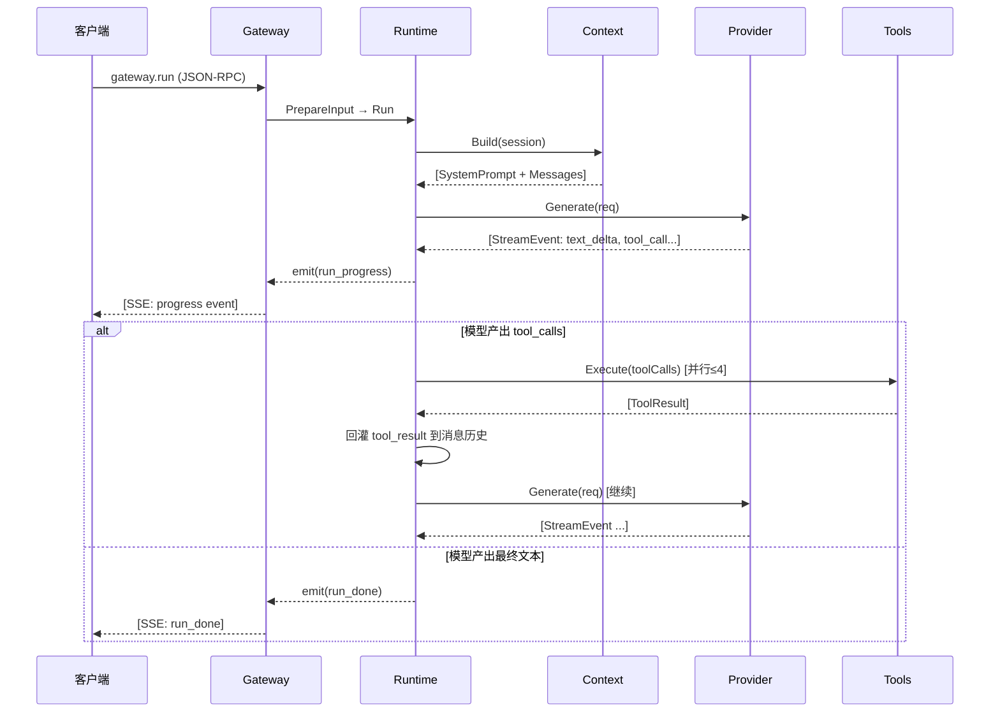

**图 9-1：ReAct 推理循环时序图。** 虚线箭头 = 异步事件；实线箭头 = 同步调用。工具执行在独立 goroutine 中并行调度。

**步骤详解：**

1. **输入归一化**（`PrepareInput` → `UserInput`）：Gateway 将客户端 JSON-RPC 请求转换为领域模型，附加 RunID、SessionID、Workdir、CapabilityToken 等元数据
2. **会话加载与加锁**（`loadOrCreateSession`）：从 SQLite 加载会话；同一 SessionID 的并发 Run 通过 `sessionLock` 串行化（不同会话可并行）
3. **Hook 执行**：触发 `SessionStart` 和 `UserPromptSubmit` 生命周期钩子；若 Hook 返回 `Blocked`，Run 终止并返回阻断原因
4. **用户消息追加**：将用户输入 Parts 作为 `user` 角色消息 append 到会话消息列表
5. **主循环（ReAct Loop）**：
   - `prepareTurnBudgetSnapshot`：检查 Token 预算，若超阈值触发 Compact（参见 §9.2）
   - Context Builder 组装完整 Prompt（参见 §8.6）
   - Provider.Generate 发起流式推理，通过 channel 推送 `StreamEvent`
   - 解析模型回复中的 `tool_calls`：若无工具调用 → 循环结束，产出最终文本
   - 并行执行工具（`executeTools`，默认并发度 4）：每个工具调用经过 Security Engine → Executor → 结果回灌
   - 循环回到步骤 5a，直到模型产出纯文本回复或达到 `max_turns` 上限
6. **终止处理**：发送 `run_done` 事件（含 Token Usage 汇总、Diff 摘要）；更新 Resume Checkpoint；释放会话锁

**异常路径：**

| 异常 | 处理策略 |
|------|----------|
| `max_turns` 达到上限（默认由配置控制） | 发送 `run_error` + `max_turn_limit` 原因；最后一次推理结果仍保留在会话中 |
| Provider 返回错误（网络/限流/认证） | 按 `generate_max_retries` 配置自动重试（在 turn 内最多 `max_attempts` 次）；不可恢复时 `run_error` |
| 工具执行超时 | 返回 error 类型的 ToolResult 回灌给模型（不中断循环），让模型决定如何处理 |
| 用户手动取消（`CancelActiveRun`） | context 取消传播 → `run_error` + `cancelled` 原因 |
| 循环检测（重复工具调用签名） | 若连续 3 轮工具签名相同，注入自愈提醒 Prompt（`NoProgressReminder`）引导模型改变策略 |

### 9.2 上下文压缩流程（Compact Flow）

**触发条件：** 每轮推理前 `prepareTurnBudgetSnapshot` 检测到 Token 消耗接近预算阈值（基于 Provider 的 `EstimateInputTokens` 估算 + 配置的 `compact_trigger_ratio`）。

**参与组件：** Runtime → Context Builder → MicroCompact → Compact Runner (Provider) → Session Store

**流程：**

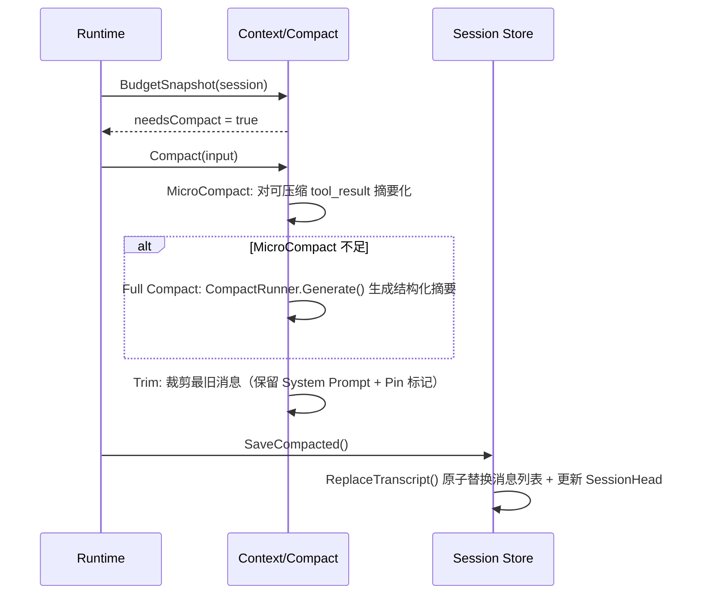

**两级压缩策略：**

| 级别 | 触发条件 | 操作 | 对上下文的影响 |
|------|----------|------|---------------|
| **MicroCompact** | 单次 Tool Call 结果过大，导致本轮预算紧张 | 对单个 tool_result 内容摘要化（保留关键输出，丢弃冗长中间日志） | 仅影响当前工具结果，不改变历史 |
| **Full Compact** | MicroCompact 后仍超预算，或累计历史消息过多 | 将历史消息中可压缩的部分通过 LLM 生成结构化摘要，替换原始消息 | 历史消息被摘要替代，System Prompt + 最近 N 轮保留 |

**关键不变量：**
- System Prompt（corePrompt + capabilities + rules + skillPrompt）永不参与压缩
- Pin 标记的消息（如用户原始问题、Plan 批准记录）不被压缩
- 压缩后的消息列表通过 `ReplaceTranscript` 原子替换（单事务），确保不会出现半压缩状态

### 9.3 权限决策流程（Permission Resolution Flow）

**触发条件：** 工具执行前，Tools Manager 调用 Security Engine 检查操作权限；若决策为 `ask`，Runtime 暂停执行并等待用户决策。

**参与组件：** Runtime → Tools Manager → Security Engine（PolicyEngine + WorkspaceSandbox）→ Gateway → 客户端

**流程：**

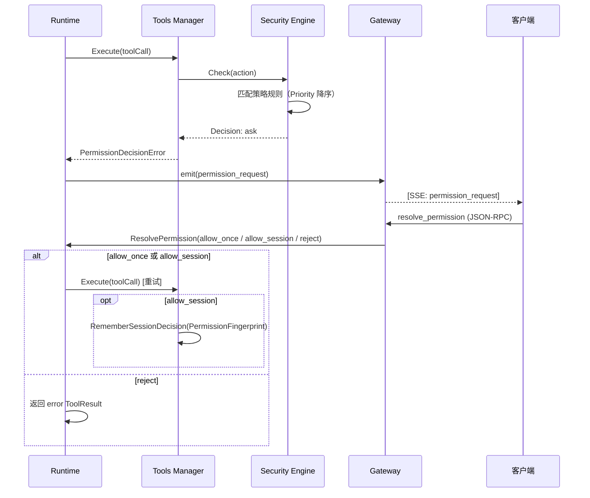

**图 9-3：权限决策时序图。** 关键特征：Runtime 在 `ask` 状态下暂停执行，等待客户端通过 JSON-RPC 回传决策。

**安全决策链：**

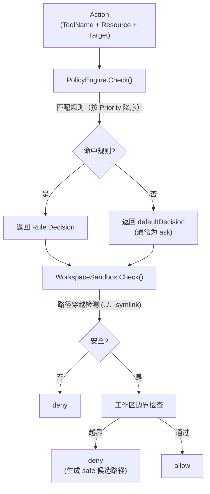

**图 9-4：安全决策链。** 两阶段检查：先过策略引擎（PolicyEngine），再过沙箱（WorkspaceSandbox）。任一阶段拒绝即终止。

**三类决策含义：**

| 决策 | 含义 | 后续行为 |
|------|------|----------|
| `allow` | 安全策略明确放行 | 直接执行 |
| `deny` | 安全策略明确拒绝 | 返回 error ToolResult，不询问用户 |
| `ask` | 需用户判断 | Runtime 暂停，发送 `permission_request` 事件，等待用户通过 `resolve_permission` 回复 |

**会话级记忆：** 用户选择 `allow_session` 后，Manager 调用 `RememberSessionDecision` 将决策持久化到会话权限记忆表，该会话后续同类操作自动放行（基于 `PermissionFingerprint` 匹配）。

### 9.4 Runner 远程工具执行流程

**触发条件：** Gateway 收到工具执行请求，且该 Runner 已注册并空闲，Gateway 将请求通过 WebSocket 转发至远程 Runner 执行。

**参与组件：** Gateway → (WebSocket) → Runner → Tools Manager → Security Engine

**流程：**

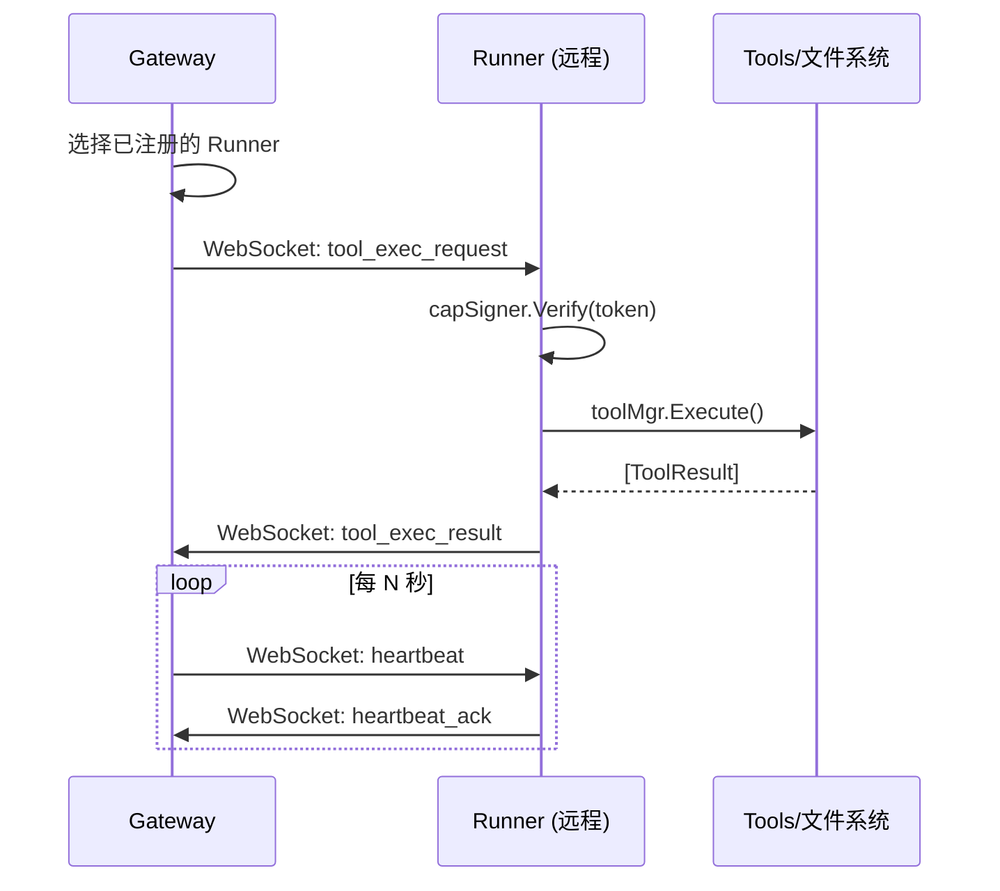

**关键机制：**

| 机制 | 说明 |
|------|------|
| **反向连接** | Runner 主动连接 Gateway（而非 Gateway 连接 Runner），因此 Runner 可位于 NAT/防火墙后 |
| **心跳保活** | 默认 10s 间隔；超时未收到 ack 则判定断连，触发重连 |
| **自动重连** | 指数退避（500ms → 1s → 2s → ... → 10s max） |
| **Capability Token** | 每个工具执行请求附带签名令牌，校验 Runner 是否有权执行该工具及访问目标路径 |
| **工作区白名单** | `WorkdirAllowlist` 限制 Runner 只能访问指定目录，即使 Capability Token 签名有效 |

### 9.5 会话生命周期

**触发条件：** 用户首次发起对话（创建） / 每次 Run（加载 + 追加） / 系统定时任务（清理）。

**状态流转：**

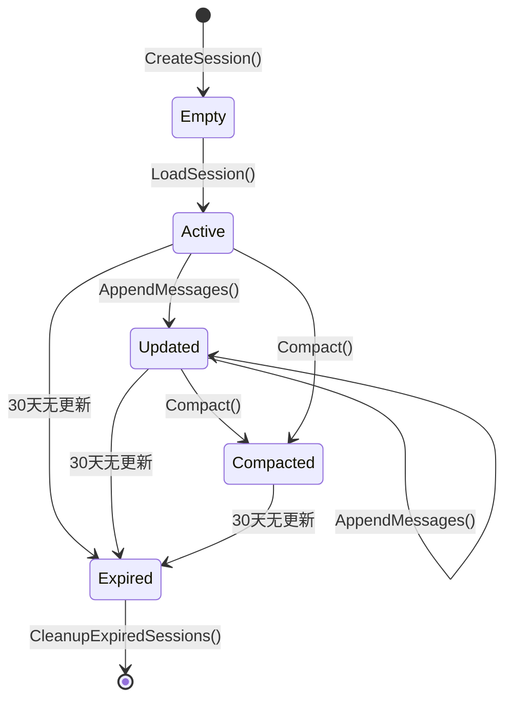

**图 9-2：会话生命周期状态机。** Active/Updated/Compacted 均为活跃状态；30 天阈值通过 `DefaultSessionMaxAge` 配置。

**数据生命周期：**

| 数据类型 | 存储位置 | 生命周期 |
|----------|----------|----------|
| 会话消息历史 | SQLite `messages` 表 | 单会话最多 8192 条；超出自动裁剪最旧消息；30 天未更新则整体清理 |
| 会话头状态 | SQLite `sessions` 表 | 与会话同生命周期 |
| Checkpoint 快照 | SQLite `checkpoint_records` 表 | 每个 Run 内保留；自动修剪（可配置保留数） |
| 权限记忆 | SQLite session_permission 表 | 跟随会话，会话删除时清理 |
| 代码变更 PerEdit | Checkpoint 文件系统存储 | Run 结束时捕获 Diff 摘要，关联 Checkpoint ID 引用 |
| 配置文件 | `~/.neocode/config.yaml` | 持久保留，手动修改 |

### 9.6 端到端动态视图：一次典型代码修改

以下通过一次典型代码修改请求，串联 §9.1-§9.5 的核心流程，展示 Gateway、Runtime、Context、Provider、Tools、Security、Session 在同一 Run 中的协作关系。

> **示例输入：** *"帮我在 auth.go 的 Login 函数里加一个登录失败次数限制，超过 5 次就锁定 30 秒"*

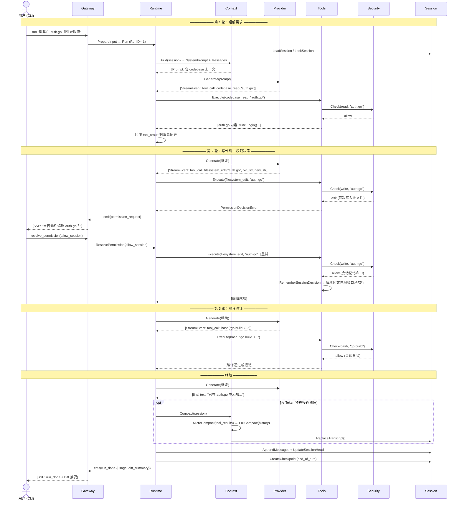

**图 9-5：端到端场景走查时序图。** 此图将五个核心流程（ReAct 循环、权限决策、Compact、Checkpoint、会话持久化）串联为一个完整的用户故事。关键观察：

1. **多轮推理是自然的：** 模型先在轮 1 读文件理解现状，轮 2 写修改，轮 3 跑编译验证——这是 AI Agent 的标准行为模式，不是设计缺陷
2. **权限决策在关键路径上：** `ask → permission_request → resolve_permission` 的暂停-恢复循环是 Human-in-the-loop 的工程实现，在第 2 轮中首次写文件时触发
3. **会话记忆消除重复审批：** 用户选择 `allow_session` 后，同会话内同文件编辑自动放行——这是 Security Engine 的 PermissionFingerprint 机制
4. **安全性在工具层而非 Runtime 层：** 每次工具执行前都经过 Security Engine，Runtime 不需要知道哪些操作是"安全的"
5. **Compact 和 Checkpoint 是隐式的：** 用户不感知 Compact（Token 预算达到阈值时自动触发）和 Checkpoint（每轮 `end_of_turn` 自动创建），但它们是系统安全网的关键组成部分

---

## 10. 数据与状态管理

### 10.1 核心数据模型

**会话聚合根（Session）：**

```
Session
├── ID, Title, Provider, Model          ← 身份与归属
├── CreatedAt, UpdatedAt                ← 时间戳
├── Workdir                             ← 运行时工作目录
├── TaskState                           ← 任务状态快照
│   ├── Summary, Goal, Constraints
│   ├── Architecture, Design
│   └── Progress, NextSteps
├── AgentMode                           ← 当前模式（default / plan）
├── Messages[]                          ← 对话历史（关联数据）
│   ├── UserMessage / AssistantMessage / ToolResult
│   ├── 每条含 ContentPart[]（text / tool_call / tool_result）
│   └── TokenUsage（input / output / cache）
├── ActivatedSkills[]                   ← 已激活的 Skill 列表
├── Todos[]                             ← Todo 列表
│   └── TodoItem: ID, Content, Status, Priority
├── CurrentPlan                         ← 当前 Plan 快照
│   └── PlanArtifact: Revision, Status, Steps, ...
├── TokenInputTotal / TokenOutputTotal  ← 累计 Token 消耗
└── HasUnknownUsage                     ← 是否含未统计的用量
```

**工具调用与结果模型：**

```
ToolCall（模型产出）                ToolResult（系统返回）
├── ID                              ├── ToolCallID（对应）
├── Name（工具名）                   ├── Content（文本结果）
├── Arguments（JSON）                ├── IsError
└── Type（function）                 └── Metadata（结构化事实）
```

### 10.2 关键状态机

#### 10.2.1 任务状态（TaskState）

TaskState 是会话级别的"任务理解"快照，由模型在推理过程中填充和更新。Runtime 在每轮开始时将当前 TaskState 注入 System Prompt 的 `taskState` 段落，确保模型理解当前上下文阶段。

TaskState 本身不强制执行状态转换——它是一个模型填充的数据结构，而非工作流引擎。转换完全由模型决定（在当前轮次的 System Prompt 中看到当前 TaskState 后自行决定是否更新）。

#### 10.2.2 Checkpoint 状态机

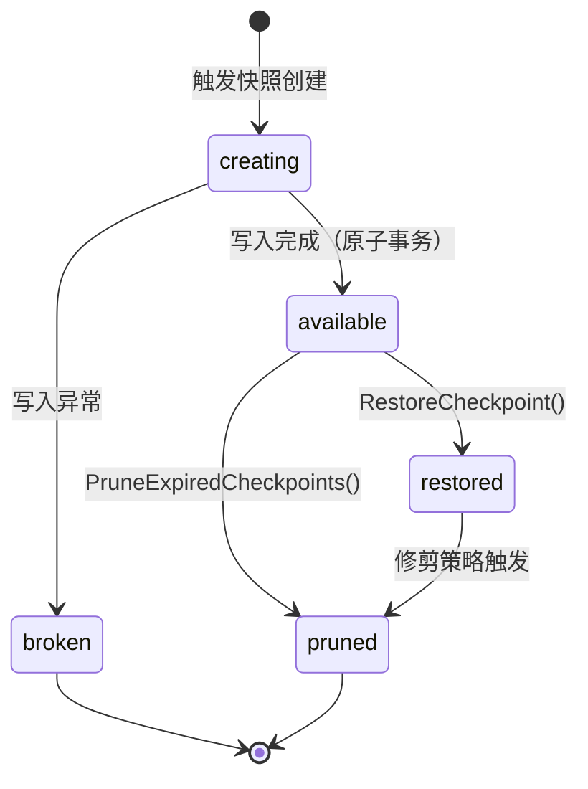

触发创建的场景：`pre_write`（写操作前）、`compact`（压缩前）、`plan_mode`（Plan 模式切换）、`manual`（用户手动）、`end_of_turn`（每轮结束）、`pre_restore_guard`（恢复前的安全快照）。创建和写入在同一 SQLite 事务中完成，确保不会出现"半写入"的快照记录。

#### 10.2.3 权限决策状态

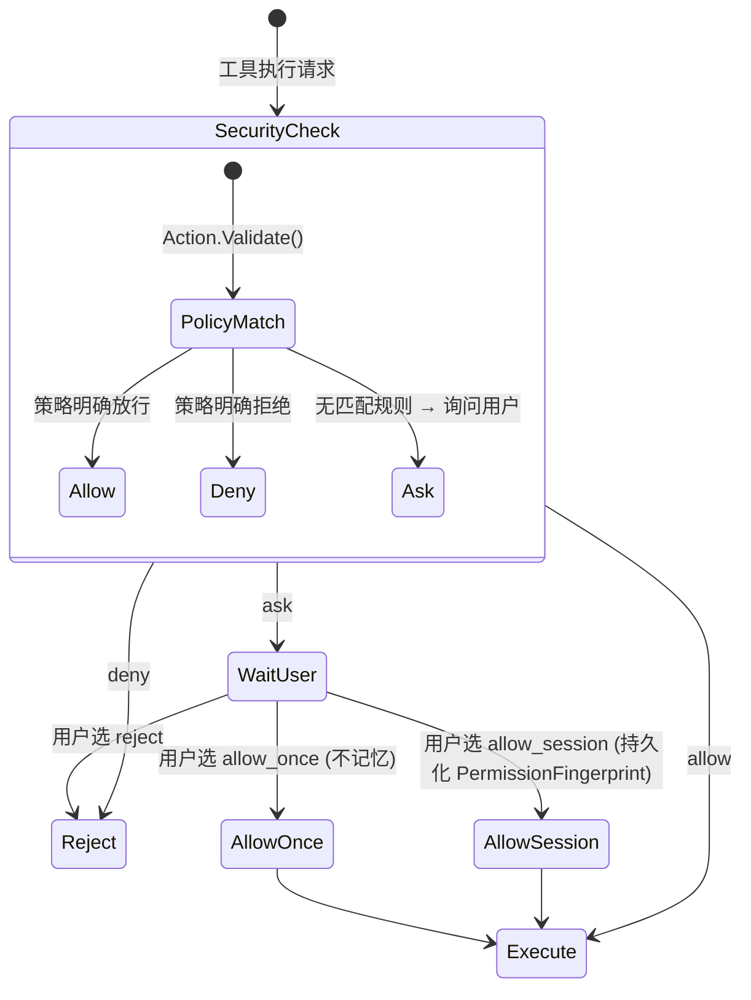

### 10.3 并发控制策略

| 场景 | 机制 | 说明 |
|------|------|------|
| 同一会话并发 Run | `sessionLock`（mutex per sessionID） | 后续同会话 Run 排队等待；不同会话可并行 |
| Config 读写 | `Manager.mu`（RWMutex） + copy-on-read | `Get()` 返回配置快照的深拷贝，写入通过 `Update(mutateFn)` 原子执行 |
| Provider 实例创建 | `providerCreateMu`（Mutex） | 防止并发切换 Provider 时创建重复连接 |
| WebSocket 并发写 | `Runner.writeMu`（Mutex） | 保护 WebSocket 连接级别的并发写入 |
| 工具并行执行 | goroutine + WaitGroup | Runtime 在 ReAct Loop 中并行调度最多 N 个工具（可配置），每个工具在独立 goroutine 中执行 |

### 10.4 数据一致性保证

| 操作 | 一致性级别 | 实现方式 |
|------|-----------|----------|
| 消息追加 | 原子追加 | SQLite 单事务：`INSERT INTO messages` + `UPDATE sessions` |
| Compact 替换 | 原子替换 | `ReplaceTranscript` 在单事务内删除旧消息 + 插入新摘要 + 更新 SessionHead |
| Checkpoint 创建 | 原子写入 | 单事务：`INSERT checkpoint_record` → `INSERT session_cp` → `UPDATE record SET status=available` |
| 配置更新 | 内存原子 + 持久化 | `Manager.Update(mutateFn)` 先在内存应用变更，再整体 `Save()` 落盘 |
| 跨进程状态（Gateway ↔ 客户端） | 最终一致 | Gateway 通过 StreamRelay 广播 Runtime 事件；客户端通过 SSE/WS 订阅更新 |

---

## 11. 接口与集成

### 11.1 通信模式总览

```
┌──────────────────────────────────────────────────────────────────┐
│                        通信协议分层                                │
│                                                                  │
│  请求 / 响应（同步）                                               │
│  ┌──────────────────────────────────────────────────────────┐   │
│  │ 协议: JSON-RPC 2.0                                        │   │
│  │ 传输: HTTP POST（loopback 或网络）                           │   │
│  │ 方向: 客户端 → Gateway → Runtime                           │   │
│  │ 典型 action: run / ask / cancel / resolve_permission      │   │
│  │                                                           │   │
│  │ 请求帧格式:                                                 │   │
│  │ { "jsonrpc": "2.0", "method": "gateway.run",              │   │
│  │   "id": "req-1", "params": {...} }                        │   │
│  │                                                           │   │
│  │ 响应帧格式:                                                 │   │
│  │ { "jsonrpc": "2.0", "type": "ack", "action": "pong",     │   │
│  │   "request_id": "req-1", "payload": {...} }               │   │
│  └──────────────────────────────────────────────────────────┘   │
│                                                                  │
│  事件流（异步）                                                    │
│  ┌──────────────────────────────────────────────────────────┐   │
│  │ 协议: SSE (Server-Sent Events) 或 WebSocket (双向消息)     │   │
│  │ 方向: Runtime → Gateway (StreamRelay) → 客户端             │   │
│  │ 典型事件: run_progress / run_done / run_error /            │   │
│  │          permission_request / ask_chunk / ask_done         │   │
│  │                                                           │   │
│  │ SSE 端点: GET /sse?session_id=...&run_id=...              │   │
│  │ WebSocket 端点: ws://localhost:PORT/ws                     │   │
│  └──────────────────────────────────────────────────────────┘   │
│                                                                  │
│  消息队列（内部）                                                  │
│  ┌──────────────────────────────────────────────────────────┐   │
│  │ 机制: Go channel (StreamRelay 内部 pub/sub)                 │   │
│  │ 方向: Runtime → StreamRelay → 所有订阅连接                   │   │
│  │ 容量: DefaultStreamQueueSize（每个连接独立缓冲）              │   │
│  └──────────────────────────────────────────────────────────┘   │
└──────────────────────────────────────────────────────────────────┘
```

### 11.2 同步 vs 异步交互

| 交互类型 | 同步/异步 | 超时 | 说明 |
|----------|----------|------|------|
| `gateway.run` | 异步 | 无直接超时（30 min Runtime 硬超时） | Gateway 立即返回 ack；后续通过 SSE/WS 推送 run_progress / run_done |
| `gateway.ask` | 异步 | 同上 | 轻量问答，类似 run 但流程更短 |
| `gateway.cancel` | 同步 | 10s | 向 Runtime 发取消信号，等待确认 |
| `gateway.ping` | 同步 | 3s | 连接探活 |
| `gateway.authenticate` | 同步 | 5s | Token 认证 |
| `gateway.resolve_permission` | 同步 | 10s | 用户权限决策，Runtime 在等待此回复时处于暂停状态 |
| Runner → Gateway | 异步 | 30s（请求级） | WebSocket 双向消息 |

### 11.3 认证模型

```
┌─────────────────────────────────────────────────────────┐
│                    认证体系                              │
│                                                         │
│  本地模式（无 Authenticator）                             │
│  ┌─────────────────────────────────────────────────┐   │
│  │ 场景: neocode CLI / TUI (本地 loopback RPC)      │   │
│  │ 身份: auth.DefaultLocalSubjectID = "local_admin" │   │
│  │ 鉴权: gateway.authenticate 自动通过（空 Token）    │   │
│  └─────────────────────────────────────────────────┘   │
│                                                         │
│  网络模式（有 Authenticator）                             │
│  ┌─────────────────────────────────────────────────┐   │
│  │ 场景: Web / Desktop / Runner / Feishu Adapter   │   │
│  │ 身份: Authenticator.ResolveSubjectID(token)      │   │
│  │ 鉴权: 客户端先发送 gateway.authenticate 获取       │   │
│  │       subject_id；后续请求携带此身份               │   │
│  └─────────────────────────────────────────────────┘   │
│                                                         │
│  Runner 额外层                                          │
│  ┌─────────────────────────────────────────────────┐   │
│  │ Capability Token: 签名令牌校验 Runner 有权         │   │
│  │ 执行哪些工具、访问哪些路径                          │   │
│  │ WorkdirAllowlist: Runner 配置级目录白名单          │   │
│  └─────────────────────────────────────────────────┘   │
└─────────────────────────────────────────────────────────┘
```

### 11.4 超时、重试与幂等性

| 机制 | 配置项 | 默认值 | 作用域 |
|------|--------|--------|--------|
| 工具执行超时 | `tool_timeout_sec` | 20s | 单个工具调用（bash 工具可单独配置） |
| 模型首包超时 | `generate_start_timeout_sec` | 90s | Provider.Generate 首次响应 |
| 模型空闲超时 | `generate_idle_timeout` | 由 Provider 决定 | 流式响应中连续无数据 |
| 模型重试 | `generate_max_retries` | 由 Provider 决定 | 同一 turn 内失败重试 |
| Runtime 硬超时 | `defaultRuntimeOperationTimeout` | 30 min | 单次 Run 的最大时长 |
| Runner 请求超时 | `RequestTimeout` | 30s | Runner 侧工具执行等待 |
| Runner 重连 | `ReconnectBackoffMin` / `Max` | 500ms ~ 10s | WebSocket 断连后自动重连 |

**幂等性保障：**
- 每次 Run 生成唯一 `RunID`（客户端或 Gateway 生成），同一 RunID 的重复 submit 被 Gateway 去重
- 工具执行不保证幂等（如 Bash、WriteFile 天然非幂等），由模型在 Prompt 指导下自行判断
- Session 消息追加通过 SQLite 事务保证不重复写入
- Checkpoint 通过 `CheckpointID` 去重

### 11.5 错误分类

参考 Gateway 错误编目（`docs/reference/gateway-error-catalog.md`）：

| 错误类别 | 错误码前缀 | 典型场景 | HTTP 映射 |
|----------|-----------|----------|-----------|
| 认证错误 | `unauthorized` | 无效 Token、未认证连接 | 401 |
| 参数校验 | `invalid_params` | 缺失必填字段、类型错误 | 400 |
| 不支持操作 | `unsupported_action` | 未注册的 action | 400 |
| 运行时错误 | `runtime_unavailable` | Runtime 进程异常 | 503 |
| 会话错误 | `session_not_found` | SessionID 不存在 | 404 |
| 内部错误 | `internal_error` | Gateway 自身异常 | 500 |
| 超时 | `timeout` | 操作超时 | 504 |
| 权限拒绝 | `permission_denied` | 安全策略拒绝 | 403 |

### 11.6 版本兼容策略

| 层面 | 策略 |
|------|------|
| **Gateway RPC API** | JSON-RPC 2.0 协议版本固定为 `"2.0"`；新增 action 不影响旧客户端；废弃 action 保留一个版本过渡期 |
| **Session 数据库 Schema** | `sqliteSchemaVersion` 管理（当前 v7）；启动时自动迁移（`MigrateSchema`） |
| **配置文件** | 向后兼容：新增字段有默认值；废弃字段在加载时忽略并 warn；`StaticDefaults()` 保证旧配置可启动 |
| **Provider 接口** | `Provider` interface 仅 2 个方法，极简稳定；新增可选能力通过 `GenerateRequest` 结构体字段扩展（`omitempty` JSON tag） |
| **Web UI** | 嵌入到 Go binary 中（`web/dist/`），与二进制同版本发布；不独立部署 |
| **自更新** | `go-selfupdate` 机制；二进制整体替换；配置文件不自动迁移（向后兼容保证可用） |

---

## 12. 部署视图

### 12.1 产物矩阵

NeoCode 通过 goreleaser 构建两个二进制产物（Inferred from `.goreleaser.yaml`）：

| 产物 | 入口 | 说明 |
|------|------|------|
| `neocode` | `cmd/neocode/main.go` | 完整 CLI：TUI 交互、Gateway 服务端 (`neocode gateway`)、HTTP Daemon (`neocode daemon`)、Local Runner (`neocode runner`)、Shell 诊断 (`neocode diag`) |
| `neocode-gateway` | `cmd/neocode-gateway/main.go` | 独立 Gateway 二进制：仅包含 Gateway 服务端，适合在服务器上长期运行为守护进程 |

**构建目标矩阵：**

| OS | Arch |
|----|------|
| Linux | amd64, arm64 |
| macOS (darwin) | amd64, arm64 |
| Windows | amd64, arm64 |

所有产物均以 `CGO_ENABLED=0` 静态编译，无系统依赖。Web UI 静态资源（React build 产物）嵌入在 `neocode` 二进制中。

### 12.2 部署拓扑

```
┌─────────────────────────────────────────────────────────────────────┐
│                        单机部署（开发者工作站）                        │
│                                                                     │
│  ┌──────────┐    ┌───────────┐    ┌──────────────┐                 │
│  │neocode   │    │neocode    │    │neocode       │                 │
│  │CLI / TUI │    │gateway    │    │daemon        │                 │
│  │          │───▶│(JSON-RPC) │    │(HTTP :18921) │                 │
│  │          │    │           │    │              │                 │
│  └──────────┘    └─────┬─────┘    └──────┬───────┘                 │
│                        │                 │                          │
│                        │           ┌─────┴────────┐                │
│                        │           │neocode:// URL │                │
│                        │           │Scheme 唤醒    │                │
│                        │           └──────────────┘                │
│                        │                                            │
│            ┌───────────┴───────────┐                                │
│            │   ~/.neocode/          │                               │
│            │   ├── config.yaml      │                               │
│            │   ├── session.db       │                               │
│            │   ├── checkpoint/      │                               │
│            │   └── skills/          │                               │
│            └───────────────────────┘                                │
└─────────────────────────────────────────────────────────────────────┘

┌─────────────────────────────────────────────────────────────────────┐
│                    分布式部署（Runner 反向连接）                       │
│                                                                     │
│  工位电脑 A (NAT/防火墙后)              服务器 / 云主机                │
│  ┌──────────────────────┐            ┌──────────────────────┐       │
│  │ neocode runner       │──WS──────▶│ neocode gateway      │       │
│  │ (工具执行)            │  主动连接  │ (RPC + 事件中继)      │       │
│  └──────────────────────┘            └──────────────────────┘       │
│                                               ▲                      │
│  手机 / 远程                                   │                     │
│  ┌──────────────────────┐                      │                     │
│  │ 飞书 / Web / CLI     │──HTTPS/JSON-RPC─────┘                    │
│  └──────────────────────┘                                           │
└─────────────────────────────────────────────────────────────────────┘
```

**图 12-1：部署拓扑。** 单机模式（上）：所有组件在同一台机器上，通过本地 loopback RPC 通信。分布式模式（下）：Local Runner 主动连接 Gateway，使远程客户端可以通过 Gateway 驱动 Runner 所在机器的工具执行。

### 12.3 环境隔离

| 环境 | 数据目录 | 说明 |
|------|----------|------|
| 默认 | `~/.neocode/` | 所有数据（配置、会话、Checkpoint、Skills 缓存）的根目录 |
| `NEOCODE_HOME` 覆盖 | `$NEOCODE_HOME/` | 通过环境变量切换数据目录，支持多 Profile 隔离 |
| 工作目录 | `--workdir` / `workdir` 配置项 | 限制工具的文件系统访问边界 |

### 12.4 扩缩容考量

| 维度 | 限制 | 说明 |
|------|------|------|
| 单机并发会话 | 无进程级上限 | 不同会话通过 `sessionLock` 并行执行；同会话串行化 |
| Gateway 连接数 | `DefaultNetworkMaxStreamConnections`（可配置） | 超过上限时新连接收到 `too_many_connections` 错误 |
| Session 消息量 | 单会话最多 8192 条 | 超限自动裁剪最旧消息 |
| Runner 数量 | 无硬限制 | 多个 Runner 可注册到同一 Gateway，Gateway 按策略选择执行节点 |
| 数据库容量 | SQLite 单文件 | 30 天过期会话自动清理，Checkpoint 自动修剪 |

---

## 13. 安全设计

### 13.1 安全模型总览

NeoCode 的安全设计遵循**纵深防御**原则：不依赖单一安全机制，而是在多个层面上独立校验。

```
外部输入（用户/IM/CI）
        │
        ▼
┌──────────────────┐  第 1 层：认证
│ Gateway Auth     │  Token 校验 → subject_id
│ (本地/网络模式)    │  未认证连接仅允许 ping + authenticate
└────────┬─────────┘
         │
         ▼
┌──────────────────┐  第 2 层：ACL 授权
│ Gateway ACL      │  method × source 白名单
│ (每连接级)         │  未授权 method → acl_denied
└────────┬─────────┘
         │
         ▼
┌──────────────────┐  第 3 层：工具级安全策略
│ Security Engine  │  PolicyEngine（规则匹配）
│ (每次调用)         │  + WorkspaceSandbox（路径校验）
└────────┬─────────┘  + CapabilityToken（Runner 权限）
         │
         ▼
┌──────────────────┐  第 4 层：操作系统约束
│ OS 级隔离         │  进程权限 = 当前用户
│                  │  文件系统权限 = OS ACL
└──────────────────┘  网络边界 = 本机 loopback
```

### 13.2 认证（Authentication）

所有客户端（无论 TUI、Web、Desktop 还是第三方）统一通过 **JSON-RPC `gateway.authenticate`** 方法完成认证。Gateway 侧根据是否配置了 `Authenticator` 决定如何处理认证请求：

| 模式 | Gateway 配置 | 认证行为 | 典型场景 |
|------|-------------|----------|----------|
| **本地模式** | 未配置 `Authenticator` | `gateway.authenticate` 可直接调用（允许空 Token），Gateway 自动授予 `local_admin` 身份 | 开发者在自己机器上启动 CLI，Gateway 默认无 Authenticator |
| **网络模式** | 配置了 `Authenticator` | 客户端必须提供有效 Token → Authenticator 解析为 `subject_id` → 连接携带此身份发起后续请求 | Web UI、Desktop、Runner、飞书 Bot 等通过 HTTP 连接 Gateway 的场景 |

**关键安全属性：**
- Gateway 在本地模式下仅接受 loopback 地址连接（`127.0.0.1`），不可从外部网络访问
- 网络模式下的 `Authenticator` 是可插拔接口：内置 static token 实现，可替换为 OAuth2/JWT/LDAP 等
- `subject_id` 在连接生命周期内不变，作为所有操作的审计主体标识
- 所有客户端使用**同一套 RPC 协议**完成认证，不存在"IPC 免认证旁路"——这是 Gateway 作为统一安全边界的基础

### 13.3 授权（Authorization）

**Gateway ACL（连接级）：** 每个连接在认证后获得 ACL profile，控制允许调用的 RPC method 列表。未在 ACL 白名单中的 method 返回 `acl_denied`。

**Security Engine（操作级）：** 每次工具执行前经过两阶段检查：

| 阶段 | 组件 | 检查内容 |
|------|------|----------|
| 策略匹配 | `PolicyEngine.Check()` | 按 Priority 降序遍历 `PolicyRule` 列表；匹配条件包括 ActionType、Resource（工具名）、TargetPrefix（路径前缀）、HostPatterns（URL 域名）等；命中返回 `allow` / `deny` / `ask` |
| 沙箱校验 | `WorkspaceSandbox.Check()` | 路径穿越检测（`../`、Symlink 逃逸）→ `deny`；工作目录边界检查 → 越界时自动生成 safe 候选路径 |

**敏感路径自动检测：**

Security Engine 内置敏感路径特征库，无需配置即可检测：
- 目录关键词：`secrets`、`.ssh`、`.gnupg`、`.aws`、`.config`
- 文件名模式：`.env`、`*.secret`、`*.token`、`*.key`、`*.pem`、`id_rsa`、`id_ed25519` 等
- 命中敏感路径的操作自动升级为 `deny`（即使 PolicyRule 未显式配置）

### 13.4 密钥管理

| 原则 | 实现 |
|------|------|
| **不入配置文件** | `api_key_env` 配置项仅存储环境变量名，不存储密钥值 |
| **仅在内存中使用** | `APIKeyResolver(envName)` 在 Provider 发起请求前才从环境变量读取 |
| **不入日志** | 日志、调试输出、配置快照序列化时排除 `api_key_env` 的值域 |
| **不通过 Gateway 传输** | Provider 调用直接从 Runtime 进程发起，密钥不经过 Gateway 的 RPC 通道 |
| **Runner 隔离** | Runner 的 Capability Token 使用 HMAC-SHA256 签名，包含工具白名单和路径白名单，有时效性 |

### 13.5 输入校验

| 校验点 | 机制 |
|--------|------|
| **JSON-RPC 参数** | Gateway 在 dispatch 前对每个 action 的 params 做结构校验；必填字段缺失 → `invalid_params` |
| **工具参数** | 每个 `Executor` 在 `Execute()` 中独立校验参数；bash 工具检测交互式命令（`vim`、`top` 等）并拒绝执行 |
| **文件路径** | 所有路径先经 `ResolveWorkspacePath()` 归一化（解析相对路径、Symlink），再经 Sandbox 校验 |
| **URL** | `webfetch` 工具限制协议（仅 http/https）、限制响应大小（可配置）、禁止访问内网地址（可配置） |
| **消息内容** | 用户输入 Parts 在 Runtime 入口做基本合法性校验（非空、格式正确） |

### 13.6 审计追踪

| 审计要素 | 记录方式 |
|----------|----------|
| **主体标识** | 每个请求携带 `subject_id`，贯穿 Gateway → Runtime → Session 全链路 |
| **请求追踪** | `SessionID + RunID` 唯一标识一次完整的用户交互；所有事件（run_progress、tool_call、permission_request）附带这两个 ID |
| **操作审计** | 工具执行前 Security Engine 的 Check 调用记录 Action 详情（ToolName、Resource、TargetType、Target、NormalizedIntent） |
| **权限记忆** | `allow_session` 决策持久化到 SQLite，可追溯"谁在何时对什么操作授权了会话级放行" |
| **指标暴露** | GatewayMetrics 提供 `auth_failures_total`（认证失败）、`acl_denied_total`（ACL 拒绝）等安全相关计数器 |

---

## 14. 可观测性设计

### 14.1 指标（Metrics）

Gateway 内置 Prometheus 指标收集器（`GatewayMetrics`，Inferred from `internal/gateway/metrics.go`），同时提供 Prometheus 格式和 JSON 格式的指标端点。

| 指标 | 类型 | 标签 | 说明 |
|------|------|------|------|
| `gateway_requests_total` | Counter | source, method, status | RPC 请求总量，按来源、方法、状态分组 |
| `gateway_auth_failures_total` | Counter | source, reason | 认证失败总量 |
| `gateway_acl_denied_total` | Counter | source, method | ACL 拒绝总量 |
| `gateway_connections_active` | Gauge | channel | 当前活跃流连接数（按 WS/SSE 通道） |
| `gateway_stream_dropped_total` | Counter | reason | 流连接剔除总量 |

**指标端点：**

| 端点 | 格式 | 说明 |
|------|------|------|
| `GET /metrics` | Prometheus text | Prometheus scrape 目标 |
| `GET /metrics.json` | JSON | 供 UI 面板或自定义监控消费 |
| `GET /healthz` | `{"status":"ok"}` | 存活探针 |

### 14.2 日志

| 层面 | 机制 | 说明 |
|------|------|------|
| Runtime | Go `log.Printf` | 关键生命周期事件（Checkpoint 创建/恢复失败、Compact 触发、Hook 执行）使用 `log.Printf` 输出到 stderr |
| Gateway | Go `log.Printf` + `http.Handler` 错误包装 | 连接异常、认证失败、流中继错误 |
| Runner | 可配置 `*log.Logger` | 默认输出到 stderr，前缀 `runner: ` |

**日志安全约束：**
- 不得在日志中输出 API Key 明文
- 不得在日志中输出用户消息内容（隐私）
- 工具调用参数中的敏感路径名（如 `.env`）在日志中以归一化相对路径替代绝对路径

### 14.3 分布式追踪

NeoCode 不使用外部分布式追踪系统（Jaeger/Zipkin），而是通过 **应用级标识符串联** 实现端到端可追踪性：

```
SessionID（会话级） + RunID（单次运行级）
     │                      │
     └──────────────────────┘
              │
    贯穿所有层：
    Client → Gateway → Runtime → Provider → Tools → Session Store
```

**附加追踪信息：**
- `TaskID` + `AgentID`：子代理调用链追踪
- `RequestID`：单次 JSON-RPC 请求-响应匹配
- `ToolCallID`：模型工具调用与执行结果的关联

### 14.4 健康检查

| 探针 | 端点 | 说明 |
|------|------|------|
| **HTTP Daemon 存活** | `GET /healthz` → 200 | Daemon 进程存活 + HTTP 服务正常 |
| **Gateway 存活** | `GET /healthz` → 200 | Gateway 进程存活 + HTTP 服务正常 |
| **Gateway 就绪** | `gateway.ping` JSON-RPC | 全链路可达（客户端 → Gateway → Runtime） |

---

## 15. 架构决策记录（ADR）

以下记录 NeoCode 架构演进过程中的关键决策，遵循 ADR 标准格式（Context → Alternatives → Decision → Consequences）。

### ADR-001：Gateway 作为唯一 RPC 边界

**状态：** Accepted

**背景：** 系统需要支持多种客户端（TUI、Web、Desktop、飞书 Bot、CI/CD 脚本）。若每个客户端独立接入 Runtime，认证、授权、流式中继将在 N 个客户端中重复实现。

**替代方案：**

| 方案 | 评估 |
|------|------|
| 各客户端直连 Runtime | 安全逻辑分散、新客户端接入成本高、Runtime 需理解传输协议 |
| 按客户端类型分别建 Gateway | 仍有重复逻辑，且客户端类型增加时需要新增 Gateway |
| **单一 Gateway 统一 RPC** | 安全收敛、客户端对等化、流式中继集中管理 |

**决策：** 所有客户端必须通过 Gateway 的 JSON-RPC 接口与 Runtime 通信。Gateway 是系统唯一的跨边界通道。

**后果：**
- 变得更容易：新增客户端类型只需实现 JSON-RPC 客户端；安全审计只需检查 Gateway 一个入口
- 变得更困难：Gateway 成为单点故障（通过本地自动拉起 + 健康检查 + 快速重启缓解）
- 需要关注：Gateway 不得包含任何客户端特化逻辑——这是架构铁律，违反将侵蚀客户端对等性

### ADR-002：Provider 插件化（2 方法接口）

**状态：** Accepted

**背景：** AI 模型市场快速变化，新模型不断涌现。系统必须支持随时切换到新模型而不修改上层代码。

**替代方案：**

| 方案 | 评估 |
|------|------|
| 统一内部模型协议，Gateway 做转换 | Gateway 职责膨胀，每种新模型的流式格式差异需在 Gateway 处理 |
| 每个客户端自行集成模型 SDK | 模型切换需更新所有客户端，密钥分散管理 |
| **Provider interface（2 方法 + channel）** | 上层零改动接入新模型，厂商差异收敛在 Provider 包内 |

**决策：** `Provider` interface 仅定义 `EstimateInputTokens` + `Generate(ctx, req, events chan)`。所有厂商差异收敛在各自的 Provider 实现中。

**后果：**
- 变得更容易：新增模型只需写 adapter；测试只需注入 Mock Provider
- 变得更困难：Provider interface 极度简洁，但某些厂商的高级特性（如 thinking、caching）需要统一抽象层来表达
- 需要关注：接口不可膨胀——每次新增方法需严格审查是否值得破坏所有已有 Provider 实现

### ADR-003：事件驱动的异步工具执行

**状态：** Accepted

**背景：** AI 推理是流式的（token 逐个产出），可能持续数十秒到数分钟。纯同步调用在推理完成前客户端完全黑屏，且无法支持中途取消或实时权限审批。

**替代方案：**

| 方案 | 评估 |
|------|------|
| 同步回调（Run 阻塞等待完成） | 用户体验差，无法中途干预 |
| 客户端轮询（定时查询执行状态） | 延迟高、带宽浪费、权限审批需实时交互 |
| **进程内事件驱动（Go channel）** | 流式实时、Human-in-the-loop、支持并行工具执行 |

**决策：** 推理结果、工具调用、权限请求、Token 用量全部通过 `RuntimeEvent` channel 异步发出，由 Gateway StreamRelay 中继到客户端。

**后果：**
- 变得更容易：Human-in-the-loop（`permission_request` 暂停等待用户决策）；流式文本透出（用户可见 AI "打字"过程）；全链路追踪（SessionID + RunID 贯穿所有事件）
- 变得更困难：客户端需要支持 SSE/WebSocket 长连接；事件顺序一致性需在 Runtime 层保证
- 需要关注：channel buffer 满时的背压策略（当前为丢弃 + drop 计数）

### ADR-004：强边界单体架构

**状态：** Accepted

**背景：** NeoCode 运行在开发者本地机器上（单机单用户），同时由 5 人团队并行开发，需要模块独立演进但不需独立部署。

**替代方案：**

| 方案 | 评估 |
|------|------|
| 微服务（每模块独立进程） | 单机场景下序列化开销、网络延迟、运维复杂度都是净成本 |
| 纯单体（模块间直接调用，无接口边界） | 无法支持 5 人并行开发和 Provider 零侵入可扩展性 |
| **强边界单体（interface 解耦）** | 编译时类型安全 + 零网络延迟 + 单一二进制部署 |

**决策：** 核心模块在同一进程中通过 Go interface 解耦，享受单体部署的简单性同时保持模块边界的严格性。仅当模块确实需要跨越物理机边界时（Runner），才拆分为独立进程。

**后果：**
- 变得更容易：单一二进制分发（`CGO_ENABLED=0` 静态编译）；无外部服务依赖；调试简单（单进程内追踪）
- 变得更困难：模块间耦合只能通过接口契约约束（无法通过网络隔离强制执行）；单进程内存压力（需关注 Compact 和内存泄漏）
- 需要关注：若未来出现多用户共享同一 NeoCode 实例的场景，可能需要重新审视此决策

### ADR-005：SQLite 作为唯一持久化存储

**状态：** Accepted

**背景：** 会话数据（消息历史、Token 统计、Checkpoint 快照）需要可靠持久化，但单机场景不需要外部数据库。

**替代方案：**

| 方案 | 评估 |
|------|------|
| PostgreSQL / MySQL | 需要用户安装和运行数据库服务 → 违反零依赖部署 |
| 纯文件存储（JSON/YAML） | 并发写不安全、无法原子事务（Compact 替换时危险）、查询需全量加载 |
| **SQLite（modernc 纯 Go）** | ACID 事务、零外部依赖、单文件存储、开箱即用 |

**决策：** 所有持久化（会话、Checkpoint、权限记忆）使用 SQLite，通过 modernc 纯 Go 实现消除 CGO 依赖。

**后果：**
- 变得更容易：单文件备份（复制 `session.db`）；原子事务（Compact 替换消息列表、Checkpoint 创建）
- 变得更困难：写并发受限（SQLite 单 writer），同会话并发写需显式加 `sessionLock`
- 需要关注：数据库文件大小增长（8192 条消息/会话 × 多会话），通过 30 天过期清理 + Checkpoint 自动修剪控制

### ADR-006：JSON-RPC 2.0 作为 RPC 协议

**状态：** Accepted

**背景：** Gateway 需要一种通用协议，使得任何客户端（从 Go TUI 到 Python 脚本到飞书服务端）都能平等接入。

**替代方案：**

| 方案 | 评估 |
|------|------|
| gRPC | 需要 protobuf 编译步骤 → 第三方接入门槛高；调试需专用工具 |
| REST | 资源建模适合 CRUD，NeoCode 的操作是动词型的（`gateway.run`、`gateway.cancel`），硬映射不自然 |
| **JSON-RPC 2.0** | 极简协议、人类可读、任何能发 HTTP POST 的环境都能接入 |

**决策：** 客户端-Gateway 间使用 JSON-RPC 2.0 作为请求/响应协议。流式事件通过 SSE 或 WebSocket 推送。

**后果：**
- 变得更容易：第三方接入成本最低（发 JSON 即可）；调试简单（可抓包查看明文）；与 SSE/WS 配合自然
- 变得更困难：无强类型 schema（对比 protobuf）；错误格式需自行规范化（`FrameError` + `GatewayRPCError`）
- 需要关注：JSON-RPC 的 batch 和 notification 语义当前不使用，避免引入复杂度

### ADR-007：Runner 反向连接模型

**状态：** Accepted

**背景：** "手机飞书发指令 → 工位电脑执行代码"的场景要求 Runner 能穿过 NAT/防火墙接收指令。

**替代方案：**

| 方案 | 评估 |
|------|------|
| Gateway 主动连接 Runner | Runner 需开放入站端口 → 企业网络通常不允许 |
| VPN/隧道统一网络 | 增加运维成本，不适合"即装即用"体验 |
| **Runner 主动连接 Gateway（反向连接）** | Runner 位于 NAT 后也可用，无需开放入站端口 |

**决策：** Runner 启动后通过 WebSocket 主动连接 Gateway 并注册自身。Gateway 将工具执行请求通过该 WebSocket 连接下发给 Runner。

**后果：**
- 变得更容易：Runner 可在任何网络环境下运行（仅需出站 HTTPS）；即装即用，零网络配置
- 变得更困难：Gateway 需管理 Runner 注册/心跳/断连重连；重连期间的工具请求需排队
- 需要关注：WebSocket 连接安全（通过 Capability Token 签名校验工具权限和路径白名单）

### ADR-008：Checkpoint 本地代码版本快照

**状态：** Accepted

**背景：** AI Agent 的写操作（文件编辑、删除）可能出错。需要一个轻量级的回滚安全网，且不能依赖用户已初始化 Git。

**替代方案：**

| 方案 | 评估 |
|------|------|
| 仅依赖 Git（`git stash` / `git checkout`） | 非 Git 仓库无法使用；AI 修改粒度远细于 commit |
| 全量文件备份 | 大仓库空间开销不可接受；恢复粒度粗 |
| **Checkpoint 快照（SQLite 记录 + 文件存储）** | 细粒度、自动触发、与 Git 并存、轻量 |

**决策：** 在每次写操作前（`pre_write`）、每轮结束（`end_of_turn`）、上下文压缩前（`compact`）自动创建 Checkpoint 快照。有 `.git` 时优先用 Git 版本追踪，无 `.git` 时 Checkpoint 提供独立安全网。

**后果：**
- 变得更容易：用户无需任何操作即有安全网；支持选择性恢复；自动修剪避免空间膨胀
- 变得更困难：需管理 Checkpoint 生命周期（creating → available → restored/pruned）；大文件（二进制、vendor）的快照效率需持续优化
- 需要关注：快照频率与磁盘空间的平衡（通过 `maxAutoKeep` 和过期修剪控制）

---

## 16. 架构风险

以下逐项记录当前架构中的已知风险及每项的缓解计划。已知局限和技术债清单见 `docs/tech-debt.md`。

### 16.1 风险清单

| 风险 | 严重度 | 描述 | 缓解措施 |
|------|--------|------|----------|
| **Gateway 单点故障** | 中 | 所有客户端依赖 Gateway 作为唯一入口；Gateway 进程异常时整个系统不可用 | 客户端内置自动拉起（auto-spawn）；本地 loopback 部署下 Gateway 与 CLI 同生命周期；网络模式下建议部署多个 Gateway 实例（当前未实现） |
| **模型行为不可预测** | 高 | 底层模型升级或切换时，Agent 的行为可能发生微妙变化（推理深度、工具选择偏好、错误处理风格），且这种变化难以通过自动化测试捕获 | Provider 层契约极简（2 方法），限制厂商差异扩散；100% 覆盖率的框架层测试确保框架逻辑不受影响；实际模型行为通过验收测试（`runtime/acceptance/`）做抽样验证 |
| **SQLite 写并发瓶颈** | 低 | 同会话的所有写操作（追加消息、更新状态、Compact 替换）串行执行；当需要跨多个会话做批量分析时单 writer 限制成为瓶颈 | 同会话并发写已通过 `sessionLock` 串行化，不同会话可并行；当前用户场景（单用户、顺序交互）下不构成实际瓶颈；若未来需要批量跨会话操作，可通过读写分离（读可并发）缓解 |
| **上下文窗口天花板** | 中 | 即使有 Compact，模型原生的 context window 有硬限制（如 Claude 200K、GPT-4 128K）；对于超长会话，最终仍会达到无法继续的临界点 | Compact 两级策略（Micro + Full）最大化利用现有窗口；`max_turns` 限制防止无限循环；长期来看需借助模型厂商的 context window 增长 |
| **TOCTOU 路径竞态** | 低 | 文件系统操作在 Security Engine 校验通过后、实际读写前，目标路径的状态可能被外部进程改变（symlink 替换攻击） | 当前在校验时 resolve symlink，但存在微小的时间窗口；现代 OS 的 `O_NOFOLLOW` 等标志可进一步缓解；实际攻击面极小（本地单用户场景） |

## 17. 附录

> 本附录用于统一术语和索引相关文档，不属于架构主体内容。

### 17.1 术语表

| 术语 | 定义 |
|------|------|
| **ReAct Loop** | Reasoning + Acting 循环：模型推理 → 解析工具调用 → 执行工具 → 回灌结果 → 继续推理，直到产出最终文本回复 |
| **Compact** | 上下文压缩：当对话历史累积到接近 Token 预算上限时，自动将历史消息摘要化或裁剪，以释放上下文空间 |
| **MicroCompact** | 轻量级压缩：仅对单个 tool_result 内容做摘要化，不改变消息列表结构。是 Compact 的第一阶段 |
| **StreamRelay** | 流式中继：Gateway 内部将 Runtime 的异步事件按 SessionID/RunID 广播到所有订阅客户端连接的 pub/sub 机制 |
| **Checkpoint** | 代码版本快照：AI 执行写操作前自动创建的文件状态快照，支持恢复和 Diff 查看 |
| **Human-in-the-loop** | 人机协作模式：AI 在执行可能危险的操作（如写文件、执行 Bash）前暂停，等待人类审批 |
| **Capability Token** | 能力令牌：Runner 执行工具时携带的 HMAC 签名令牌，限定允许的工具列表、路径范围和有效期 |
| **Skill** | 技能：通过 SKILL.md 文件定义的专用行为 Prompt，在会话中按需激活并注入 System Prompt |
| **MCP** | Model Context Protocol：通过本地 stdio 子进程动态挂载外部工具的开放协议 |
| **Provider** | 模型厂商适配器：实现统一 Generate 接口、封装厂商特定协议和流式格式的插件化组件 |
| **Gateway** | 协议路由层：系统唯一的 RPC 入口，负责客户端认证、请求路由和事件流中继 |
| **Runner** | 远程工具执行代理：独立进程，通过 WebSocket 主动连接 Gateway，在本地执行 Gateway 下发的工具请求 |
| **ADR** | Architecture Decision Record：架构决策记录，记录背景、替代方案、决策和后果 |

### 17.2 相关文档索引

| 文档 | 路径 | 说明 |
|------|------|------|
| Gateway RPC API 参考 | `docs/reference/gateway-rpc-api.md` | 完整的 JSON-RPC method、params、error code 定义 |
| Gateway 错误编目 | `docs/reference/gateway-error-catalog.md` | 所有 Gateway 错误码的语义和 HTTP 映射 |
| Gateway 兼容性 | `docs/reference/gateway-compatibility.md` | 跨版本兼容性保证 |
| TUI-Gateway 契约矩阵 | `docs/reference/tui-gateway-contract-matrix.md` | TUI 与 Gateway 间的协议契约 |
| Provider 接入指南 | `docs/guides/adding-providers.md` | 如何新增模型厂商 |
| Gateway 集成指南 | `docs/guides/gateway-integration-guide.md` | 第三方客户端接入指南 |
| MCP 配置指南 | `docs/guides/mcp-configuration.md` | MCP Server 配置详解 |
| 飞书适配器指南 | `docs/guides/feishu-adapter.md` | 飞书 Bot 接入配置 |
| Context Compact 详解 | `docs/context-compact.md` | Compact 策略和预算管理的实现细节 |
| Runtime 事件流 | `docs/runtime-provider-event-flow.md` | Runtime 与 Provider 间的事件协议 |
| Stop Reason 决策 | `docs/stop-reason-and-decision-priority.md` | 停止原因和决策优先级 |
| Skills 系统设计 | `docs/skills-system-design.md` | Skills 系统的详细设计 |
| Gateway 详细设计 | `docs/gateway-detailed-design.md` | Gateway 内部实现细节 |
| 开发规范 | `AGENTS.md` | 项目 AI 协作规则、模块边界、编码规范 |

