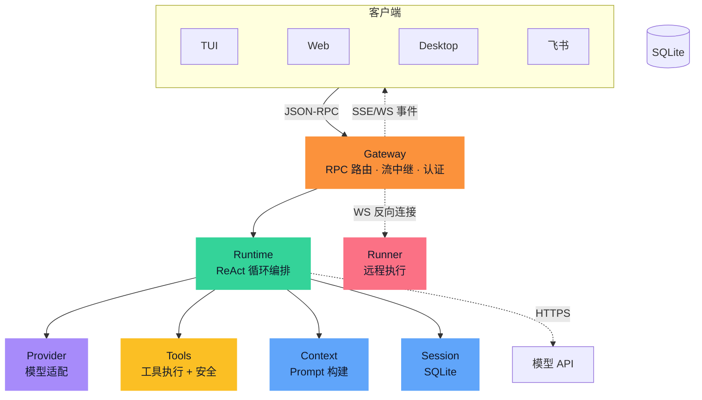
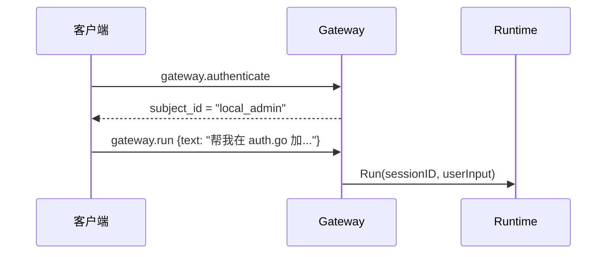
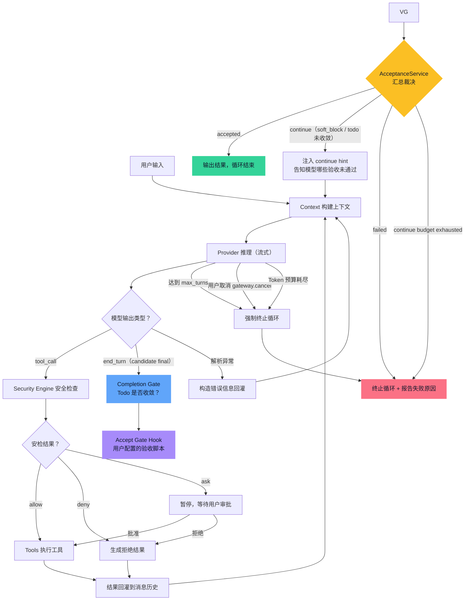
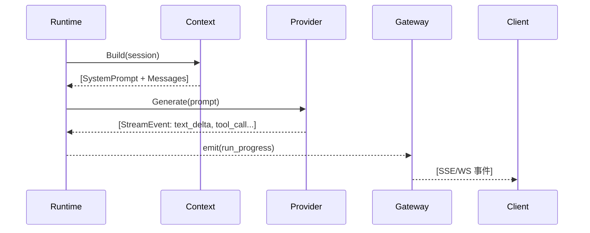
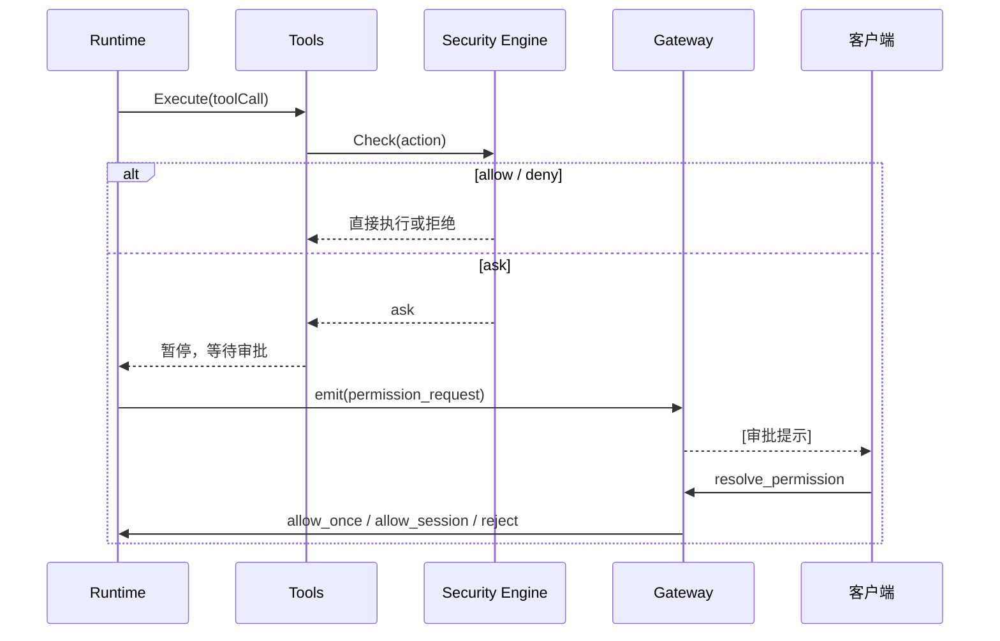
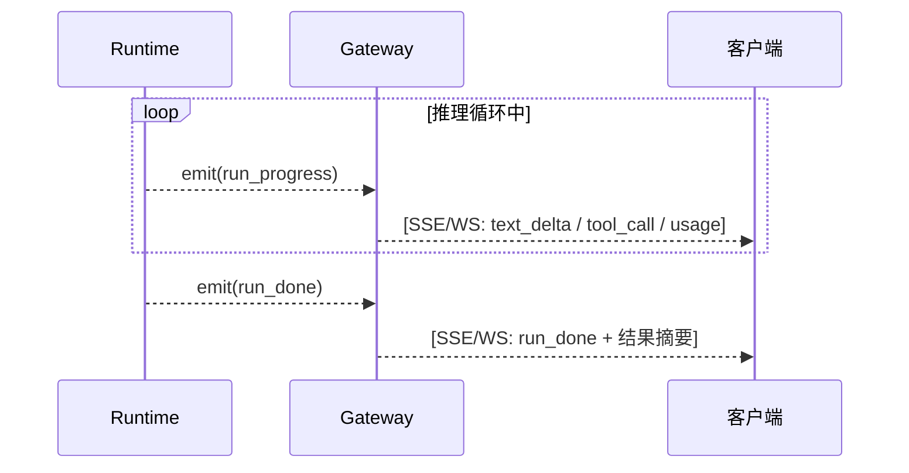
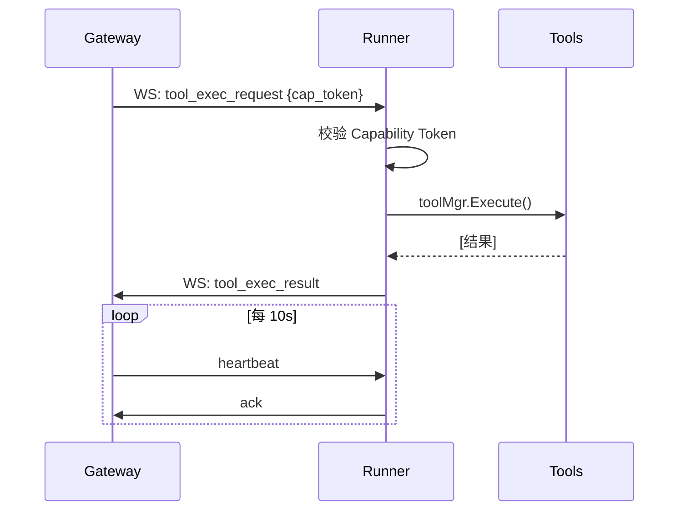
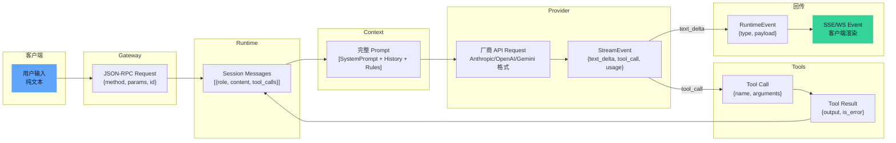

# NeoCode 系统架构

**v3.0** | 2026-05-10 | 目标读者：团队成员、项目贡献者

---

## 1. 概述

NeoCode 是一个本地优先的 AI Coding Agent。它在开发者本地运行，通过终端、Web、桌面和 IM 等多端接入，执行代码理解、修改和验证的完整闭环。

**它做什么：** 你告诉它"帮我在 auth.go 里加登录限流"——它读取文件、理解代码、写出修改、跑编译验证，每一步都经过你的审批。

**它怎么跑：** 一个 `neocode` 二进制文件，不需要数据库、不需要 Docker、不需要联网（连本地模型也可以）。



**六条设计选择：**

| 选择 | 一句话原因 |
|------|-----------|
| **强边界单体**（同进程，interface 解耦） | 单机单用户场景下微服务是净成本 |
| **进程内事件驱动**（Go channel） | AI 推理是流式的，需要中途可暂停等审批 |
| **Provider 插件化**（2 方法接口） | 新增模型不改 Runtime 或 Gateway 一行代码 |
| **SQLite 持久化**（modernc 纯 Go） | 零外部依赖，ACID 事务满足会话和 Checkpoint |
| **JSON-RPC 2.0** + SSE/WebSocket | 任何能发 HTTP POST 的环境都能接入 |
| **Runner 反向连接**（Runner 主动连 Gateway） | 工位电脑在 NAT/防火墙后，无需开放入站端口 |

### 1.1 核心挑战

将 LLM 变成一个可靠的编码代理，需要解决以下根本性问题：

| 挑战 | 问题本质 | 系统应对 |
|------|----------|----------|
| **LLM 输出不稳定** | 同样的 Prompt，不同模型（甚至同一模型的不同请求）可能产出完全不同的工具调用策略和代码质量 | Provider 归一化 + Compact 保持上下文一致性 |
| **工具执行具有副作用** | 模型决定执行 `rm -rf` 或修改关键配置文件，后果不可撤销 | Security Engine 四层防御 + Checkpoint 自动快照 |
| **上下文窗口有限** | 模型的 context window 有硬上限（4K–200K tokens），长对话和大代码库必然超限 | Context 模块 Compact 策略（Full Compact / Trim） |
| **多轮任务需要状态管理** | 一次任务可能跨越数十轮推理，中间包含工具调用、审批暂停、错误重试，状态必须一致 | Session 持久化 + Runtime 集中管理会话状态 |
| **多端接入的一致性** | TUI、Web、Desktop、飞书、CI 脚本需要用统一协议接入，且行为一致 | Gateway 作为唯一 RPC 边界 + JSON-RPC 2.0 标准协议 |

---

## 2. 一次完整的请求

跟随一次典型的用户请求，边走边讲各组件如何协作。场景：用户输入 *"帮我在 auth.go 的 Login 函数加登录失败次数限制"*。

### 2.1 请求进入

用户输入通过客户端（TUI/Web/Desktop/飞书）发送到 Gateway。

**Gateway 为什么存在。** 系统需要支持五种客户端类型。如果每个客户端直连 Runtime，认证逻辑要写五遍，流式事件推送要写五遍，安全漏洞要修五处。Gateway 将五条路径收敛为一条——所有客户端只需发 JSON-RPC 请求。

Gateway 做三件事：**认证**（谁在请求）、**路由**（请求应该交给哪个 Runtime 操作）、**流中继**（把 Runtime 的异步事件推回给客户端）。它对客户端一视同仁——TUI 和飞书 Bot 在 Gateway 看来是完全相同的 JSON-RPC 调用方。



Gateway 对外暴露三个端点：JSON-RPC（请求/响应）、SSE（服务端推送事件流）、WebSocket（双向消息，供 Runner 使用）。客户端通过 JSON-RPC 发送指令，通过 SSE 或 WebSocket 接收流式事件。

### 2.2 推理循环

Runtime 收到请求后，进入 ReAct 循环——推理（Reasoning）和行动（Acting）交替进行。

以下 flowchart 展示了 ReAct 循环的完整判断逻辑和退出条件。注意：模型的 `end_turn` **不等于真正结束**——它只是一个 candidate final，必须通过 Completion Gate 和 Accept Gate Hook 的验收才能被系统接受：



**Accept Gate 为什么存在。** 模型说"我做完了"不等于真的做完了。Accept Gate + Hook 是系统对模型输出进行客观验收的机制——它不依赖模型自述，而是通过实际检查（文件是否存在、代码是否编译通过、测试是否通过、Todo 是否收敛）来判断任务是否真正完成。

**验收流程三阶段：**

1. **Completion Gate**：系统预检：检查 Todo 收敛状态和输出可见性。如果还有 required todo 未完成或无可见输出，直接阻塞。
2. **Accept Gate Hook**：用户或仓库配置的 accept_gate hook，可运行命令脚本或内置 handler，对模型输出进行客观验收。
3. **AcceptanceService**：汇总 Completion Gate、Accept Gate Hook 和 continue 预算的信号，产出唯一的终态裁决。

**四种裁决结果：**

| 裁决 | 条件 | 系统行为 |
|------|------|----------|
| **accepted** | Completion + Verification 全部通过 | 循环正常结束，发出 `run_done` |
| **continue** | 存在 `soft_block`（Todo 未收敛、verifier 未通过但可修复） | 注入 continue hint（包含 verifier 证据和缺失事实），强制模型继续工作 |
| **incomplete** | `hard_block`（需要外部条件）或无进展超过 `max_no_progress` 阈值 | 终止循环，报告未完成原因 |
| **failed** | verifier 返回 `fail`（如编译失败、测试失败） | 终止循环，报告验证失败原因和 `ErrorClass` |

**循环退出条件（四类）：**

| 退出条件 | 触发方式 | 结果 |
|----------|----------|------|
| **验收通过** | Completion Gate + Accept Gate Hook 全部 pass | Runtime 发出 `run_done`（`accepted`） |
| **验收终止** | required todo failed 或 continue 预算耗尽 | Runtime 发出 `run_done`（`failed` / `incomplete`） |
| **强制终止** | 达到 `max_turns` 上限（配置项）或 Token 预算耗尽 | Runtime 发出 `run_done` + 终止原因 |
| **用户取消** | 客户端发送 `gateway.cancel` | Runtime 收到取消信号，停止当前循环 |

**第一步：构建上下文。** Runtime 把当前会话状态（消息历史、Todo 列表、激活的 Skills、已批准的 Plan）交给 Context 模块。Context 按固定顺序组装 System Prompt——核心行为准则、工具能力列表、项目规则、当前任务状态、Plan 上下文——然后返回给 Runtime。

**Runtime 为什么不自己拼 Prompt。** Prompt 的组装逻辑是一个独立的关注点。上下文压缩（Compact）的策略——什么时候触发、哪些消息不能裁剪——需要在 Context 模块内独立演进。如果 Runtime 内嵌了 Prompt 拼接，修改压缩策略就需要改推理循环，两者耦合。

**第二步：调用模型。** Runtime 把组装好的 Prompt 交给 Provider。Provider 是模型厂商的抽象层——它唯一的职责就是把不同厂商的 API 归一化为两个操作：估算 Token 数、发起流式推理。

**Provider 为什么只有 2 个方法。** 接口越大，实现新 Provider 的成本越高，厂商差异泄漏到 Runtime 的风险越大。当前已接入 Anthropic、OpenAI、Gemini、DeepSeek、MiniMax、Mimo 六家厂商，以及通过 OpenAI 兼容协议接入的 Qwen、GLM 等。每接入一家，Runtime 和 Gateway 零改动。



Provider 通过 Go channel 推送流式事件：`text_delta`（增量文本，用户看到 AI "打字"）、`tool_call_start/args/end`（模型决定调用工具）、`usage`（Token 消耗统计）。Runtime 消费这些事件，转成统一的 `RuntimeEvent`，发给 Gateway 的事件中继器。

### 2.3 工具执行与安全审批

模型在推理过程中可能决定调用工具。比如读 `auth.go`、搜索代码库中的 `Login` 函数、编辑文件、执行 `go build`。

**所有工具调用经过同一个入口。** Tools Manager 是系统中最敏感的模块——它是唯一被允许执行文件 I/O、Bash 命令、网络请求和 MCP 外部工具的组件。任何模型可调用的能力必须在此注册，Runtime 不直接执行工具。

**每次调用先过安检。** Security Engine 位于工具执行的关键路径上，不可跳过。它做两阶段检查：

1. **策略引擎**：按优先级匹配规则。规则可以按工具名、路径前缀、域名、敏感文件类型等条件命中。决策有三种：`allow`（直接放行）、`deny`（直接拒绝）、`ask`（暂停等用户审批）。

2. **工作区沙箱**：校验目标路径是否在工作目录内。阻断 `../` 穿越和 Symlink 逃逸。检测到越界时，不直接拒绝——而是计算一个 safe 候选路径（工作目录内的等价路径），供上层决定。



**敏感路径自动检测。** Security Engine 内置了敏感文件特征库，不需要用户配置：`.env`、`*.secret`、`*.token`、`*.key`、`*.pem`、`id_rsa`、`id_ed25519` 等。命中敏感路径的操作**强制 `deny`**——即使 PolicyRule 中没有显式配置，即使用户选了 `allow_session`。

**回滚安全网。** 每次写操作前（`pre_write`）、每轮结束时（`end_of_turn`）、上下文压缩前（`compact`），系统自动创建 Checkpoint。如果 AI 改坏了代码，可以恢复到上一个快照。Checkpoint 与 Git 并存——有 `.git` 时优先用 Git 追踪，无 `.git` 时 Checkpoint 提供独立的安全网。

**异常处理路径。** ReAct 循环中可能发生三类异常，每类都有明确的处理策略：

| 异常类型 | 场景 | 系统行为 |
|----------|------|----------|
| **工具执行失败** | `go build` 超时、文件写入权限不足、网络请求失败 | 将错误信息封装为 Tool Result 回灌给 LLM，模型根据错误决定下一步（重试、换方案、放弃） |
| **LLM 输出解析失败** | 模型返回无法解析的 tool_call JSON、引用不存在的工具名、参数格式不合法 | 构造格式化错误消息回灌给 LLM，提示其修正输出格式；连续解析失败超过阈值时终止循环 |
| **模型拒绝或异常** | Provider 返回 HTTP 4xx/5xx、模型因安全策略拒绝响应、网络超时 | Provider 将错误映射为统一的错误类型，Runtime 根据错误类型决定是否重试（可重试错误自动重试，不可重试错误终止循环并通知用户） |

关键原则：**错误不吞没，错误即数据。** 工具执行失败和 LLM 输出异常不会直接终止循环——它们被当作信息回灌给模型，让模型有机会自我修正。只有在异常持续累积（超过重试阈值）或不可恢复时，才强制终止。

### 2.4 结果回传

Runtime 在执行过程中持续发出事件。Gateway 的 StreamRelay 是一个 pub/sub 机制——客户端通过 `bindStream` 订阅特定的 Session/Run 的事件流，Gateway 把 Runtime 事件广播到所有匹配的订阅连接。



**事件驱动的价值。** AI 推理是流式的——token 逐个产出，可能持续数十秒到数分钟。事件驱动模型让客户端可以：
- **实时看到 AI "打字"**（`text_delta` 事件逐个推送）
- **中途取消**（发送 `gateway.cancel`，Runtime 收到后停止循环）
- **查看 Token 消耗**（每次循环的 input/output/cache 用量实时透出）
- **接受权限审批**（`permission_request` 暂停循环，等待用户回复）

事件通道是 Go channel，StreamRelay 是进程内的 pub/sub——没有引入消息队列。这是刻意的：外部消息中间件违反零依赖部署约束。

### 2.5 Runner：跨越物理机的工具执行

Runner 是系统中唯一可以运行在不同物理机上的组件。场景：你在手机上通过飞书发指令，工位电脑上的 Runner 执行代码修改。



Runner 主动连接 Gateway（反向连接），不开放入站端口。这意味着 Runner 可以在 NAT/防火墙后运行。Gateway 发给 Runner 的每个工具执行请求中携带 Capability Token——这是一个 HMAC-SHA256 签名的令牌，限定允许的工具列表、路径范围和有效期。

### 2.6 数据流全景

以下图展示了数据从用户输入到最终输出的完整流转路径，以及每一步的数据形态变换：



**数据形态变换要点：**

| 阶段 | 输入形态 | 输出形态 | 关键变换 |
|------|----------|----------|----------|
| Gateway 接收 | 纯文本 + 元数据 | JSON-RPC Request | 认证注入 `subject_id`，路由到目标 Session |
| Context 组装 | Session 消息历史 + 规则文件 | 完整 Prompt（Messages 数组） | 按固定顺序拼接 SystemPrompt；若 Token 超预算，触发 Compact |
| Provider 转换 | 统一 Messages 数组 | 厂商特定格式 | Anthropic 用 `content blocks`，OpenAI 用 `messages`，差异在 Provider 内消化 |
| 流式输出 | 厂商特定 SSE 格式 | 统一 StreamEvent | Provider 将厂商事件归一化为 `text_delta` / `tool_call_start` / `usage` |
| 事件中继 | RuntimeEvent | SSE/WS 帧 | Gateway 的 StreamRelay 按 Session/Run 过滤，广播到匹配的订阅连接 |

**上下文裁剪（Compact）。** 当消息历史的 Token 数接近模型窗口上限时，Context 模块自动触发压缩：

- **Full Compact**：调用 LLM 对整段历史生成摘要，替换原始消息列表。旧消息删除和新摘要插入在同一个 SQLite 事务中完成，保证原子性。

数据回流发生在两处：**工具结果回灌**（Tool Result 写入 Session Messages，供下一轮推理使用）和 **Compact 结果回写**（压缩后的摘要替换原始历史）。

---

## 3. 架构决策

以下六条决策定义了 NeoCode 的基本形态。每条说明面对什么问题、选择了什么方案、付出了什么代价。

### 决策 1：强边界单体

**问题：** 系统需要在单机单用户场景下运行，但也要支持五人并行开发、模块独立演进。

**方案：** 所有核心模块（Gateway、Runtime、Provider、Tools、Session）运行在同一进程中，通过 Go interface 解耦。模块之间只依赖接口契约，不依赖具体实现。这既不是微服务（单机场景下序列化开销和运维复杂度是净成本），也不是纯单体（模块之间直接调用会阻止独立演进）。当某个模块确实需要跨越物理机时——比如 Runner——才拆分为独立进程。

**代价：** 无法独立扩缩容单个模块（当前不需要）；模块间耦合只能靠接口契约约束，无法用网络隔离强制执行。

### 决策 2：进程内事件驱动

**问题：** AI 推理是流式的、可能持续数十秒、需要在中途暂停等待用户审批。同步调用会让客户端在推理完成前完全黑屏。

**方案：** Provider 通过 Go channel 推送流式事件，Runtime 消费并转为统一的 `RuntimeEvent`，Gateway 的 StreamRelay 广播到订阅客户端。暂停-恢复语义通过事件实现：`permission_request` 事件发出后，Runtime 等待 `resolve_permission` 回复，不阻塞其他 goroutine。

**代价：** 客户端需要支持 SSE 或 WebSocket 长连接，相比纯 HTTP 请求-响应多了连接管理的复杂度。

### 决策 3：Gateway 作为唯一 RPC 边界

**问题：** 五种客户端（TUI/Web/Desktop/飞书/CI）需要在不同场景下接入 Agent。如果各自直连 Runtime，认证和流式推送要重复实现五次。

**方案：** Gateway 是系统对外的唯一入口。它不做业务逻辑——只做认证、路由和流中继。客户端只需实现 JSON-RPC 客户端 + SSE/WS 事件消费，就可以完整接入。TUI 和飞书 Bot 在 Gateway 视角完全相同。

**代价：** Gateway 成为单点故障。缓解手段：本地模式下客户端自动拉起 Gateway（auto-spawn）；网络模式下可部署多实例。

### 决策 4：Provider 插件化，仅 2 个方法

**问题：** AI 模型市场快速变化，系统需要随时接入新模型而不修改上层代码。

**方案：** `Provider` interface 仅定义 `EstimateInputTokens` 和 `Generate` 两个方法。所有厂商特定的请求组装、流式格式解析、错误映射都在 Provider 实现内部消化。当前支持 Anthropic、OpenAI、Gemini、DeepSeek、MiniMax、Mimo，以及通过 OpenAI 兼容协议接入的 Qwen、GLM 等。

**代价：** 无法深度利用特定厂商的高级特性（如 Anthropic 的 thinking 预算粒度控制、OpenAI 的 response_format）。这些特性需要统一抽象层来表达，当前暂不支持。

### 决策 5：SQLite 持久化

**问题：** 会话数据需要可靠持久化，但不能引入外部数据库运维负担。

**方案：** SQLite 通过 modernc 纯 Go 实现链接到二进制。它提供 ACID 事务——Compact 替换消息列表时，旧消息删除和新摘要插入在同一个事务中完成，不会出现"消息丢了但 SessionHead 没更新"的半状态。单文件存储，备份只需复制 `session.db`。

**代价：** SQLite 是单 writer，同会话的并发写必须显式串行化（sessionLock）。不同会话可以并行，单用户场景下不构成实际瓶颈。

### 决策 6：JSON-RPC 2.0 + SSE/WebSocket

**问题：** 第三方客户端需要用最简单的协议接入。飞书适配器是 Python 写的，CI 脚本是 Bash curl，不应该要求它们安装 protobuf 编译器。

**方案：** 请求/响应用 JSON-RPC 2.0——一个 method 字符串 + params JSON + id 就能完成一次调用。流式事件用 SSE 或 WebSocket 推送——不需要额外的协议握手。这个组合让任何能发 HTTP POST 的环境都能成为 NeoCode 客户端。

**代价：** 没有 gRPC 的强类型 schema 和自动代码生成。错误格式需要自行规范化（Gateway 的 `FrameError` 和 `GatewayRPCError` 做统一包装）。

---

## 4. 安全边界

安全模型分四层。每层独立校验，不依赖上层假设下层已经"安全了"。

```
客户端 ──▶ [1] Gateway · 认证 ──▶ [2] Gateway · ACL ──▶ [3] Security Engine ──▶ [4] OS 约束
```

**第 1 层：认证。** 所有客户端统一调用 `gateway.authenticate` 获取身份。本地 loopback 场景下没有配置 Authenticator，Gateway 自动授予 `local_admin`。网络场景下 Authenticator 校验 Token 后分配 `subject_id`。`subject_id` 在整个连接生命周期内不变，作为后续所有操作的审计主体。

**第 2 层：ACL。** Gateway 为每个连接维护 method × source 白名单。未授权的 method 直接拒绝，不进 Runtime。

**第 3 层：Security Engine。** 这是防御的核心。两个组件协同工作：PolicyEngine 按优先级匹配策略规则（allow/deny/ask），WorkspaceSandbox 校验路径边界（阻断穿越、检测 Symlink、生成 safe 候选）。每次工具执行前必须经过这两道检查，不可跳过。

**第 4 层：OS 约束。** 系统进程以当前用户权限运行。文件系统权限即 OS ACL。

**贯穿所有层的保护：**
- **密钥不入磁盘。** `api_key_env` 仅存环境变量名，真实密钥在 Provider 发起 HTTPS 请求前才从环境变量读取。密钥不出现在配置文件、日志、Gateway 传输中。
- **敏感路径自动检测。** Security Engine 内置敏感文件特征（`.env`、`*.key`、`id_rsa` 等），命中即拒绝——不依赖用户配置策略规则。
- **Capability Token。** Runner 的每个工具执行请求附带 HMAC-SHA256 签名令牌，限定工具白名单、路径白名单和有效期。

---

## 5. 部署视图

**产物：** 一个 `neocode` 二进制（含 CLI、TUI、Gateway、Runner、Daemon、Web UI），通过 `CGO_ENABLED=0` 静态编译，支持 Linux/macOS/Windows × amd64/arm64。另有独立的 `neocode-gateway` 二进制用于服务器常驻。

**部署拓扑：**
- **单机：** TUI/Web/Desktop 通过本地 loopback RPC 连接 Gateway，Gateway 和 Runtime 同进程或独立 Daemon。
- **分布：** Runner 在工位电脑上通过 WebSocket 主动连接 Gateway（云/服务器），客户端通过 Gateway 的 HTTP 端点接入。

**数据目录：** `~/.neocode/`（可通过 `NEOCODE_HOME` 环境变量覆盖）。内含 `config.yaml`、`session.db`、Checkpoint 文件、Skills 缓存。

---

## 6. 风险

| 风险 | 为什么是风险 | 当前缓解 |
|------|-------------|----------|
| Gateway 单点故障 | 所有客户端依赖 Gateway 入口 | 本地 auto-spawn；网络模式可部署多实例 |
| 模型行为不可预测 | 切换模型时，同样的 Prompt 可能产生不同的工具调用策略 | Provider 2 方法接口限制差异扩散；验收测试抽样验证 |
| 上下文窗口天花板 | 即使有 Compact，模型的 context window 有硬上限 | Compact 两级策略最大化利用窗口；`max_turns` 硬上限 |
| SQLite 单 writer | 同会话并发写必须串行化 | 不同会话可并行；单用户场景不构成瓶颈 |
| TOCTOU 路径竞态 | 安全检查与实际文件操作之间存在微小时间窗口 | `O_NOFOLLOW` 缓解；本地单用户攻击面极小 |

---

## 7. 可扩展性

系统设计了五个主要扩展点。每个扩展点遵循同一原则：**新增能力不修改已有模块的代码**。

### 7.1 Provider：接入新模型

**扩展方式：** 实现 `Provider` 接口的 2 个方法。

```go
type Provider interface {
    // EstimateInputTokens 估算输入 Token 数，用于 Compact 决策
    EstimateInputTokens(messages []Message) (int, error)
    // Generate 发起流式推理，通过 channel 返回 StreamEvent
    Generate(ctx context.Context, params GenerateParams) (<-chan StreamEvent, error)
}
```

**接入步骤：**
1. 在 `internal/provider/` 下新建厂商目录
2. 实现 `Provider` 接口，将厂商特定的请求组装、流式格式解析、错误映射封装在实现内部
3. 在 Provider 注册表中注册新实现
4. 在 `config.yaml` 中添加对应的 provider 配置项

**边界：** 厂商差异不泄漏到 Runtime 或 Gateway。所有厂商特定的字段、错误码、流式格式在 Provider 内部消化。

### 7.2 Tool：新增可被模型调用的能力

**扩展方式：** 定义 Tool Schema + 实现 Execute 方法。

每个 Tool 需要提供：
- **Schema**：JSON Schema 格式的参数定义，描述工具名称、用途、输入参数及其类型约束。模型根据 Schema 决定何时调用、传什么参数。
- **Execute**：接收经过 Schema 校验的参数，执行操作，返回结果。

**当前内置工具（示例）：**

| 工具 | 能力 | 安全约束 |
|------|------|----------|
| `read_file` | 读取文件内容 | 工作区沙箱限制路径 |
| `write_file` | 写入/创建文件 | 工作区沙箱 + Checkpoint 快照 |
| `bash` | 执行 Shell 命令 | 超时限制 + 输出长度限制 + 禁止交互式命令 |
| `web_fetch` | 抓取网页内容 | 协议范围限制 + 响应大小限制 |
| `search_code` | 代码库搜索 | 工作区沙箱 |

**接入步骤：**
1. 在 `internal/tools/` 下新建工具文件
2. 定义 Schema（名称、描述、参数的 JSON Schema）
3. 实现 Execute 函数（参数校验 → 权限检查 → 执行 → 输出裁剪 → 返回结果）
4. 在 Tools Manager 中注册

**边界：** 所有可被模型调用的能力必须经过 `internal/tools` 注册。不允许在 Runtime 或 TUI 中内嵌工具逻辑。每个工具的执行都经过 Security Engine 的安全检查，不可跳过。

### 7.3 Context：扩展上下文源

**扩展方式：** Context 模块按固定顺序组装 System Prompt，每个组装阶段是独立的构建步骤。

**当前上下文源：**
1. 核心行为准则（System Identity）
2. 工具能力列表（Tool Schemas）
3. 项目规则（`.agents/` 目录下的规则文件）
4. 当前任务状态（Todo 列表、Plan 上下文）
5. Skills 上下文（激活的 Skill 指令）
6. 消息历史（Session Messages）

**如何扩展：**
- 新增上下文源时，在 Context Builder 的构建流程中添加对应的构建步骤
- 每个构建步骤独立负责内容生成和 Token 预算控制
- Compact 策略由 Context 模块统一管理，新增的上下文源自动参与 Token 预算核算

**边界：** Context 只负责 Prompt 构建与上下文裁剪，不处理运行时决策。Compact 的触发时机由 Runtime 决定，Compact 的执行策略由 Context 决定。

### 7.4 Security：扩展安全策略

**扩展方式：** Security Engine 的策略引擎支持按优先级匹配的规则列表。

**规则结构：**
- **匹配条件**：工具名、路径前缀 / Glob、域名、文件类型
- **决策**：`allow`（直接放行）、`deny`（直接拒绝）、`ask`（暂停等用户审批）
- **优先级**：数值越小优先级越高，首个匹配的规则生效

**如何扩展：**
- 通过配置文件添加自定义策略规则
- 内置的敏感路径检测（`.env`、`*.key`、`id_rsa` 等）作为最高优先级硬编码规则，不可被配置覆盖
- WorkspaceSandbox 的路径边界校验独立于策略规则，始终生效

### 7.5 客户端：接入新的前端

**扩展方式：** 实现 JSON-RPC 2.0 客户端 + SSE/WebSocket 事件消费。

任何能发送 HTTP POST 的环境都可以成为 NeoCode 客户端。接入新前端不需要修改 Gateway 或 Runtime 的任何代码——只需要：

1. 调用 `gateway.authenticate` 获取身份
2. 通过 JSON-RPC 发送指令（`gateway.run`、`gateway.cancel` 等）
3. 通过 SSE 或 WebSocket 订阅并消费事件流

**已有实现：** TUI（Go）、Web UI（嵌入式）、飞书适配器（Python）、CI 脚本（Bash curl）。

---

## 附录 A：术语

| 术语 | 含义 |
|------|------|
| **ReAct Loop** | 推理→工具调用→结果回灌→继续推理，直到产出最终文本 |
| **Compact** | Token 预算接近阈值时，自动压缩/摘要化历史消息 |
| **StreamRelay** | Gateway 内部的 pub/sub，将 Runtime 事件广播到订阅客户端 |
| **Checkpoint** | AI 写操作前的自动文件快照，支持回滚 |
| **Human-in-the-Loop** | 危险操作暂停执行，等待人类审批 |
| **Capability Token** | Runner 执行工具时携带的 HMAC 签名令牌，限定能力和范围 |

## 附录 B：架构决策索引

| ADR | 决策 | 详见 |
|-----|------|------|
| ADR-001 | Gateway 作为唯一 RPC 边界 | [architecture-v1.md §15](architecture-v1.md) |
| ADR-002 | Provider 2 方法接口 | [architecture-v1.md §15](architecture-v1.md) |
| ADR-003 | 事件驱动异步执行 | [architecture-v1.md §15](architecture-v1.md) |
| ADR-004 | 强边界单体 | [architecture-v1.md §15](architecture-v1.md) |
| ADR-005 | SQLite 持久化 | [architecture-v1.md §15](architecture-v1.md) |
| ADR-006 | JSON-RPC 2.0 + SSE/WS | [architecture-v1.md §15](architecture-v1.md) |
| ADR-007 | Runner 反向连接 | [architecture-v1.md §15](architecture-v1.md) |
| ADR-008 | Checkpoint 本地快照 | [architecture-v1.md §15](architecture-v1.md) |

## 附录 C：相关文档

| 文档 | 路径 |
|------|------|
| v1 完整架构（详细流程、模块描述） | [architecture-v1.md](architecture-v1.md) |
| 产品定位与竞品分析 | [../product/positioning.md](../product/positioning.md) |
| Gateway RPC API 参考 | [../reference/gateway-rpc-api.md](../reference/gateway-rpc-api.md) |
| 安装、告警与诊断 | [../guides/operations.md](../guides/operations.md) |
| 已知局限与技术债 | [../tech-debt.md](../tech-debt.md) |
| 未来演进路线图 | [../roadmap.md](../roadmap.md) |
| 项目开发规范 | [../../AGENTS.md](../../AGENTS.md) |
