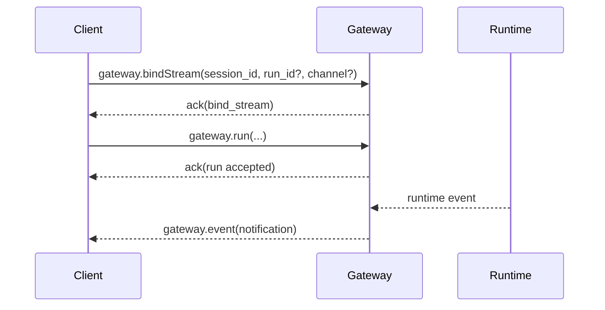
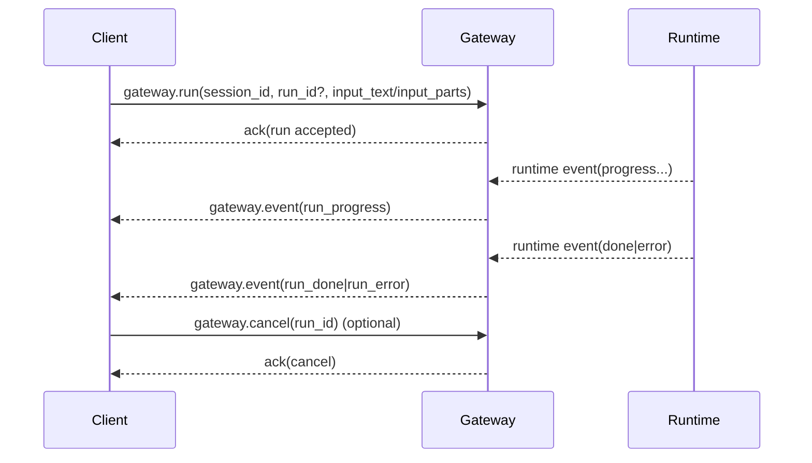

# Gateway RPC API

本文档定义 Gateway 对外 JSON-RPC 协议契约，面向第三方客户端实现者。  
术语遵循 RFC 规范语义：`MUST`、`SHOULD`、`MAY`。

## 0. 通用协议基线

### 0.1 统一请求信封

```go
type JSONRPCRequest struct {
	JSONRPC string          `json:"jsonrpc"` // 固定 "2.0"
	ID      json.RawMessage `json:"id,omitempty"`
	Method  string          `json:"method"`
	Params  json.RawMessage `json:"params,omitempty"`
}
```

规范约束：

1. `jsonrpc` `MUST` 为 `"2.0"`。  
2. `id` `MUST` 提供，且不可为 `null` 或空字符串。  
3. `params` `MUST` 通过严格解码（`DisallowUnknownFields`），未知字段会触发错误。  

### 0.2 统一响应信封

```go
type JSONRPCResponse struct {
	JSONRPC string          `json:"jsonrpc"`
	ID      json.RawMessage `json:"id"`
	Result  json.RawMessage `json:"result,omitempty"` // 成功时为 MessageFrame
	Error   *JSONRPCError   `json:"error,omitempty"`  // 失败时为 JSON-RPC Error
}

type JSONRPCError struct {
	Code    int               `json:"code"`
	Message string            `json:"message"`
	Data    *JSONRPCErrorData `json:"data,omitempty"`
}

type JSONRPCErrorData struct {
	GatewayCode string `json:"gateway_code,omitempty"`
}
```

### 0.3 MessageFrame（Result 载荷）

```go
type MessageFrame struct {
	Type      FrameType    `json:"type"` // ack / event / error
	Action    FrameAction  `json:"action,omitempty"`
	RequestID string       `json:"request_id,omitempty"`
	RunID     string       `json:"run_id,omitempty"`
	SessionID string       `json:"session_id,omitempty"`
	InputText string       `json:"input_text,omitempty"`
	InputParts []InputPart `json:"input_parts,omitempty"`
	Workdir   string       `json:"workdir,omitempty"`
	Payload   any          `json:"payload,omitempty"`
	Error     *FrameError  `json:"error,omitempty"`
}
```

### 0.4 HTTP 与 JSON-RPC 映射

1. `/rpc` 默认 `HTTP 200`，错误通过 JSON-RPC `error` 返回。  
2. `/rpc` 仅当 `gateway_code=unauthorized` 返回 `HTTP 401`。  
3. `/rpc` 仅当 `gateway_code=access_denied` 返回 `HTTP 403`。  

### 0.5 观测基线

Observation（通用）：

1. 每个请求都会计入 `gateway_requests_total{source,method,status}`。  
2. 认证失败会计入 `gateway_auth_failures_total{source,reason}`。  
3. ACL 拒绝会计入 `gateway_acl_denied_total{source,method}`。  
4. 请求日志包含 `request_id/session_id/method/source/status/gateway_code/latency_ms`。  
5. `gateway.ping` 成功日志默认静默，失败仍记录。  

---

## 1. gateway.authenticate

Method: `gateway.authenticate`  
Stability: `Stable`  
Auth Required: `No`

Request Schema（JSON Schema）：

```json
{
  "type": "object",
  "required": ["jsonrpc", "id", "method", "params"],
  "properties": {
    "jsonrpc": { "const": "2.0" },
    "id": { "type": ["string", "number"] },
    "method": { "const": "gateway.authenticate" },
    "params": {
      "type": "object",
      "required": ["token"],
      "additionalProperties": false,
      "properties": {
        "token": { "type": "string", "minLength": 1 }
      }
    }
  },
  "additionalProperties": false
}
```

Response Schema：

1. Success（完整 payload）：

```json
{
  "jsonrpc": "2.0",
  "id": "req-1",
  "result": {
    "type": "ack",
    "action": "authenticate",
    "request_id": "req-1",
    "payload": {
      "message": "authenticated",
      "subject_id": "local_admin"
    }
  }
}
```

2. Failure（完整 payload）：

```json
{
  "jsonrpc": "2.0",
  "id": "req-1",
  "error": {
    "code": -32602,
    "message": "missing required field: params.token",
    "data": {
      "gateway_code": "missing_required_field"
    }
  }
}
```

Observation：

1. 失败时会增长 `gateway_auth_failures_total`。  
2. 请求日志会记录认证态（`auth_state`）变化。  

---

## 2. gateway.ping

Method: `gateway.ping`  
Stability: `Stable`  
Auth Required: `Yes`

Request Schema（Go Struct）：

```go
type PingParams struct{}
```

Response Schema：

1. Success：

```json
{
  "jsonrpc": "2.0",
  "id": "req-2",
  "result": {
    "type": "ack",
    "action": "ping",
    "request_id": "req-2",
    "payload": {
      "message": "pong",
      "version": "dev"
    }
  }
}
```

2. Failure：统一 `error` 信封。

Observation：

1. 成功 `ping` 默认不输出请求日志（降噪）。  
2. 对已绑定连接，`ping` 会刷新绑定 TTL（续期）。  

---

## 3. gateway.bindStream

Method: `gateway.bindStream`  
Stability: `Stable`  
Auth Required: `Yes`

Request Schema（Go Struct）：

```go
type BindStreamParams struct {
	SessionID string `json:"session_id"`        // MUST
	RunID     string `json:"run_id,omitempty"`  // MAY
	Channel   string `json:"channel,omitempty"` // all|ipc|ws|sse，默认 all
}
```

请求约束：

1. `session_id` `MUST` 非空。  
2. `channel` `MUST` 属于 `all|ipc|ws|sse`。  
3. 若 `channel != all`，其值 `MUST` 与连接自身通道一致，否则返回 `invalid_action`。  
4. 单连接绑定数上限为 `128`，超过上限返回 `invalid_action`。  

Response Schema：

1. Success（完整 payload）：

```json
{
  "jsonrpc": "2.0",
  "id": "req-3",
  "result": {
    "type": "ack",
    "action": "bind_stream",
    "request_id": "req-3",
    "session_id": "session-1",
    "run_id": "run-1",
    "payload": {
      "message": "stream binding updated",
      "channel": "all"
    }
  }
}
```

2. Failure（完整 payload）：

```json
{
  "jsonrpc": "2.0",
  "id": "req-3",
  "error": {
    "code": -32602,
    "message": "invalid bind_stream channel",
    "data": {
      "gateway_code": "invalid_action"
    }
  }
}
```

### 双向交互细节（重点）

1. 客户端调用 `gateway.bindStream` 后，先收到 `ack(bind_stream)`。  
2. 后续 runtime 事件通过 `gateway.event` 反向推送，不再通过 `gateway.bindStream` 响应体承载。  
3. 绑定匹配规则（运行事件）：
1. 当事件 `run_id` 非空时：`run_id` 精确绑定可收到；`run_id` 为空的 session 级绑定也可收到。  
2. 当事件 `run_id` 为空时：仅 session 级绑定（`run_id=""`）可收到。  
4. 绑定 TTL 为 `15m`，清理周期为 `30s`。客户端 `SHOULD` 周期调用 `gateway.ping` 续期。  
5. 自动绑定生效规则：
1. 除 `authenticate`、`bindStream`、`ping` 外，其它请求若携带 `session_id/run_id`，网关会自动续绑。  
2. 自动续绑不替代显式绑定；第三方客户端仍 `SHOULD` 在重连后主动执行 `bindStream`。  

### 交互时序



Observation：

1. `gateway_requests_total{method="gateway.bindStream",status="ok|error"}`。  
2. `gateway_connections_active{channel}` 反映连接活跃数。  
3. 慢消费者导致队列满时会增加 `gateway_stream_dropped_total{reason="queue_full"}`。  

---

## 4. gateway.run

Method: `gateway.run`  
Stability: `Stable`  
Auth Required: `Yes`

Request Schema（Go Struct）：

```go
type RunParams struct {
	SessionID  string         `json:"session_id,omitempty"`  // 推荐显式传递
	RunID      string         `json:"run_id,omitempty"`      // 可选
	InputText  string         `json:"input_text,omitempty"`  // 与 input_parts 至少一个非空
	InputParts []RunInputPart `json:"input_parts,omitempty"` // text|image
	Workdir    string         `json:"workdir,omitempty"`     // 请求级工作目录覆盖
	Mode       string         `json:"mode,omitempty"`        // Agent 工作模式：build|plan，可选，默认沿用 session 当前 mode
}

type RunInputMedia struct {
	URI      string `json:"uri,omitempty"`
	AssetID  string `json:"asset_id,omitempty"`
	MimeType string `json:"mime_type"`
	FileName string `json:"file_name,omitempty"`
}

type RunInputPart struct {
	Type  string         `json:"type"`            // text|image
	Text  string         `json:"text,omitempty"`  // text MUST
	Media *RunInputMedia `json:"media,omitempty"` // image MUST
}
```

请求约束：

1. `input_text` 与 `input_parts` 至少一项非空。  
2. `input_parts` 中：
1. `type=text` 时 `text` `MUST` 非空。  
2. `type=image` 时 `media.mime_type` `MUST` 非空，`media.uri` 与 `media.asset_id` `MUST` 二选一且不能同时提供。Web 上传图片应先调用 `POST /api/session-assets`，再在 `gateway.run` 中用 `asset_id` 引用。
3. 未知字段会因严格解码触发 `invalid_frame`。  
4. `run_id` 归一化顺序为：显式 `run_id` > `request_id` > 网关生成 `run_<timestamp>`。  
5. `mode` 可选值为 `"build"` 或 `"plan"`，为空时默认沿用 session 当前 mode（新会话默认为 `"build"`）。切换 mode 后，后端会更新 session 并影响后续运行的工具可用性和 prompt 策略。  

Response Schema：

1. Success（完整 payload，表示“受理成功”而非“执行完成”）：

```json
{
  "jsonrpc": "2.0",
  "id": "req-4",
  "result": {
    "type": "ack",
    "action": "run",
    "request_id": "req-4",
    "session_id": "session-1",
    "run_id": "run-1",
    "payload": {
      "message": "run accepted"
    }
  }
}
```

2. Failure（完整 payload，发生在受理前校验或授权阶段）：

```json
{
  "jsonrpc": "2.0",
  "id": "req-4",
  "error": {
    "code": -32602,
    "message": "input_parts[image] requires media.uri",
    "data": {
      "gateway_code": "invalid_multimodal_payload"
    }
  }
}
```

### 双向交互细节（重点）

1. `gateway.run` 采用“异步受理”模型：网关先返回 `ack(run accepted)`。  
2. 运行结果通过 `gateway.event` 持续回流，客户端 `MUST` 以事件流判断最终状态。  
3. 事件类型映射：
1. `run_progress`：常规过程事件。  
2. `run_done`：运行完成。  
3. `run_error`：运行失败或取消。  
4. `gateway.event.params.payload.payload` 载荷中包含 runtime envelope：
1. `runtime_event_type`  
2. `turn`  
3. `phase`  
4. `timestamp`  
5. `payload_version`（当前为 `2`）  
6. `payload`  
5. HTTP 来源的 `run` 会在网关内部脱离请求取消（`context.WithoutCancel`），避免客户端短连接中断导致任务误取消。  
6. `ack` 后若 runtime 立即失败，网关仅记录日志（`gateway run async failed`），不会再补发同步 JSON-RPC error。客户端 `SHOULD` 为 run 设置完成超时并结合 `gateway.event` 或 `gateway.cancel` 做兜底。  
7. 客户端中断执行时，调用 `gateway.cancel`（按 `run_id` 精确取消）。  

### 交互时序



### HTTP session asset API

浏览器图片上传使用 HTTP API，不通过 JSON-RPC 传输文件内容。客户端发送图片前需要先拥有有效 `session_id`（新会话可先调用 `gateway.createSession`）。

`POST /api/session-assets`

- Auth Required: `Yes`，使用 `Authorization: Bearer <token>`。
- Headers: `X-NeoCode-Workspace-Hash` 携带当前工作区哈希；多工作区 Web 客户端必须发送，省略时回落到默认工作区。
- Content-Type: `multipart/form-data`。
- 字段：`session_id`（必填）、`file`（必填）。
- 仅接受 PNG/JPEG/WebP；服务端按文件头检测 MIME，不信任浏览器声明。
- 空文件返回 `400`，超出 `MaxSessionAssetBytes` 返回 `413`，不支持 MIME 返回 `415`，未认证返回 `401`，Origin/CORS 或 ACL 拒绝返回 `403`。
- 工作区不存在返回 `404 workspace not found`；目标 session 不在该工作区返回 `404 session not found`。
- 成功返回：

```json
{
  "session_id": "session-1",
  "asset_id": "asset-1",
  "mime_type": "image/png",
  "size": 1024
}
```

`GET /api/session-assets/{session_id}/{asset_id}`

- Auth Required: `Yes`。
- Headers: `X-NeoCode-Workspace-Hash` 携带当前工作区哈希；多工作区 Web 客户端必须发送。
- 返回图片二进制，用于历史消息缩略图。
- 工作区不存在返回 `404 workspace not found`；不存在、跨 session 或不可见的 asset 返回 `404 asset not found`。

Observation：

1. `gateway_requests_total{method="gateway.run",status="ok|error"}`。  
2. 请求日志记录 `latency_ms` 与 `gateway_code`。  
3. 异步阶段异常会写日志：`gateway run async failed`。  

---

## 5. gateway.compact

Method: `gateway.compact`  
Stability: `Stable`  
Auth Required: `Yes`

Request Schema（Go Struct）：

```go
type CompactParams struct {
	SessionID string `json:"session_id"`       // MUST
	RunID     string `json:"run_id,omitempty"` // MAY
}
```

Response Schema：

1. Success：

```json
{
  "jsonrpc": "2.0",
  "id": "req-5",
  "result": {
    "type": "ack",
    "action": "compact",
    "request_id": "req-5",
    "session_id": "session-1",
    "payload": {
      "applied": true,
      "before_chars": 12345,
      "after_chars": 4567,
      "saved_ratio": 0.63,
      "trigger_mode": "manual",
      "transcript_id": "compact-1",
      "transcript_path": ".neocode/transcripts/compact-subagent.md"
    }
  }
}
```

2. Failure：统一 `error` 信封，超时通常为 `gateway_code=timeout`。  

Observation：

1. `gateway_requests_total` 会记录 compact 成败。  
2. runtime 超时会写入结构化错误日志。  

---

## 6. gateway.executeSystemTool

Method: `gateway.executeSystemTool`  
Stability: `Stable`  
Auth Required: `Yes`

Request Schema（Go Struct）：

```go
type ExecuteSystemToolParams struct {
	SessionID string          `json:"session_id,omitempty"`
	RunID     string          `json:"run_id,omitempty"`
	Workdir   string          `json:"workdir,omitempty"`
	ToolName  string          `json:"tool_name"` // MUST
	Arguments json.RawMessage `json:"arguments,omitempty"`
}
```

Request 约束：
1. `tool_name` `MUST` 非空。  
2. 网关层 `MUST` 对 `tool_name` 做白名单校验。  
3. 当前白名单包含 `memo_list`、`memo_remember`、`memo_recall`、`memo_remove`、`diagnose`。

Response Schema：
1. Success：返回 `ack`，`payload` 为系统工具执行结果。  
2. Failure：统一 `error` 信封；白名单外工具返回 `gateway_code=invalid_action`。

Observation：
1. 此方法计入 `gateway_requests_total{method="gateway.executeSystemTool",...}`。  
2. 白名单拒绝会记录结构化请求日志，便于审计非预期调用来源。

---

## 7. gateway.activateSessionSkill

Method: `gateway.activateSessionSkill`  
Stability: `Stable`  
Auth Required: `Yes`

Request Schema（Go Struct）：

```go
type ActivateSessionSkillParams struct {
	SessionID string `json:"session_id"` // MUST
	SkillID   string `json:"skill_id"`   // MUST
}
```

Response Schema：
1. Success：返回 `ack`，`payload` 包含 `session_id`、`skill_id` 与确认消息。  
2. Failure：统一 `error` 信封，常见 `missing_required_field` / `invalid_action` / `access_denied`。  

Observation：
1. 计入 `gateway_requests_total{method="gateway.activateSessionSkill",...}`。  
2. 与 `gateway.event` 中 `skill_activated` 事件联动。  

---

## 8. gateway.deactivateSessionSkill

Method: `gateway.deactivateSessionSkill`  
Stability: `Stable`  
Auth Required: `Yes`

Request Schema（Go Struct）：

```go
type DeactivateSessionSkillParams struct {
	SessionID string `json:"session_id"` // MUST
	SkillID   string `json:"skill_id"`   // MUST
}
```

Response Schema：
1. Success：返回 `ack`，`payload` 包含 `session_id`、`skill_id` 与确认消息。  
2. Failure：统一 `error` 信封，常见 `missing_required_field` / `invalid_action` / `access_denied`。  

Observation：
1. 计入 `gateway_requests_total{method="gateway.deactivateSessionSkill",...}`。  
2. 与 `gateway.event` 中 `skill_deactivated` 事件联动。  

---

## 9. gateway.listSessionSkills

Method: `gateway.listSessionSkills`  
Stability: `Stable`  
Auth Required: `Yes`

Request Schema（Go Struct）：

```go
type ListSessionSkillsParams struct {
	SessionID string `json:"session_id"` // MUST
}
```

Response Schema：
1. Success：返回 `ack`，`payload.skills` 为会话激活技能状态数组。  
2. Failure：统一 `error` 信封，常见 `missing_required_field` / `access_denied`。  

Observation：
1. 计入 `gateway_requests_total{method="gateway.listSessionSkills",...}`。  
2. `payload.skills[*].missing=true` 表示会话中记录了该技能但当前注册表不可见。  

---

## 10. gateway.listAvailableSkills

Method: `gateway.listAvailableSkills`  
Stability: `Stable`  
Auth Required: `Yes`

Request Schema（Go Struct）：

```go
type ListAvailableSkillsParams struct {
	SessionID string `json:"session_id,omitempty"` // OPTIONAL
}
```

Response Schema：
1. Success：返回 `ack`，`payload.skills` 为可见技能状态数组。  
2. Failure：统一 `error` 信封，常见 `invalid_action` / `access_denied`。  

Observation：
1. 计入 `gateway_requests_total{method="gateway.listAvailableSkills",...}`。  
2. 当携带 `session_id` 时，返回值中的 `active` 字段表示会话激活态。  
3. `payload.skills[*].descriptor.source.layer` 可选返回 `project/global`，用于区分项目层与全局层来源。  

---

## 11. gateway.cancel

Method: `gateway.cancel`  
Stability: `Stable`  
Auth Required: `Yes`

Request Schema（Go Struct）：

```go
type CancelParams struct {
	SessionID string `json:"session_id,omitempty"`
	RunID     string `json:"run_id,omitempty"` // MUST
}
```

Response Schema：

1. Success：

```json
{
  "jsonrpc": "2.0",
  "id": "req-6",
  "result": {
    "type": "ack",
    "action": "cancel",
    "request_id": "req-6",
    "payload": {
      "canceled": true,
      "run_id": "run-1"
    }
  }
}
```

2. Failure：统一 `error` 信封，常见 `missing_required_field` 或 `resource_not_found`。  

Observation：

1. 未命中运行目标常由 runtime 桥接映射为 `resource_not_found`。  
2. 调用行为会被请求日志完整记录。  

---

## 12. gateway.listSessions

Method: `gateway.listSessions`  
Stability: `Stable`  
Auth Required: `Yes`

Request Schema（JSON Schema）：

```json
{
  "type": "object",
  "required": ["jsonrpc", "id", "method"],
  "properties": {
    "jsonrpc": { "const": "2.0" },
    "id": { "type": ["string", "number"] },
    "method": { "const": "gateway.listSessions" }
  },
  "additionalProperties": false
}
```

Response Schema：

1. Success：

```json
{
  "jsonrpc": "2.0",
  "id": "req-7",
  "result": {
    "type": "ack",
    "action": "list_sessions",
    "request_id": "req-7",
    "payload": {
      "sessions": [
        {
          "id": "session-1",
          "title": "debug http gateway",
          "created_at": "2026-04-22T09:00:00Z",
          "updated_at": "2026-04-22T09:30:00Z"
        }
      ]
    }
  }
}
```

2. Failure：统一 `error` 信封。  

Observation：

1. 仅有请求级指标与日志，无流式副作用。  

---

## 13. gateway.loadSession

Method: `gateway.loadSession`  
Stability: `Stable`  
Auth Required: `Yes`

Request Schema（Go Struct）：

```go
type LoadSessionParams struct {
	SessionID string `json:"session_id"` // MUST
}
```

Response Schema：

1. Success：

```json
{
  "jsonrpc": "2.0",
  "id": "req-8",
  "result": {
    "type": "ack",
    "action": "load_session",
    "request_id": "req-8",
    "session_id": "session-1",
    "payload": {
      "id": "session-1",
      "title": "debug http gateway",
      "created_at": "2026-04-22T09:00:00Z",
      "updated_at": "2026-04-22T09:30:00Z",
      "workdir": "C:/repo",
      "messages": []
    }
  }
}
```

2. Failure：统一 `error` 信封，常见 `missing_required_field/access_denied`。  

Observation：

1. 当前默认桥接实现可能在会话不存在时自动创建会话。  
2. 第三方客户端 `SHOULD` 以响应内容为准，不应假设 “不存在必报错”。  

---

## 14. gateway.resolvePermission

Method: `gateway.resolvePermission`  
Stability: `Stable`  
Auth Required: `Yes`

Request Schema（Go Struct）：

```go
type ResolvePermissionParams struct {
	RequestID string `json:"request_id"` // MUST
	Decision  string `json:"decision"`   // allow_once|allow_session|reject
}
```

Response Schema：

1. Success：

```json
{
  "jsonrpc": "2.0",
  "id": "req-9",
  "result": {
    "type": "ack",
    "action": "resolve_permission",
    "request_id": "req-9",
    "payload": {
      "request_id": "perm-1",
      "decision": "allow_once",
      "message": "permission resolved"
    }
  }
}
```

2. Failure：统一 `error` 信封，常见 `missing_required_field/invalid_action`。  

Observation：

1. 建议业务侧按 `request_id` 建立审批链路追踪。  

---

## 15. gateway.approvePlan

Method: `gateway.approvePlan`
Stability: `Stable`
Auth Required: `Yes`

Request Schema:

```go
type ApprovePlanParams struct {
	SessionID string `json:"session_id"` // MUST
	PlanID    string `json:"plan_id"`    // MUST
	Revision  int    `json:"revision"`   // MUST > 0
}
```

Response Schema:

```json
{
  "type": "ack",
  "action": "approve_plan",
  "session_id": "session-1",
  "payload": {
    "plan_id": "plan-1",
    "revision": 2,
    "status": "approved"
  }
}
```

Semantics:
1. Only the current session plan matching `plan_id + revision` and `draft` status can be approved.
2. After success, clients can call `gateway.run` with `mode: "build"` to execute the approved plan.

---

## 16. wake.openUrl

Method: `wake.openUrl`  
Stability: `Experimental`  
Auth Required: `Yes`

Request Schema（Go Struct）：

```go
type WakeIntent struct {
	Action    string            `json:"action"` // 当前主要为 review
	SessionID string            `json:"session_id,omitempty"`
	Workdir   string            `json:"workdir,omitempty"`
	Params    map[string]string `json:"params,omitempty"`
	RawURL    string            `json:"raw_url,omitempty"`
}
```

Response Schema：

1. Success：

```json
{
  "jsonrpc": "2.0",
  "id": "req-10",
  "result": {
    "type": "ack",
    "action": "wake.openUrl",
    "request_id": "req-10",
    "session_id": "session-1",
    "payload": {
      "message": "wake intent accepted",
      "action": "review",
      "params": {
        "path": "README.md"
      }
    }
  }
}
```

2. Failure：统一 `error` 信封。实验能力建议调用方具备降级逻辑。  

Observation：

1. 与稳定方法共享同一套指标与日志链路。  

---

## 17. gateway.event（服务端通知）

Method: `gateway.event`  
Stability: `Stable`  
Auth Required: `Connection-Scoped Yes`

Request Schema: `N/A`（客户端不可主动调用）  

Response Schema（通知完整 payload）：

```json
{
  "jsonrpc": "2.0",
  "method": "gateway.event",
  "params": {
    "type": "event",
    "action": "run",
    "session_id": "session-1",
    "run_id": "run-1",
    "payload": {
      "event_type": "run_progress|run_done|run_error",
      "payload": {
        "runtime_event_type": "agent_chunk|agent_done|error|...",
        "turn": 3,
        "phase": "reasoning",
        "timestamp": "2026-04-22T09:01:02.123456789Z",
        "payload_version": 4,
        "payload": {}
      }
    }
  }
}
```

Observation：

1. 连接活跃数通过 `gateway_connections_active{channel}` 观测。  
2. 事件丢弃通过 `gateway_stream_dropped_total{reason}` 观测。  

---

## 附录：客户端实现要点

1. 重连后固定执行：`authenticate -> bindStream -> ping(保活)`。  
2. 对 `gateway.run` 必须使用“异步受理”心智：`ack` 仅表示入队受理。  
3. 异常处理应优先读取 `error.data.gateway_code`，再读取 `message`。  
4. 事件驱动端建议对每个 `run_id` 建立完成超时，防止 ACK 后无终态事件造成悬挂。  

---

## 附录：结构体自动生成 JSON 示例

本附录由脚本自动生成，确保示例与 Go 结构体一致。  
生成命令：`go run ./scripts/generate_gateway_rpc_examples`

<!-- AUTO-GENERATED:BEGIN -->
> 以下 JSON 示例由 `go run ./scripts/generate_gateway_rpc_examples` 自动生成。
> 如结构体或字段标签发生变更，请重新执行生成命令。

### gateway.authenticate

Request：

```json
{
  "jsonrpc": "2.0",
  "id": "req-auth-1",
  "method": "gateway.authenticate",
  "params": {
    "token": "\u003cTOKEN\u003e"
  }
}
```

Success Response：

```json
{
  "jsonrpc": "2.0",
  "id": "req-auth-1",
  "result": {
    "type": "ack",
    "action": "authenticate",
    "request_id": "req-auth-1",
    "payload": {
      "message": "authenticated",
      "subject_id": "local_admin"
    }
  }
}
```

Failure Response：

```json
{
  "jsonrpc": "2.0",
  "id": "req-auth-1",
  "error": {
    "code": -32602,
    "message": "invalid auth token",
    "data": {
      "gateway_code": "unauthorized"
    }
  }
}
```

### gateway.ping

Request：

```json
{
  "jsonrpc": "2.0",
  "id": "req-ping-1",
  "method": "gateway.ping",
  "params": {}
}
```

Success Response：

```json
{
  "jsonrpc": "2.0",
  "id": "req-ping-1",
  "result": {
    "type": "ack",
    "action": "ping",
    "request_id": "req-ping-1",
    "payload": {
      "message": "pong",
      "version": "dev"
    }
  }
}
```

Failure Response：

```json
{
  "jsonrpc": "2.0",
  "id": "req-ping-1",
  "error": {
    "code": -32602,
    "message": "unauthorized",
    "data": {
      "gateway_code": "unauthorized"
    }
  }
}
```

### gateway.bindStream

Request：

```json
{
  "jsonrpc": "2.0",
  "id": "req-bind-1",
  "method": "gateway.bindStream",
  "params": {
    "session_id": "session-demo-1",
    "run_id": "run-demo-1",
    "channel": "all"
  }
}
```

Success Response：

```json
{
  "jsonrpc": "2.0",
  "id": "req-bind-1",
  "result": {
    "type": "ack",
    "action": "bind_stream",
    "request_id": "req-bind-1",
    "run_id": "run-demo-1",
    "session_id": "session-demo-1",
    "payload": {
      "channel": "all",
      "message": "stream binding updated"
    }
  }
}
```

Failure Response：

```json
{
  "jsonrpc": "2.0",
  "id": "req-bind-1",
  "error": {
    "code": -32602,
    "message": "invalid bind_stream channel",
    "data": {
      "gateway_code": "invalid_action"
    }
  }
}
```

Notes：

1. `bindStream` 仅建立订阅绑定，后续运行事件通过 `gateway.event` 推送。

### gateway.run

Request：

```json
{
  "jsonrpc": "2.0",
  "id": "req-run-1",
  "method": "gateway.run",
  "params": {
    "session_id": "session-demo-1",
    "run_id": "run-demo-1",
    "input_text": "请分析这段代码并给出改进建议",
    "input_parts": [
      {
        "type": "text",
        "text": "补充一段上下文描述"
      },
      {
        "type": "image",
        "media": {
          "uri": "file:///tmp/screenshot.png",
          "mime_type": "image/png",
          "file_name": "screenshot.png"
        }
      }
    ],
    "workdir": "C:/workspace/demo"
  }
}
```

Success Response：

```json
{
  "jsonrpc": "2.0",
  "id": "req-run-1",
  "result": {
    "type": "ack",
    "action": "run",
    "request_id": "req-run-1",
    "run_id": "run-demo-1",
    "session_id": "session-demo-1",
    "payload": {
      "message": "run accepted"
    }
  }
}
```

Failure Response：

```json
{
  "jsonrpc": "2.0",
  "id": "req-run-1",
  "error": {
    "code": -32602,
    "message": "input_parts[image] requires media.uri",
    "data": {
      "gateway_code": "invalid_multimodal_payload"
    }
  }
}
```

Notes：

1. `Success Response` 只代表受理成功，不代表运行完成。
2. 运行完成或失败需要通过 `gateway.event` 的 `run_done/run_error` 判断。

### gateway.compact

Request：

```json
{
  "jsonrpc": "2.0",
  "id": "req-compact-1",
  "method": "gateway.compact",
  "params": {
    "session_id": "session-demo-1",
    "run_id": "run-demo-1"
  }
}
```

Success Response：

```json
{
  "jsonrpc": "2.0",
  "id": "req-compact-1",
  "result": {
    "type": "ack",
    "action": "compact",
    "request_id": "req-compact-1",
    "run_id": "run-demo-1",
    "session_id": "session-demo-1",
    "payload": {
      "Applied": true,
      "BeforeChars": 12345,
      "AfterChars": 4567,
      "SavedRatio": 0.63,
      "TriggerMode": "manual",
      "TranscriptID": "compact-demo-1",
      "TranscriptPath": ".neocode/transcripts/compact-demo-subagent.md"
    }
  }
}
```

Failure Response：

```json
{
  "jsonrpc": "2.0",
  "id": "req-compact-1",
  "error": {
    "code": -32603,
    "message": "compact timed out",
    "data": {
      "gateway_code": "timeout"
    }
  }
}
```

### gateway.executeSystemTool

Request：

```json
{
  "jsonrpc": "2.0",
  "id": "req-exec-tool-1",
  "method": "gateway.executeSystemTool",
  "params": {
    "session_id": "session-demo-1",
    "run_id": "run-demo-1",
    "workdir": "C:/workspace/demo",
    "tool_name": "memo_list",
    "arguments": {}
  }
}
```

Success Response：

```json
{
  "jsonrpc": "2.0",
  "id": "req-exec-tool-1",
  "result": {
    "type": "ack",
    "action": "execute_system_tool",
    "request_id": "req-exec-tool-1",
    "run_id": "run-demo-1",
    "session_id": "session-demo-1",
    "payload": {
      "ToolCallID": "",
      "Name": "memo_list",
      "Content": "[memo] listed successfully",
      "IsError": false,
      "Metadata": null,
      "Facts": {
        "WorkspaceWrite": false,
        "VerificationPerformed": false,
        "VerificationPassed": false,
        "VerificationScope": ""
      }
    }
  }
}
```

Failure Response：

```json
{
  "jsonrpc": "2.0",
  "id": "req-exec-tool-1",
  "error": {
    "code": -32602,
    "message": "invalid execute_system_tool tool_name",
    "data": {
      "gateway_code": "invalid_action"
    }
  }
}
```

Notes：

1. `tool_name` 在网关层按白名单校验，当前允许 `memo_list`、`memo_remember`、`memo_recall`、`memo_remove`、`diagnose`。

### gateway.activateSessionSkill

Request：

```json
{
  "jsonrpc": "2.0",
  "id": "req-skill-on-1",
  "method": "gateway.activateSessionSkill",
  "params": {
    "session_id": "session-demo-1",
    "skill_id": "go-review"
  }
}
```

Success Response：

```json
{
  "jsonrpc": "2.0",
  "id": "req-skill-on-1",
  "result": {
    "type": "ack",
    "action": "activate_session_skill",
    "request_id": "req-skill-on-1",
    "session_id": "session-demo-1",
    "payload": {
      "message": "skill activated",
      "session_id": "session-demo-1",
      "skill_id": "go-review"
    }
  }
}
```

Failure Response：

```json
{
  "jsonrpc": "2.0",
  "id": "req-skill-on-1",
  "error": {
    "code": -32602,
    "message": "missing required field: params.skill_id",
    "data": {
      "gateway_code": "missing_required_field"
    }
  }
}
```

### gateway.deactivateSessionSkill

Request：

```json
{
  "jsonrpc": "2.0",
  "id": "req-skill-off-1",
  "method": "gateway.deactivateSessionSkill",
  "params": {
    "session_id": "session-demo-1",
    "skill_id": "go-review"
  }
}
```

Success Response：

```json
{
  "jsonrpc": "2.0",
  "id": "req-skill-off-1",
  "result": {
    "type": "ack",
    "action": "deactivate_session_skill",
    "request_id": "req-skill-off-1",
    "session_id": "session-demo-1",
    "payload": {
      "message": "skill deactivated",
      "session_id": "session-demo-1",
      "skill_id": "go-review"
    }
  }
}
```

Failure Response：

```json
{
  "jsonrpc": "2.0",
  "id": "req-skill-off-1",
  "error": {
    "code": -32602,
    "message": "missing required field: params.skill_id",
    "data": {
      "gateway_code": "missing_required_field"
    }
  }
}
```

### gateway.listSessionSkills

Request：

```json
{
  "jsonrpc": "2.0",
  "id": "req-skill-active-1",
  "method": "gateway.listSessionSkills",
  "params": {
    "session_id": "session-demo-1"
  }
}
```

Success Response：

```json
{
  "jsonrpc": "2.0",
  "id": "req-skill-active-1",
  "result": {
    "type": "ack",
    "action": "list_session_skills",
    "request_id": "req-skill-active-1",
    "session_id": "session-demo-1",
    "payload": {
      "skills": [
        {
          "skill_id": "go-review",
          "descriptor": {
            "id": "go-review",
            "name": "Go Review",
            "description": "Review Go code with actionable findings.",
            "version": "1.0.0",
            "source": {
              "kind": "local",
              "layer": "project"
            },
            "scope": "session"
          }
        }
      ]
    }
  }
}
```

Failure Response：

```json
{
  "jsonrpc": "2.0",
  "id": "req-skill-active-1",
  "error": {
    "code": -32602,
    "message": "missing required field: params.session_id",
    "data": {
      "gateway_code": "missing_required_field"
    }
  }
}
```

### gateway.listAvailableSkills

Request：

```json
{
  "jsonrpc": "2.0",
  "id": "req-skill-list-1",
  "method": "gateway.listAvailableSkills",
  "params": {
    "session_id": "session-demo-1"
  }
}
```

Success Response：

```json
{
  "jsonrpc": "2.0",
  "id": "req-skill-list-1",
  "result": {
    "type": "ack",
    "action": "list_available_skills",
    "request_id": "req-skill-list-1",
    "session_id": "session-demo-1",
    "payload": {
      "skills": [
        {
          "descriptor": {
            "id": "go-review",
            "name": "Go Review",
            "description": "Review Go code with actionable findings.",
            "version": "1.0.0",
            "source": {
              "kind": "local",
              "layer": "project"
            },
            "scope": "session"
          },
          "active": true
        }
      ]
    }
  }
}
```

Failure Response：

```json
{
  "jsonrpc": "2.0",
  "id": "req-skill-list-1",
  "error": {
    "code": -32602,
    "message": "access denied",
    "data": {
      "gateway_code": "access_denied"
    }
  }
}
```

### gateway.cancel

Request：

```json
{
  "jsonrpc": "2.0",
  "id": "req-cancel-1",
  "method": "gateway.cancel",
  "params": {
    "session_id": "session-demo-1",
    "run_id": "run-demo-1"
  }
}
```

Success Response：

```json
{
  "jsonrpc": "2.0",
  "id": "req-cancel-1",
  "result": {
    "type": "ack",
    "action": "cancel",
    "request_id": "req-cancel-1",
    "payload": {
      "canceled": true,
      "run_id": "run-demo-1"
    }
  }
}
```

Failure Response：

```json
{
  "jsonrpc": "2.0",
  "id": "req-cancel-1",
  "error": {
    "code": -32602,
    "message": "cancel target not found",
    "data": {
      "gateway_code": "resource_not_found"
    }
  }
}
```

### gateway.listSessions

Request：

```json
{
  "jsonrpc": "2.0",
  "id": "req-list-1",
  "method": "gateway.listSessions"
}
```

Success Response：

```json
{
  "jsonrpc": "2.0",
  "id": "req-list-1",
  "result": {
    "type": "ack",
    "action": "list_sessions",
    "request_id": "req-list-1",
    "payload": {
      "sessions": [
        {
          "id": "session-demo-1",
          "title": "gateway 文档联调",
          "created_at": "2026-04-22T09:00:00Z",
          "updated_at": "2026-04-22T09:10:00Z"
        }
      ]
    }
  }
}
```

Failure Response：

```json
{
  "jsonrpc": "2.0",
  "id": "req-list-1",
  "error": {
    "code": -32602,
    "message": "unauthorized",
    "data": {
      "gateway_code": "unauthorized"
    }
  }
}
```

### gateway.loadSession

Request：

```json
{
  "jsonrpc": "2.0",
  "id": "req-load-1",
  "method": "gateway.loadSession",
  "params": {
    "session_id": "session-demo-1"
  }
}
```

Success Response：

```json
{
  "jsonrpc": "2.0",
  "id": "req-load-1",
  "result": {
    "type": "ack",
    "action": "load_session",
    "request_id": "req-load-1",
    "session_id": "session-demo-1",
    "payload": {
      "id": "session-demo-1",
      "title": "gateway 文档联调",
      "created_at": "2026-04-22T09:00:00Z",
      "updated_at": "2026-04-22T09:10:00Z",
      "workdir": "C:/workspace/demo"
    }
  }
}
```

Failure Response：

```json
{
  "jsonrpc": "2.0",
  "id": "req-load-1",
  "error": {
    "code": -32602,
    "message": "load_session access denied",
    "data": {
      "gateway_code": "access_denied"
    }
  }
}
```

### gateway.resolvePermission

Request：

```json
{
  "jsonrpc": "2.0",
  "id": "req-permission-1",
  "method": "gateway.resolvePermission",
  "params": {
    "request_id": "perm-request-1",
    "decision": "allow_once"
  }
}
```

Success Response：

```json
{
  "jsonrpc": "2.0",
  "id": "req-permission-1",
  "result": {
    "type": "ack",
    "action": "resolve_permission",
    "request_id": "req-permission-1",
    "payload": {
      "decision": "allow_once",
      "message": "permission resolved",
      "request_id": "perm-request-1"
    }
  }
}
```

Failure Response：

```json
{
  "jsonrpc": "2.0",
  "id": "req-permission-1",
  "error": {
    "code": -32602,
    "message": "invalid resolve_permission decision",
    "data": {
      "gateway_code": "invalid_action"
    }
  }
}
```

### wake.openUrl

Request：

```json
{
  "jsonrpc": "2.0",
  "id": "req-wake-1",
  "method": "wake.openUrl",
  "params": {
    "action": "review",
    "session_id": "session-demo-1",
    "workdir": "C:/workspace/demo",
    "params": {
      "path": "README.md"
    },
    "raw_url": "http://neocode:18921/review?path=README.md"
  }
}
```

Success Response：

```json
{
  "jsonrpc": "2.0",
  "id": "req-wake-1",
  "result": {
    "type": "ack",
    "action": "wake.openUrl",
    "request_id": "req-wake-1",
    "session_id": "session-demo-1",
    "payload": {
      "action": "review",
      "message": "wake intent accepted",
      "params": {
        "path": "README.md"
      }
    }
  }
}
```

Failure Response：

```json
{
  "jsonrpc": "2.0",
  "id": "req-wake-1",
  "error": {
    "code": -32602,
    "message": "missing required field: params.path",
    "data": {
      "gateway_code": "missing_required_field"
    }
  }
}
```

### gateway.event

Notification：

```json
{
  "jsonrpc": "2.0",
  "method": "gateway.event",
  "params": {
    "type": "event",
    "action": "run",
    "run_id": "run-demo-1",
    "session_id": "session-demo-1",
    "payload": {
      "event_type": "run_progress",
      "payload": {
        "payload": {
          "delta": "正在分析请求..."
        },
        "payload_version": 4,
        "phase": "reasoning",
        "runtime_event_type": "agent_chunk",
        "timestamp": "2026-04-22T09:01:02.123456789Z",
        "turn": 3
      }
    }
  }
}
```

### session.todos.list

Request：

```json
{
  "jsonrpc": "2.0",
  "id": "req-todos-1",
  "method": "session.todos.list",
  "params": {
    "session_id": "session-demo-1"
  }
}
```

Success Response（示例）：

```json
{
  "jsonrpc": "2.0",
  "id": "req-todos-1",
  "result": {
    "type": "ack",
    "action": "list_session_todos",
    "request_id": "req-todos-1",
    "session_id": "session-demo-1",
    "payload": {
      "todos": [],
      "summary": {
        "total": 0,
        "open": 0
      }
    }
  }
}
```

说明：`payload.summary` 为聚合统计，`payload.todos` 为会话当前 todo 列表。

### runtime.snapshot.get

Request：

```json
{
  "jsonrpc": "2.0",
  "id": "req-snapshot-1",
  "method": "runtime.snapshot.get",
  "params": {
    "session_id": "session-demo-1"
  }
}
```

Success Response（示例）：

```json
{
  "jsonrpc": "2.0",
  "id": "req-snapshot-1",
  "result": {
    "type": "ack",
    "action": "get_runtime_snapshot",
    "request_id": "req-snapshot-1",
    "session_id": "session-demo-1",
    "payload": {
      "snapshot": {}
    }
  }
}
```

说明：`payload.snapshot` 为 runtime 快照对象，包含事实、决策与 todo 视图等可观测状态。
<!-- AUTO-GENERATED:END -->
