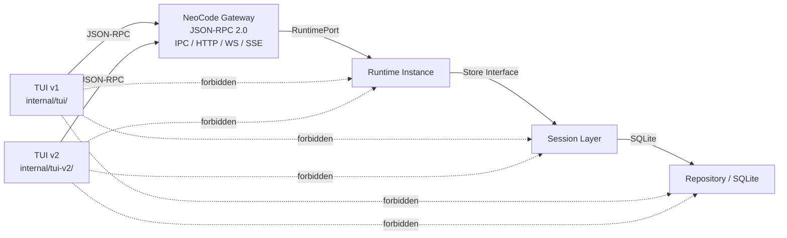

# NeoCode TUI v2 — 核心架构与导航

> 版本：v3.0 — TUI v2 Focus-Only Ghost Console
> 日期：2026-05-18
> 状态：设计草案

---

## 本文档定位

本文档是 **NeoCode TUI v2 设计文档集** 的入口。它提供架构总览、核心约束和子文档导航。具体设计细节请按主题跳转到对应的子文档。

---

## 文档导航

| 主题 | 文档 | 说明 |
|------|------|------|
| **视觉与交互** | [`tui-v2-ui-ux-design.md`](./tui-v2-ui-ux-design.md) | Ghost Console 视觉语言、Focus-Only 布局、三层键位系统、LazyVim 色彩分层 |
| **数据与契约** | [`tui-v2-data-and-gateway.md`](./tui-v2-data-and-gateway.md) | ViewModel 状态模型、Gateway RPC 接口需求、事件协议、错误处理 |
| **工程实现** | [`tui-v2-implementation-guide.md`](./tui-v2-implementation-guide.md) | 目录结构、组件拆分原则、App 装配、阶段性实施路线图 |
| **HTML 原型** | [`../design/tui-v2-terminal-preview.html`](../design/tui-v2-terminal-preview.html) | 可交互的终端视觉原型 |

---

## 1. 背景与目标

### 1.1 为什么要做 TUI v2

当前 NeoCode TUI v1（`internal/tui/`）已实现完整的 Bubble Tea 交互界面，具备对话式 Agent 交互、会话管理、权限审批、命令面板等核心能力。

TUI v2 不作为 v1 的渐进式改造，而是 **独立的并行实现**，原因：

1. **键位系统不兼容**：v2 引入 Normal Mode / Input Mode 双模式、Leader Key (`Space`)、`Shift+Enter` 换行、`Ctrl+C` 取消/双退等全新键位语义，与 v1 键位无法共存。
2. **组件架构不同**：v2 采用更细粒度的组件拆分，状态管理、主题系统、鼠标支持从第一天就是一等公民。
3. **视觉语言升级**：v2 采用 LazyVim 风格的色彩分层，抛弃所有椭圆药丸、玻璃拟态卡片、圆角终端容器等非终端原生元素。
4. **零风险共存**：v1 保持不变，v2 独立目录开发，用户可通过 CLI flag 选择版本。

### 1.2 TUI v2 核心目标

1. **Focus-Only 单布局**：不区分 wide/focus/compact 模式。一套布局适配所有终端尺寸。
2. **终端原生视觉**：LazyVim 风格色彩分层。无椭圆药丸、无玻璃拟态、无外层圆角容器。
3. **双模式键位**：Input Mode (插入/输入) + Normal Mode (`Esc` 切换) + Leader Key (`Space`)。
4. **强制鼠标支持**：所有区域响应点击和滚动。
5. **Telescope 风格命令面板**：搜索优先、accent bar 高亮当前项。
6. **Gateway-only 架构**：所有后端能力通过 Gateway JSON-RPC 获取。
7. **独立实现**：`internal/tui-v2/` 目录，不修改 `internal/tui/`。

### 1.3 核心约束

- TUI v2 所有数据必须来自 Gateway。
- TUI v2 不能直接访问 Runtime、Session、SQLite、Repository。
- TUI v1 (`internal/tui/`) 保持不动，v2 (`internal/tui-v2/`) 独立开发。
- 双版本通过独立二进制切换（`neocode` = v1，`neocode-v2` = v2）。

---

## 2. 架构边界

### 2.1 系统拓扑



### 2.2 边界规则

| 规则 | 说明 |
|------|------|
| TUI 是展示层 | 只消费事件并负责渲染，不存业务状态，不直接调用 provider，不直接执行 tools |
| Gateway 是唯一通信入口 | 所有 TUI↔后端交互必须经过 Gateway JSON-RPC 接口 |
| Session 管理会话状态 | 由 Runtime 编排，通过 Gateway 的 `loadSession`/`listSessions` 等方法暴露摘要给 TUI |
| Runtime 执行智能编程任务 | TUI 只能看到 Gateway 返回的 Runtime 摘要状态，不能直接访问 Runtime 实例 |
| Repository / SQLite 负责持久化 | TUI 绝不感知数据库文件和表结构 |
| TUI 不允许直接接触 Runtime、Session、SQLite | 违反此规则属于架构违规，必须修正 |

### 2.3 当前架构合规状态

基于代码扫描（`internal/tui/` 的 import 分析，TUI v2 以此为基础）：

| 检查项 | 状态 | 说明 |
|--------|------|------|
| TUI import `internal/runtime` | 未发现 | TUI 使用 `internal/tui/services` 中自定义的 `Runtime` 接口 |
| TUI import `internal/session` | 存在类型依赖 | 7 个文件导入 `agentsession` 使用 `Summary`、`Session`、`AgentMode`、`TodoItem` 等**领域类型**，不依赖持久化实现 |
| TUI import Repository | 未发现 | — |
| TUI import SQLite | 未发现 | — |
| TUI 直接读取数据库 | 未发现 | — |
| TUI 通过 Gateway 通信 | 已确认 | `RemoteRuntimeAdapter` 通过 `GatewayRPCClient` 完成所有后端调用 |

**TUI v2 改进目标：** 将 `internal/session` 的类型依赖彻底移除，TUI v2 只使用 Gateway DTO 或独立 `internal/tui-v2/state/` 中定义的 ViewModel 类型。

---

## 3. TUI v1 / v2 共存与构建策略

### 3.1 推荐方案：独立二进制（方案 A）

**已确定采用此方案。** 新增 `cmd/neocode-v2/main.go` 作为 TUI v2 的独立入口，与 `cmd/neocode`（v1）完全隔离。

```go
package main

import (
    "context"
    "fmt"
    "os"
    "neo-code/internal/cli"
)

func main() {
    if err := cli.ExecuteWithTUI(context.Background(), "v2"); err != nil {
        fmt.Fprintf(os.Stderr, "neocode-v2: %v\n", err)
        os.Exit(1)
    }
}
```

构建与使用：
```bash
go build -o neocode-v2 ./cmd/neocode-v2   # 构建 TUI v2
go build -o neocode ./cmd/neocode         # 构建 TUI v1（不变）
neocode-gateway                           # Gateway server（不受影响）
```

优点：
- v1 和 v2 二进制完全独立，互不干扰
- 不需要修改 `internal/cli/root.go` 或 `internal/app/bootstrap.go`
- v2 的任何代码变更不会影响 v1 的编译和行为
- 可以独立发布、独立测试、独立回滚

### 3.2 备选方案：CLI Flag 切换（方案 B）

如果后续需要从同一入口切换版本，可在此基础上增加 `--tui` flag。当前不做此实现，以保持 v1 入口零改动。

用法参考（当前不启用）：
```bash
neocode --tui=v2    # 如果将来启用
```

### 3.3 不支持构建标签方案

不使用 `//go:build tui_v2` 构建标签。原因：
- 构建标签导致同一个文件可能被两个版本编译，增加维护复杂度
- 需要维护两套几乎相同的 cmd 入口
- CLI flag 方案更灵活（同一二进制即可切换）

### 3.4 共存原则

| 原则 | 说明 |
|------|------|
| v1 代码不动 | `internal/tui/` 保持当前状态，不修改、不删除 |
| v2 独立开发 | 所有新代码在 `internal/tui-v2/` |
| Gateway 共享 | v1 和 v2 通过相同的 Gateway IPC 通信，无服务端变更 |
| 配置共享 | 同一套 `~/.neocode/config.yaml` |
| 会话共享 | 同一个 SQLite 数据库，v1 和 v2 可访问相同的会话 |
| 互不感知 | v1 不知道 v2 的存在，反之亦然 |

---

## 4. 严格禁止事项

以下规则为强制性架构约束：

1. **禁止 TUI v2 import Runtime 内部包**（`neo-code/internal/runtime`）
2. **禁止 TUI v2 import Session 内部包**（`neo-code/internal/session`）— TUI v2 目标：完全移除该依赖
3. **禁止 TUI v2 import Repository / SQLite 内部包**
4. **禁止 TUI v2 直接读取数据库文件**
5. **禁止 TUI v2 直接启动 Runtime 实例**
6. **禁止 TUI v2 直接持有 Runtime 实例指针**
7. **禁止 TUI v2 通过本地文件绕过 Gateway 获取会话状态**
8. **禁止为了视觉效果在 TUI 中伪造 Runtime 状态**（所有状态数据必须来自 Gateway）
9. **禁止让 UI 逻辑依赖后端内部实现细节**
10. **禁止将 Gateway 事件协议写死为不可扩展结构**
11. **禁止在普通消息、工具调用、文件变更、状态展示上使用完整线框** — 线框仅限弹窗、确认、帮助、picker
12. **禁止使用椭圆药丸、圆角标签、玻璃拟态卡片、外层圆角容器** — TUI v2 硬性视觉约束
13. **禁止修改 `internal/tui/` 以适应 TUI v2** — v1 代码保持不动
14. **禁止 TUI v2 使用 TUI v1 键位语义** — 两套键位系统独立，不兼容

---

## 5. 验收标准

| # | 验收标准 | 对应文档 |
|---|---------|---------|
| 1 | Ghost Console 视觉语言定义清晰（非三栏 IDE、非后台管理） | [UI/UX](./tui-v2-ui-ux-design.md) |
| 2 | Focus-Only 单布局，无 wide/focus/compact 模式切换 | [UI/UX](./tui-v2-ui-ux-design.md) |
| 3 | LazyVim 色彩分层定义，硬性约束禁止椭圆药丸/玻璃拟态/圆角容器 | [UI/UX](./tui-v2-ui-ux-design.md) |
| 4 | 全新三层键位系统（Input/Normal/Leader），与 v1 不兼容 | [UI/UX](./tui-v2-ui-ux-design.md) |
| 5 | Telescope 风格命令面板（搜索优先、accent bar 高亮） | [UI/UX](./tui-v2-ui-ux-design.md) |
| 6 | 鼠标操作强制支持，所有区域可点击可滚动 | [UI/UX](./tui-v2-ui-ux-design.md) |
| 7 | TUI v1 / v2 共存策略明确（CLI flag 或独立二进制） | 本文档 §3 |
| 8 | `internal/tui-v2/` 完整目录结构设计 | [工程实现](./tui-v2-implementation-guide.md) |
| 9 | Gateway 是 TUI v2 的唯一通信入口 | [数据/契约](./tui-v2-data-and-gateway.md) |
| 10 | 已有接口和缺失接口严格区分 | [数据/契约](./tui-v2-data-and-gateway.md) |
| 11 | ViewModel 状态模型设计完整 | [数据/契约](./tui-v2-data-and-gateway.md) |
| 12 | 事件流与渲染映射完整 | [数据/契约](./tui-v2-data-and-gateway.md) |
| 13 | 错误处理覆盖完整 | [数据/契约](./tui-v2-data-and-gateway.md) |
| 14 | 响应式终端布局（小屏/大屏） | [UI/UX](./tui-v2-ui-ux-design.md) |
| 15 | 组件拆分建议清晰（每个文件 < 800 行） | [工程实现](./tui-v2-implementation-guide.md) |
| 16 | 架构合规风险指出 | 本文档 §2.3 |
| 17 | 线框使用规则（默认不画框） | [UI/UX](./tui-v2-ui-ux-design.md) |
| 18 | 权限弹窗设计（小、直接、键盘+鼠标） | [UI/UX](./tui-v2-ui-ux-design.md) |
| 19 | 帮助浮层（分组展示快捷键） | [UI/UX](./tui-v2-ui-ux-design.md) |
| 20 | Ctrl+C 双退保护逻辑 | [UI/UX](./tui-v2-ui-ux-design.md) |
| 21 | Nerd Font / 低色彩 fallback | [UI/UX](./tui-v2-ui-ux-design.md) |
| 22 | 文档能指导后续 TUI v2 实现 | 全部四份文档 |

---

## 附录：相关文档索引

| 文档 | 路径 | 说明 |
|------|------|------|
| TUI-Gateway 契约矩阵 | `docs/reference/tui-gateway-contract-matrix.md` | 当前 TUI 使用的 13 个 RPC 方法 |
| Gateway RPC API 完整参考 | `docs/reference/gateway-rpc-api.md` | 所有 48 个 RPC 方法 |
| Gateway 错误码目录 | `docs/reference/gateway-error-catalog.md` | 11 个稳定错误码 |
| Gateway IPC 控制面 API | `~/meno/gateway-ipc-control-plane-api.md` | 完整接口参考 |
| AGENTS.md | `AGENTS.md` | 项目 AI 协作规则 |
| CLAUDE.md | `CLAUDE.md` | 项目快速入口 |
| Runtime-Provider 事件流 | `docs/runtime-provider-event-flow.md` | 事件类型与 ReAct 循环 |
| Context Compact 策略 | `docs/context-compact.md` | Budget 控制与 Compact |
| Skills 系统设计 | `docs/skills-system-design.md` | Skills 发现与激活 |
| TUI v2 HTML 原型 | `docs/design/tui-v2-terminal-preview.html` | 视觉参考 |

---

*文档基于 NeoCode 源码分析整理。所有代码路径来自真实仓库。已有接口标注"已有"，建议新增接口标注"建议"。不确定内容标注"待确认"。*
